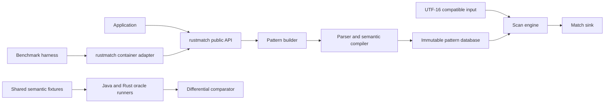

# rustmatch

[](LICENSE)

> **Status: active implementation.** The vertically integrated semantic spine
> now covers the documented rmatch 2.x consuming language, including UTF-16,
> flags, anchors, and boundaries, with pinned Java evidence. Optimization and
> scale work begins at I6. This is a development prototype, not a published crate.

> **Roadmap:** [See the implementation dependency graph and current
> status](docs/roadmap.md). Planning is complete; implementation is at `6/12`
> increments started and `6/12` complete.

> **Engineering standards:** [Documentation, Rust hygiene, testing, and pull-
> request expectations](CONTRIBUTING.md) are part of the product contract.

> **Project participation:** [Contributing](CONTRIBUTING.md) -
> [Code of Conduct](CODE_OF_CONDUCT.md) - [Security](SECURITY.md) -
> [Support](SUPPORT.md) - [Governance](GOVERNANCE.md)

`rustmatch` is intended to be a native Rust implementation of the rmatch idea:
register many regular expressions once, compile them into shared matching
machinery, and scan large text inputs without running an independent full
search for every pattern.

The goal is semantic compatibility, not source-code similarity. The Java
implementation is the behavioral reference and an important source of lessons,
but the Rust implementation should use Rust's strengths: ownership, explicit
lifetimes, enums, dense integer-indexed storage, contiguous memory, fearless
parallelism, and a small public API. This is not a Java-to-Rust transliteration
project.

## TL;DR

### What we are building

- A pure Rust, Apache-2.0-licensed many-pattern regular-expression engine.
- A matcher with the same supported syntax and match-selection semantics as
  rmatch 2.x.
- A Rust-native API for building an immutable pattern database and reusing it
  across large inputs.
- A benchmark adapter that participates in the same correctness-gated,
  receipt-producing campaigns as Java rmatch, RE2/J, Java regex, and
  Hyperscan.
- An implementation designed from the data layout inward, not a mechanical
  port of Java classes.

### What "compatible" means

For the canonical compatibility input mode, Java rmatch and rustmatch must:

1. Accept and reject the same documented pattern language.
2. Produce the same multiset of `(pattern_id, start, end)` match events.
3. Report the longest match for each pattern and input start position.
4. Report matches from every eligible start position, including overlapping
   and nested matches.
5. Use half-open `[start, end)` offsets.
6. Apply the same ASCII definitions for shorthand classes and word boundaries,
   and the same Java single-UTF-16-unit case mapping.
7. Preserve the same build-then-scan lifecycle and failure boundaries where
   those are observable to callers.

Callback order is intentionally unspecified in both implementations and is not
part of compatibility. Rust API spelling and type structure are also not
expected to resemble Java API spelling.

There is one non-negotiable wrinkle: Java `char` and `String` positions are
UTF-16 code units, while Rust `str` is UTF-8. Exact parity therefore requires a
canonical UTF-16 compatibility input and UTF-16 offsets. The first stable API
must expose that fact honestly. An ergonomic UTF-8 facade may be added, but it
must not quietly relabel byte offsets as Java-compatible offsets.

### Initial API

The first public surface is deliberately smaller than the eventual convenience
API. It is implemented as follows:

```rust
use rustmatch::{MatcherBuilder, PatternId, Utf16Text};

let mut builder = MatcherBuilder::new();
builder.add(PatternId::new(1), "cat")?;
builder.add(PatternId::new(2), "dog")?;

let matcher = builder.build()?;
let input = Utf16Text::from("cat and dog");

matcher.scan(&input, |hit| {
    println!(
        "pattern={} span={:?}",
        hit.pattern_id(),
        hit.span(),
    );
})?;
```

The public types are `MatcherBuilder`, `Matcher`, `PatternId`, `PatternFlags`,
`Utf16Text`, `Match`, `Utf16Span`, and one non-exhaustive `Error` type. The
methods cover construction, plain or flagged pattern registration, build,
scan, bounded state-cache configuration, and read-only accessors. The cache
defaults to 8,192 scan-local deterministic states; setting
`MatcherBuilder::state_cache_budget(0)` selects the exact NFA path. Filling a
nonzero budget also falls back to that path rather than dropping work.
`PatternId` is a `u32`-backed domain type;
positions remain `u64` UTF-16 coordinates; and `Utf16Text` owns its exact
`Vec<u16>`. Parser, HIR, NFA, state, cache, worker, and sink
implementation types stay private. Borrowed or custom inputs, iterators, async
APIs, fallible callbacks, runtime pattern mutation, and other tuning knobs are
deferred until a concrete use case earns them. Cache counters remain available
only to repository tooling behind the non-default `benchmark-internals`
feature and are not part of the supported application API.

The lifecycle is explicit:

```text
register patterns -> build immutable matcher -> scan one or more inputs
```

No pattern mutation occurs while a compiled matcher is in use. A changed rule
set produces a new matcher.

### Current support contract

The executable spine currently has this deliberately small contract:

| Area | Current behavior |
|---|---|
| Patterns | Accept one or more non-empty patterns made from UTF-16 literals, dot, character classes, ranges, supported escapes, ASCII shorthand classes, alternation, plain or non-capturing groups, greedy repetition, prefix `i`/`s` flags, line anchors, and ASCII word boundaries. Reject scoped flags, lazy quantifiers, possessive quantifiers, and patterns that can only match zero width. |
| Input | Accept any finite sequence of UTF-16 code units, including empty input and isolated surrogates. Rust strings are encoded once; `Utf16Text::from_units` preserves raw units. |
| Pattern identity | Require a unique caller-supplied `PatternId`. The same literal may be registered under different IDs; a duplicate ID is an error. |
| Matches | For every pattern and every input start position, report the longest match from that start. Report matches at all starts, including overlaps. Alternatives may give one pattern several possible lengths. |
| Event identity | A match consists of its `PatternId` and span. Equal text registered under different IDs produces distinct events. |
| Coordinates | Report zero-based, half-open UTF-16 spans `[start, end)`. A supplementary Unicode scalar therefore occupies two engine positions. |
| Ordering | Callback order is unspecified. Compatibility tests compare normalized event multisets, not callback order. |
| Failure boundary | Reject an invalid pattern during registration or build. Return an error if an input position cannot fit the public coordinate type. Expected user errors do not panic. |
| Lifecycle | Build an immutable matcher, then scan any number of inputs. Changing the pattern set requires a new matcher. |

The current pattern syntax is deliberately explicit:

- `.` matches one UTF-16 code unit, including newline and isolated surrogates.
- `[abc]`, `[a-z]`, `[^abc]`, and unions of literals, ranges, and supported
  class escapes compile to one UTF-16 predicate. Empty `[]` matches nothing;
  `[^]` matches every UTF-16 code unit.
- `\d` is `0-9`; `\w` is `A-Z`, `a-z`, `0-9`, and `_`; `\s` is space, tab,
  newline, vertical tab, form feed, and carriage return. `\D`, `\W`, and `\S`
  complement those ASCII member sets over the complete UTF-16 domain.
- Escaped metacharacters are literals. `\n`, `\t`, `\r`, and `\f` are the
  supported control escapes. Inside a class, `\\`, `\]`, `\[`, `\-`, `\^`,
  the control escapes, and lowercase `\d`, `\w`, and `\s` are supported.
- `a|b` selects between alternatives. Parentheses group composition;
  `(ab)` and `(?:ab)` are equivalent because rustmatch does not capture.
- `?`, `*`, `+`, `{m}`, `{m,n}`, and `{m,}` greedily repeat the immediately
  preceding atom or group. Counted bounds may not exceed 1,000; `{0}` and
  `{0,0}` are rejected, while `{0,}` is the unbounded zero-minimum form.
- A leading `(?i)` enables Java-compatible, single-UTF-16-unit case folding;
  `(?s)` is accepted as a no-op because dot always includes newline. `(?is)`
  and `(?si)` combine them. `PatternFlags::CASE_INSENSITIVE` provides the same
  compile-time behavior without rewriting programmatically assembled text.
- `^` constrains a consuming path to input or line start, and `$` constrains it
  to input or line end. `\b` and `\B` test boundaries using the same ASCII
  word-character definition as `\w`. Assertions are NFA edges, not post-hoc
  filters; assertion-free pattern sets use a separate scan specialization.
- A leading or interior empty alternative is an epsilon branch. As in the
  pinned Java contract, a trailing empty alternative is ignored and an empty
  group matches nothing. Rustmatch deliberately rejects a pattern that can
  only produce a zero-width match.

The fixtures cover literals and overlapping starts, all predicate families,
ASCII boundary values and newlines, class negation and ranges, literal and
control escapes, branching and nested grouping shapes, empty alternatives,
greedy and counted repetition, quantifier binding, longest-match ambiguity,
raw and supplementary UTF-16, non-ASCII classes, exhaustive Java 21 case-map
provenance, prefix and typed flags, and malformed registration cases.
The assertion tier adds input and line edges, groups, alternatives, flags,
ASCII/non-ASCII boundaries, raw surrogates, phase adversaries, and explicit
pure-zero-width rejection.

### Development strategy: an executable spine first

The implementation began deliberately narrow but architecturally real. The
literal bootstrap, ASCII predicates, branching composition, and repetition
increments all execute the intended end-to-end path:

```text
public builder
    -> minimal parser and HIR
    -> shared dense NFA compiler
    -> immutable pattern database
    -> production-shaped scan engine
    -> longest-match event tracking
    -> public match sink
    -> oracle and benchmark adapters
```

This is not a temporary substring loop. It is the first, least capable version
of the final system. Every later increment broadens or accelerates this running
system while preserving end-to-end tests. At no planned point should the
project contain several sophisticated horizontal layers that have never been
executed together.

### Definition of success

`rustmatch` is ready for a first stable release only when all of the following
are true:

- The shared semantic suite passes against Java rmatch for supported syntax,
  rejected syntax, edge cases, and generated cases.
- The Rust adapter passes the benchmark repository's correctness gate before
  any timing is retained.
- The implementation has no known input-dependent panics for valid public API
  use.
- The hot scan path performs no per-character heap allocation after warm-up.
- Single-threaded and parallel behavior are documented and tested.
- The public crate surface is small, documented, and does not expose compiler
  or automaton internals as accidental extension points.
- Every published performance claim links to reproducible receipts containing
  exact versions, inputs, hashes, machine information, and thread settings.

### Non-goals

- Recreating Java package structure or class hierarchy.
- Becoming a drop-in replacement for PCRE, `java.util.regex`, Rust `regex`,
  RE2, or Hyperscan.
- Supporting captures, backreferences, lookaround, or every regex dialect.
- Beating Hyperscan merely because both projects scan multiple patterns.
- Claiming streaming support before retention, lookback, and offset behavior
  have been specified and tested.
- Using `unsafe` as a substitute for a measured design.

---

## Product requirements document

### Document metadata

| Field | Value |
|---|---|
| Product | `rustmatch` |
| Status | Proposed |
| License | Apache License 2.0 |
| Behavioral reference | Maven Central `no.rmz:rmatch:2.0.0-RC1` |
| Primary implementation language | Rust 2024 edition |
| Bootstrap toolchain | Rust `1.97.0`, pinned for development and primary CI |
| Minimum supported Rust version | Rust `1.85.0`, the first Rust 2024 release |
| Primary workload | Many patterns reused over large text buffers |
| Primary quality order | Correctness, semantic parity, predictability, performance |

### Background

Conventional regex APIs are usually organized around one compiled expression
matching one input. That is excellent for the common case, but it creates a
poor scaling shape when an application must apply thousands of expressions to
the same large corpus. A straightforward loop repeatedly traverses the same
input, once per expression.

Java rmatch explores a different tradeoff. It registers a set of regular
expressions, compiles shared finite-automaton machinery, and scans the corpus
through a many-pattern pipeline. Recent exploratory measurements suggest that
this becomes useful as pattern sets and corpora grow, even though specialized
native engines still establish a much higher performance ceiling.

Rust is a natural language for a second implementation because the problem is
dominated by representation, locality, controlled allocation, and safe
parallel reads. A native Rust implementation can preserve the idea and
semantics while reconsidering every internal choice.

### Problem statement

Rust users do not currently have an implementation of rmatch's exact
many-pattern semantics that can be tested against the Java implementation and
inserted into the existing cross-engine benchmark harness. Reusing Java
through JNI would preserve code but not produce a native Rust engine, would
complicate deployment, and would conceal rather than answer the interesting
implementation questions.

We need a Rust-native library that:

- handles large, reusable pattern sets as one compiled database;
- reports the same matches as Java rmatch on its documented language;
- scales from a single worker to explicitly configured parallel execution;
- exposes enough input abstraction for future specialized buffers without
  making the ordinary string case awkward;
- can be measured fairly beside Java rmatch in the existing benchmark system.

### Product principles

1. **Semantics are a specification, not an anecdote.** Compatibility is
   established by shared fixtures and differential tests.
2. **Correctness precedes timing.** A fast run with the wrong match count is a
   rejected run.
3. **Java optimizations are hypotheses, not evidence.** We will try ideas that
   worked in Java rmatch, but each one must prove a positive performance effect
   in the Rust implementation before it is admitted as an optimization.
4. **Build the executable spine first.** The earliest matcher is narrow but
   uses the intended compiler, database, engine, event, and test boundaries.
5. **Rust-native does not mean Rust-different.** Internal design should be
   idiomatic Rust, while observable matching behavior remains compatible.
6. **Pay for what is used.** Assertions, Unicode handling, prefilters, and
   parallel execution must not impose their full cost on patterns that do not
   need them.
7. **Immutable after build.** Compilation and scanning are separate phases.
8. **No accidental public architecture.** Dense state tables, compiler stages,
   caches, and diagnostics stay private unless users have a demonstrated need.
9. **Receipts over adjectives.** Performance descriptions must be backed by
   versioned, reproducible evidence.
10. **Safe Rust first.** Any `unsafe` block requires a measured benefit, a
   documented invariant, focused tests, and independent review.
11. **Neat for comprehension.** Code, documentation, tests, fixtures, and
    evidence should be easy for humans and machines to navigate and verify.
    This favors clarity and explicitness, not ornamental abstraction or churn.

### Goals

#### G-1: Semantic compatibility

Implement the rmatch 2.x syntax and match-selection contract, including
overlap, longest-per-start behavior, line anchors, word boundaries, and the
documented ASCII-oriented character rules.

#### G-2: A native Rust product

Offer an API that feels normal to a Rust developer: builders, immutable
compiled values, typed identifiers, explicit errors, borrowed input where
possible, no global mutable engine state, and clear `Send`/`Sync` behavior.

#### G-3: Competitive many-pattern throughput

Build an architecture that can exploit shared automata, dense memory, literal
prefiltering, cache reuse, and pattern partitioning. Performance targets are
gates against regressions and against the Java reference, not promises made
before measurements exist.

#### G-4: Shared empirical infrastructure

Add rustmatch to
[rmatch-performance-measurements](https://github.com/la3lma/rmatch-performance-measurements)
using the same generated fixtures, containers, correctness checks, timing
boundaries, and receipt schema.

#### G-5: Maintainability

Keep the semantic model, compiler, execution engine, and optimization layers
separable enough that each can be tested without relying on incidental internal
state.

### Non-goals and deferred scope

| Item | Disposition |
|---|---|
| Capture groups and extraction | Not in the rmatch 2.x contract |
| Backreferences | Excluded; not regular-language machinery |
| Lookahead and lookbehind | Deferred and not compatibility promises |
| Lazy or possessive quantifiers | Deferred |
| Atomic groups | Deferred |
| Unicode property classes | Deferred |
| Locale-sensitive or multi-code-point folding | Deferred |
| Pure zero-width match reporting | Excluded from the 2.x contract |
| Mid-pattern or scoped flags | Deferred |
| Dynamic add/remove after build | Explicitly out of scope |
| Unbounded streaming | Requires a separate retention and lookback design |
| Stable automaton serialization | Potential later feature, not a first-release gate |
| C ABI, Python bindings, or WebAssembly API | Potential later projects |

### Users and jobs to be done

#### Application developer

Wants to register hundreds to tens of thousands of rules, scan large inputs,
receive pattern identity and spans, and avoid understanding automata internals.

#### Systems developer

Wants explicit control over parallelism, memory behavior, buffer ownership, and
failure propagation. May provide a specialized input implementation.

#### rmatch maintainer

Wants a second implementation that catches specification ambiguity and
behavioral bugs through differential testing.

#### Performance researcher

Wants a named, reproducible rustmatch engine lane in the cross-engine harness,
with compile time, scan time, throughput, memory, match counts, and exact
provenance.

#### Contributor

Wants a staged architecture, local correctness tests, focused benchmarks, and
clear rules for when an optimization is acceptable.

### Functional requirements

| ID | Requirement | Acceptance signal |
|---|---|---|
| FR-001 | Register a pattern with a stable caller-provided pattern ID | The ID is returned with every event from that registration |
| FR-002 | Register many patterns before build | Pattern count is limited by resources, not a small API ceiling |
| FR-003 | Build an immutable reusable matcher | Scanning cannot mutate the registered pattern set |
| FR-004 | Scan a canonical UTF-16-compatible input | Match offsets agree with Java rmatch on all shared fixtures |
| FR-005 | Report half-open spans | Every hit has `start <= end` and slices the intended text |
| FR-006 | Report longest match per pattern and start | `a+` over `aaa` reports `[0,3)`, `[1,3)`, `[2,3)` |
| FR-007 | Preserve independent pattern identity | `a` and `ab` may both report at the same start |
| FR-008 | Preserve distinct registrations | Distinct IDs or handlers remain distinguishable even for equal pattern text |
| FR-009 | Support the documented syntax table | Shared positive fixtures pass |
| FR-010 | Reject malformed and unsupported syntax at registration/build time | Shared negative fixtures fail before scanning |
| FR-011 | Remain usable after a rejected registration | A later valid registration can still be built |
| FR-012 | Support explicit single-thread execution | Results match the reference event multiset |
| FR-013 | Support explicit parallel pattern partitioning | Results match the single-thread event multiset |
| FR-014 | Propagate sink/callback failures | The scan returns the original or a documented wrapper error |
| FR-015 | Permit repeated scans with one compiled matcher | Results remain stable across inputs and repetitions |
| FR-016 | Expose a custom read-only input trait | External implementations can provide indexed symbols safely |
| FR-017 | Materialize ordinary Rust strings conveniently | The common path requires no custom trait implementation |
| FR-018 | Emit benchmark-runner JSON | Output can be archived as a standard benchmark receipt |
| FR-019 | Keep every implementation increment executable end to end | Each merged capability is exercised from public builder through match event |

### Supported syntax baseline

The initial target is the documented Java rmatch 2.x surface:

| Family | Syntax and behavior |
|---|---|
| Literals | Exact sequences |
| Composition | Concatenation and `a|b` alternation |
| Repetition | `?`, `*`, `+`, `{m}`, `{m,n}`, `{m,}` |
| Groups | `(ab)` and `(?:ab)`, grouping only, no captures |
| Any symbol | `.` includes newline |
| Classes | `[abc]`, ranges, and negated classes |
| Shorthands | ASCII `\d`, `\w`, `\s` and complements |
| Anchors | `^` at input/line start, `$` at input/line end |
| Boundaries | ASCII `\b` and `\B` |
| Flags | Prefix `(?i)`, `(?s)`, combinations, and typed case-insensitive option |
| Escapes | Supported literal and control escapes from the reference contract |

Counted repetition is capped at 1,000 expanded repetitions unless a later
joint specification revision changes both implementations.

### Match semantics

The compatibility oracle compares normalized events. For a set of registered
patterns `P` and input `I`, an event is:

```text
(pattern_id, start_utf16, end_utf16)
```

For every pattern and every input start position:

1. Consider all legal consuming paths from that start.
2. If one or more paths accept, choose the greatest end position.
3. Emit one event for that pattern ID and start position.
4. Do not suppress events merely because another event overlaps or contains
   them.

Rustmatch rejects patterns that can only match zero width. The Java reference
accepts those patterns but emits no events; the fixture suite records this as
the one explicit product difference. Assertions may constrain a consuming
match.

The event multiset is normative. Delivery order is not.

### Character and offset model

This is the first architectural decision that must be recorded formally.

Java rmatch consumes Java `char` values. Therefore its symbols and offsets are
UTF-16 code units, not Unicode scalar values and not UTF-8 bytes. A supplementary
Unicode character is two symbols to the Java engine.

The proposed canonical model is:

- `Symbol = u16`.
- `Position = u64` counting UTF-16 code units.
- Pattern text is parsed as UTF-16 code units, not as Rust Unicode scalar
  values. This preserves Java atom and quantifier behavior even around
  supplementary characters.
- The ordinary builder accepts `&str` and encodes it to canonical UTF-16 before
  parsing. A lower-level UTF-16 pattern entry point may admit isolated surrogate
  units for exhaustive compatibility testing.
- `Utf16Text` owns or borrows a stable sequence of `u16` symbols.
- `Utf16Text::from` implements `From<&str>` and encodes a Rust string to UTF-16
  once, outside the scan timing boundary.
- Match spans are UTF-16 spans and can always be decoded through the input.
- ASCII corpora have identical byte and UTF-16 offsets, which keeps the current
  benchmark scenarios straightforward.

An optional UTF-8-native facade may later maintain a checked mapping between
UTF-16 compatibility positions and UTF-8 byte ranges. If introduced, it must
make the coordinate system visible in types, for example `Utf16Span` versus
`ByteSpan`. No API may return an unqualified integer offset whose unit is
ambiguous.

### Public API requirements

The eventual public crate should expose concepts, not implementation layers:

- `MatcherBuilder`
- `Matcher`
- `PatternId`
- `PatternFlags`
- `Match` or `MatchEvent`
- `Utf16Text` and/or a carefully named compatibility input type
- a read-only `Input` trait
- parse/build/scan error types
- an explicit parallelism configuration

It should not expose:

- NFA or DFA node implementations;
- state-set caches;
- parser event handlers;
- prefilter internals;
- partition worker types;
- graph-printing helpers;
- storage arenas or node IDs other than diagnostic snapshots behind an
  unstable feature.

### Non-functional requirements

| ID | Requirement | Target or gate |
|---|---|---|
| NFR-001 | Correctness | Zero known differential failures in supported syntax |
| NFR-002 | Memory safety | Safe Rust by default; Miri-clean tests for unsafe-free core |
| NFR-003 | Allocation | No per-symbol heap allocation in steady-state scan |
| NFR-004 | Determinism | Same normalized event multiset across worker counts |
| NFR-005 | Reuse | Compiled matcher can scan repeatedly without rebuilding |
| NFR-006 | Concurrency | Immutable matcher is shareable when sink/input contracts permit |
| NFR-007 | Error quality | Parse errors include source span and actionable reason |
| NFR-008 | Observability | Optional aggregate diagnostics without hot-path logging |
| NFR-009 | Documentation | Every public item has rustdoc and at least one end-to-end example |
| NFR-010 | Toolchain | Rust 2024; primary CI on pinned `1.97.0`; MSRV lane on `1.85.0` |
| NFR-011 | Reproducibility | Published benchmark points have archived receipts |
| NFR-012 | Portability | Linux and macOS first; no architecture-specific correctness |
| NFR-013 | Dependency hygiene | Small dependency set, audited before releases |
| NFR-014 | Performance admission | Performance-motivated changes require a positive Rust result beyond predeclared noise; Java results alone and neutral outcomes fail the gate |
| NFR-015 | Architectural continuity | Early narrow implementations use final-shaped boundaries rather than throwaway matching paths |
| NFR-016 | Comprehensible engineering | Formatting, linting, rustdoc, visibility, errors, tests, task IDs, and evidence formats follow the enforced contribution standard |

### Performance requirements

The project begins without invented throughput promises. Performance will be
specified as progressively stronger gates:

1. **Complexity gate:** no implementation path equivalent to scanning the
   complete corpus independently for every registered pattern.
2. **Allocation gate:** steady-state scan reuses scratch storage.
3. **Regression gate:** representative scenarios must not slow by more than the
   campaign's noise-aware threshold without an explicit tradeoff decision.
4. **Reference gate:** rustmatch should be competitive with Java rmatch on at
   least the workloads where shared many-pattern machinery is valuable.
5. **Scaling gate:** measure 1,000, 2,500, 5,000, 7,500, and 10,000 patterns on
   8 MiB and 50 MiB inputs, including thread sweeps.
6. **Honesty gate:** compile time, warm-up time, scan time, peak memory, match
   count, and total wall time remain separate metrics.

Hyperscan remains a native reference ceiling, not a promise that rustmatch will
match its specialized implementation or execution model.

Within the Rust ecosystem, the first direct performance reference is
[`regex::RegexSet`](https://docs.rs/regex/1.13.1/regex/struct.RegexSet.html).
It is an optimized one-pass many-pattern matcher, but its native result is the
set of patterns that matched somewhere, not match locations. The early
[B0 comparison contract](docs/benchmarking/regexset-comparison.md) therefore
defines one native set-membership lane and one complete-event lane. Both lanes
validate results before retaining timings, separate compilation from scanning,
and state plainly when one engine performs richer work.

### Optimization admission gate

An optimization is any change proposed primarily to make compilation,
scanning, allocation, memory use, or parallel throughput better. Lazy
determinization, state-set representations, caches, prefilters, specialized
collections, SIMD, `unsafe`, allocation strategies, and automatic parallelism
all pass through this gate.

Java rmatch is valuable prior art. If an optimization worked there, that is a
good reason to test it in Rust. It is not evidence that the optimization works
in Rust. Different layouts, ownership, compiler optimizations, standard
libraries, allocators, and runtime costs can reverse the result.

Before implementing a performance idea, record:

1. the mechanism and why it may help Rust;
2. the workloads and metric it is intended to improve;
3. the exact baseline revision and modes being compared;
4. the campaign's noise model and minimum meaningful improvement;
5. the regressions in build time, memory, latency, or other scenarios that
   would make the trade unacceptable.

The implementation passes only when:

- optimized and baseline event results are identical;
- baseline and candidate use the same inputs, machine allocation, build mode,
  warm-up policy, and measurement boundaries;
- retained receipts show a positive improvement beyond the predeclared noise
  threshold for the intended workload;
- the complete scenario set reveals no unaccepted material regression; and
- any selective activation rule is itself measured and reproducible.

A neutral, inconclusive, or slower result fails the optimization gate. The
experiment may be retained as a useful lab note, but the code is removed or
left disabled outside the production path. A local win accompanied by losses
elsewhere may justify a narrowly activated path only when the activation
criterion is explicit, safe, and independently measured.

Pass/fail is not performance analysis. Every admitted optimization must also
explain the absolute times, output volume, scaling shape, memory tradeoff,
cache or fallback behavior, profile hotspots, and limits on generalization.
Diagnostic controls should separate competing explanations where practical;
for example, a no-match corpus distinguishes pattern-set search cost from
result delivery. A green threshold without this critical interpretation is an
incomplete experiment.

This hard positive-improvement requirement does **not** apply to semantic
extensions such as richer supported regex syntax. Those changes are admitted
for functionality and compatibility. They must pass correctness evidence and,
when they touch a hot path, a non-regression budget, but they do not have to
make existing patterns faster.

### Testing and regression policy

Tests are part of the executable spine, not cleanup work after the engine is
feature-complete. Every pull request must pass the required CI workflow before
it can merge. Once the first workflow exists, `main` should be protected so a
red or missing required check cannot be waived by habit.

#### Fast functional PR CI

The normal PR lane should be small, readable, and dependable enough to run on
every change. It includes:

- formatting and Clippy with warnings denied;
- compilation of the workspace, examples, tests, and relevant feature sets;
- focused unit tests for parser, HIR, compiler, state sets, and error types;
- compact public end-to-end tests from builder through emitted match events;
- Java/Rust differential smoke fixtures for the syntax tier implemented so
  far;
- negative-path tests for rejected syntax, sink/input failures, limits, and
  lifecycle errors;
- rustdoc examples and the UC evidence-summary test.

Functional tests should be pleasant to review: one behavior per test, small
fixtures, exact expected events or errors, descriptive names, and explicit
`Prepare`, `Test`, and `Assert` comments where the three stages are not already
obvious. A PR with failing functional tests is not mergeable.

#### Coarse CI performance tripwire

CI is not the authoritative performance laboratory. Hosted runners are noisy,
and a broad scenario campaign would be too slow for every PR. CI should still
run one or a few short, deterministic scans to catch catastrophic mistakes
such as accidentally rebuilding per character, disabling a cache, allocating
inside the hot loop, or falling onto an obviously wrong path.

The tripwire should:

- validate event count or event hash before considering timing;
- build base and PR revisions in the same job and release configuration;
- use the same generated fixture, container allocation, warm-up count, and
  measurement boundary;
- compare medians from several scans rather than one wall-clock sample;
- use a deliberately broad, versioned failure threshold; and
- rerun once before failing a PR for timing alone.

The active Wuthering Heights policy requires the default one-worker path and
fails only when the median slowdown exceeds 100% and the absolute regression is
at least 50 ms. A possible failure is rerun in reverse order before the job is
allowed to fail. This deliberately broad threshold is a smoke alarm, not
evidence that a change is fast, neutral, or worthy of publication.

A CI tripwire failure blocks the PR pending investigation and a stable-machine
rerun. A CI tripwire pass does not satisfy the optimization admission gate.
The generated literal `C1` lane catches broad hot-loop mistakes; the retained
Wuthering Heights `C2` lane adds a realistic 5,000-pattern regression line with
an 8 MiB deterministic corpus expansion, exact source and event digests, and a
size above the full-prefilter activation threshold. Both use deliberately
broad thresholds and retain base, candidate, and comparison receipts.

#### Authoritative external regression testing

Performance-sensitive work is tested outside hosted CI on a designated stable
machine using the benchmark repository. Before such a change is accepted into
`main`:

1. Run the exact base and candidate revisions with correctness validation.
2. Use the full applicable scenario set, not only the workload expected to
   improve.
3. Retain individual measurements, environment metadata, versions, hashes,
   memory observations, and thread sweeps where relevant.
4. Investigate any real regression, even when the coarse CI tripwire remained
   green.
5. Reject or redesign the change unless its semantic value justifies a
   documented tradeoff, or its optimization claim passes the hard positive-
   improvement gate.

This external campaign is the authoritative regression-management path. The CI
tripwire exists to catch severe and unusual anomalies that escape it; CI does
not replace it.

### Documentation and Rust code hygiene

Rustmatch should be a *neat* project because comprehension is a correctness and
maintenance feature. Neat does not mean maximizing the number of abstractions,
reformatting working code for taste, or satisfying tools without judgment. It
means that a person or an automated agent can identify the public contract,
find the implementation, understand the invariants, run the evidence, and make
a focused change without reconstructing hidden context.

The binding details live in [CONTRIBUTING.md](CONTRIBUTING.md). The core rules
are:

- use stable Rust, canonical `rustfmt`, and Clippy with warnings denied;
- keep visibility as narrow as possible and review every exported item as an
  API commitment;
- use domain types for pattern IDs, state IDs, positions, spans, flags, and
  configuration instead of ambiguous primitives;
- prefer explicit ownership and simple data flow over clever lifetime or trait
  machinery that has no demonstrated need;
- return typed, contextual errors for expected failures and reserve panics for
  documented internal invariant violations;
- forbid `unsafe` in the initial core and admit it later only through the
  safety and performance gates;
- document every public item, crate, and important module, including units,
  lifecycle, concurrency, errors, panics, and examples where relevant;
- comment invariants and reasons, not syntax that the code already states;
- keep tests small, deterministic, behavior-named, and exact about expected
  events or errors;
- avoid dead code, broad lint suppression, anonymous TODOs, and speculative
  extension points; and
- keep generated artifacts reproducible and machine-readable evidence
  versioned and schema-checked.

The required PR workflow will enforce formatting, linting, compilation, tests,
and rustdoc from the executable-spine increment onward. Dependency, license,
security, unused-dependency, and semantic-version checks join the appropriate
scheduled and release gates. A check may be suppressed only at the narrowest
scope with a written reason; making CI green by globally weakening a rule is
not acceptable.

### Benchmark interoperability requirements

The rustmatch runner must consume the benchmark project's existing generated
artifacts and emit one compact JSON object with at least:

- engine name and exact version or Git SHA;
- pattern count and preparation time;
- warm-up durations;
- scan durations and median;
- logical corpus throughput;
- observed matches per iteration;
- execution mode and worker count;
- process failure information.

The surrounding harness owns container identity, host metadata, input hashes,
expected counts, and receipt archival. A result is comparable only when input
hashes agree and expected and observed match counts agree.

### Release criteria

#### `0.1.0`: walking skeleton

- Public builder and scan API exists.
- Literals, concatenation, and alternation work.
- Java oracle comparison runs in CI.
- No performance claim.

#### `0.2.0`: semantic core

- Quantifiers, groups, classes, flags, anchors, and boundaries implemented.
- Positive and negative syntax matrices pass.
- Property and fuzz testing active.

#### `0.3.0`: engine architecture

- Dense state representation and reusable scratch buffers.
- Lazy deterministic-state cache or another candidate only if Rust receipts
  pass the hard positive-improvement gate.
- Single-thread benchmark adapter accepted by the harness.

#### `0.4.0`: optimized and parallel

- Safe literal prefilter.
- Explicit pattern partitioning.
- Correctness parity across worker counts.
- Rust prefilter and parallelism receipts pass their predeclared positive-
  improvement gates; Java results are not release evidence.
- Complete thread calibration receipts.

#### `1.0.0`: stable compatibility release

- Compatibility statement is backed by a versioned shared suite.
- Public API and MSRV are declared stable.
- Cross-engine benchmark campaign is reproducible.
- Security, dependency, documentation, and performance release gates pass.

### Risks and mitigations

| Risk | Consequence | Mitigation |
|---|---|---|
| UTF-16/UTF-8 ambiguity | False compatibility and unusable spans | Typed coordinate systems and a canonical UTF-16 oracle mode |
| Match semantics misunderstood | Plausible but wrong output | Golden fixtures plus differential event-multiset tests |
| Object model copied from Java | Poor locality and unidiomatic API | Architecture around dense IDs and arrays before porting behavior |
| Premature optimization | Complex wrong engine | Walking skeleton, reference interpreter, then measured optimization |
| Java optimization copied on reputation | Rust complexity without a Rust benefit | Treat Java results as hypotheses; require correctness-gated Rust baseline/candidate receipts and a positive result beyond noise |
| Unsafe prefilter skips matches | Silent false negatives | Prefilter must prove necessity; differential bypass tests |
| Parallel callbacks differ | Nondeterminism or races | Normalize events in tests; explicit `Send`/`Sync` sink contracts |
| DFA state explosion | Unbounded memory | Lazy construction, budgets, metrics, and NFA fallback policy |
| Counted expansion blow-up | Build-time memory spikes | Enforce shared cap and fail early |
| Benchmark overfitting | Misleading claims | Several families, sizes, densities, corpora, and retained receipts |
| Dependency drift | Supply-chain or MSRV surprises | Minimal dependencies, lockfile, audit, and release checklist |
| Specification drift between repos | Implementations diverge | Versioned semantic fixtures consumed by both projects |

### Open product decisions

These require ADRs before their associated implementation lands. The initial
API has already selected an owned `Utf16Text` and callback-based scan; borrowed
inputs and iterators remain possible later additions rather than bootstrap
requirements.

1. Should a later convenience API add borrowed inputs or a match iterator?
2. Should parallel scanning invoke a shared concurrent sink or collect
   partition-local events and merge afterward?
3. What is the maximum supported explicit worker count, if any?
4. What state-cache budget and fallback behavior prevent pathological DFA
   growth?
5. Is compiled pattern database serialization worth stabilizing after 1.0?

---

## Architecture

### Architectural thesis

The Java implementation demonstrates that the semantics and the many-pattern
pipeline work. Rustmatch should preserve those facts while changing the unit of
design from communicating heap objects to compact immutable tables plus
per-scan scratch state.

The architecture has four hard boundaries:

1. **Surface language:** parse and validate the documented regex dialect.
2. **Semantic compiler:** turn syntax into a context-aware finite automaton.
3. **Execution engine:** scan input and produce the normative event multiset.
4. **Optimization shell:** accelerate safe cases without changing the semantic
   engine's answers.

The unoptimized semantic path remains available in tests as an oracle. Every
optimization must be bypassable so its output can be compared with that path.
An optimization copied or adapted from Java remains outside the production
path until rustmatch's own correctness-gated receipts pass the optimization
admission gate. Architectural resemblance and Java benchmark history do not
waive that requirement.

### Executable spine

The implementation begins with a thin vertical slice through every important
boundary. Its first language is intentionally tiny:

- pattern text is a non-empty sequence of 7-bit ASCII literal characters;
- input contains only 7-bit ASCII;
- no groups, alternation, classes, repetition, flags, or assertions;
- several patterns may be registered and share one synthetic NFA start;
- all eligible start positions and distinct pattern IDs are reported;
- spans use the final typed UTF-16 coordinate API, for which ASCII positions
  are numerically identical to byte positions.

Despite those restrictions, the spine must use:

- the intended `MatcherBuilder`, `Matcher`, `PatternId`, input, span, and sink
  concepts;
- a minimal AST/HIR that can grow without changing the public API;
- Thompson-style NFA fragments represented by dense IDs and contiguous tables;
- an immutable pattern database;
- the real forward scan loop and reusable per-scan scratch ownership;
- normalized match events compared with Java rmatch;
- the same benchmark runner protocol planned for later releases.

The spine deliberately omits lazy determinization, prefiltering, clever state
sets, parallelism, broad syntax, and non-ASCII handling. Those are improvements
to a working engine, not prerequisites for discovering whether the pieces fit.

This creates an early integration ratchet: after the spine lands, no feature is
complete when only its parser or compiler unit tests pass. It must be
demonstrable through the public API, differential fixture, and, when relevant,
the benchmark adapter.

### System context



### Compile-time pipeline

```text
pattern text + flags
        |
        v
lexer/parser with source spans
        |
        v
validated HIR
        |
        v
normalization and bounded expansion
        |
        v
Thompson-style epsilon NFA fragments
        |
        v
shared NFA + terminal pattern sets
        |
        v
static analyses and literal hints
        |
        v
immutable PatternDatabase
```

#### Parser

Use a hand-written recursive-descent or precedence parser over canonical UTF-16
code units, with explicit source spans. The grammar is small enough that
generator complexity is not justified. The parser returns a typed AST and
never mutates automata directly.

Important properties:

- Quantifiers bind to the preceding atom, not an accumulated literal run.
- Unsupported constructs are recognized deliberately and get a specific
  error, rather than falling through as surprising literals.
- Inline flags are accepted only in the documented prefix position.
- Escapes and character-class ranges have focused validation.
- Parse errors retain canonical UTF-16 spans. When the source was a Rust
  `&str`, diagnostics map those spans back to UTF-8 byte ranges and display the
  offending fragment.

#### High-level intermediate representation

Normalize the AST into a smaller HIR:

```rust,ignore
enum Hir {
    Empty,
    Literal(Vec<u16>),
    Class(CharClassId),
    Any,
    Concat(Vec<Hir>),
    Alternate(Vec<Hir>),
    Repeat { node: Box<Hir>, min: u16, max: Option<u16> },
    Assert(Assertion),
}
```

This is illustrative. The actual representation should use arenas once sizes
justify them. HIR normalization should:

- flatten nested concatenations and alternations;
- combine adjacent literals;
- normalize flags into character predicates;
- enforce repetition bounds;
- compute nullable, minimum-length, and literal-hint properties;
- reject a pattern that can only produce a zero-width match.

#### NFA compiler

Use Thompson-style fragment construction because it is simple, auditable, and
well suited to a regular-language subset. Each node receives a dense integer
ID. Edges refer to IDs, not pointers or trait objects.

Suggested logical edge kinds:

```rust,ignore
enum Edge {
    Epsilon(StateId),
    Consume { class: CharClassId, target: StateId },
    Assert { kind: Assertion, target: StateId },
}
```

The stored form should be structure-of-arrays or compact adjacency slices,
chosen by measurement. Terminal states reference compact pattern-ID sets.

Patterns join a shared synthetic start. The compiler records enough ownership
metadata to partition patterns later without requiring runtime graph surgery.

#### Character classes

ASCII is the hot case and should have a direct representation. A candidate
layout is:

- a 128-bit ASCII membership mask;
- sorted inclusive UTF-16 ranges for non-ASCII code units;
- a negation flag or normalized complemented ranges;
- precomputed class IDs shared across patterns.

Do not assume that Rust `char` case operations match Java's single-`char`
mapping. Compatibility folding needs a generated or explicitly verified
UTF-16-code-unit mapping, with exhaustive tests over all 65,536 values.

### Pattern database

`PatternDatabase` is immutable after construction and owns:

- dense NFA tables;
- interned character classes;
- terminal pattern-ID sets;
- context-assertion metadata;
- safe literal hints;
- start-state acceleration tables;
- lazily initialized deterministic-state cache configuration;
- partition assignment metadata;
- diagnostic counters that do not affect results.

It should be cheap to share through `Arc<Matcher>` only when sharing is needed;
the API should not force an extra atomic reference count into every use.

### Execution model

#### Semantic baseline

The first correct engine should be a lock-step NFA interpreter with dense
state sets. It is not expected to be the final fast engine. It is expected to
be obviously correct and useful as an independent oracle for optimized paths.

At each input position, the engine:

1. Introduces a new candidate start when the start closure can consume the
   current symbol.
2. Advances candidates already in flight.
3. Evaluates context assertions using previous, current, and next symbols.
4. Records the greatest accepting end for each pattern and start.
5. Emits a result only when no path for that pattern/start can extend farther,
   or at end of input.

The implementation must avoid a heap object per candidate. Candidate frontiers
should use reusable vectors, generation-marked arrays, compact bitsets, or a
measured hybrid.

#### Lazy determinization

The production direction is a lazy DFA-like cache over NFA state subsets:

- A deterministic state is a sorted dense set or bitset of NFA state IDs.
- Transitions are computed on demand and cached.
- The state key includes context only when assertion-sensitive closure depends
  on it.
- ASCII transitions use direct indexed tables after materialization.
- Non-ASCII transitions use compact maps or range dispatch.
- Cache size and hit/miss/state counts are observable.
- A budget prevents uncontrolled state growth; fallback remains semantically
  exact.

Whether the final engine is best described as lazy DFA, tagged NFA, or a hybrid
is an empirical decision. The semantic interfaces should permit alternatives.

#### Match tracking

The difficult output rule is not merely acceptance. The engine must retain the
best end for each `(pattern_id, start)` until that candidate is unable to
extend. A Rust-native design should avoid Java-style nested match objects.

Candidate representations to prototype:

1. A frontier per start with compact active-state and terminal-pattern sets.
2. A ring of start slots whose storage is recycled once all paths die.
3. Batched starts sharing the same deterministic state, with start-position
   vectors.
4. Terminal deltas that update only pattern IDs newly final at a transition.

Each prototype must pass the same oracle before performance comparison.

### Assertions and context

`^`, `$`, `\b`, and `\B` are zero-width assertions that constrain consuming
matches. They belong in epsilon closure and terminal evaluation, not in a
post-hoc filter.

At position `i`, the engine can derive a small context class from:

- beginning/end of input;
- whether the previous symbol is newline;
- whether the next symbol is newline;
- whether adjacent symbols satisfy ASCII `\w`.

Only states whose closure reaches assertion edges need context-sensitive cache
keys. Pattern sets without assertions should retain the simpler hot path.

### Literal prefilter

A literal prefilter may skip impossible start positions, but false negatives
are never acceptable. The architecture therefore separates:

- extraction of a necessary literal and its offset constraints;
- proof that the hint is safe for the complete pattern;
- multi-literal scanning;
- mapping hits back to candidate starts and pattern IDs;
- the semantic engine, which verifies all candidates.

The first implementation can run without a prefilter. Later work should begin
with a simple native Aho-Corasick trie or another measured multi-literal
structure. External crates may be evaluated, but adding one must not blur
compatibility, licensing, or receipt provenance.

Every prefiltered test must also run with prefiltering disabled and compare the
complete normalized event multiset.

### Parallelism

Java rmatch partitions patterns and lets each worker scan the same immutable
input. Rustmatch should begin with the same coarse strategy because it is easy
to reason about and benchmark-compatible:

1. Assign patterns deterministically to `N` partitions.
2. Build one immutable engine database per partition or one database with
   partition views, whichever measures better.
3. Scan the same read-only input concurrently.
4. Invoke a thread-safe sink or accumulate partition-local events.
5. Return after every partition completes or a documented failure policy has
   resolved.

The default worker heuristic is a convenience, not a performance truth. The
API must permit explicit worker counts, and the benchmark harness must sweep
them independently for each scenario. No low arbitrary cap should exclude
high-core-count servers.

Future work may partition inputs, states, or both, but only after boundary
semantics and duplicate suppression are proven.

### Input architecture

Internally, the compatibility input trait should express randomly addressable
UTF-16 code units without requiring a total length:

```rust,ignore
pub trait Input: Sync {
    fn symbol_at(&self, position: u64) -> Option<u16>;

    fn decode(&self, span: Utf16Span) -> Result<String, InputError>;
}
```

This sketch leaves room for:

- owned UTF-16 text;
- borrowed UTF-16 slices;
- materialized Rust strings;
- memory-mapped or file-backed content;
- bounded-window inputs with a documented decode retention window.

The trait remains private or sealed during the first slice. `Utf16Text` is the
only initial public input. A public custom-input trait is added only after its
object-safety, retention, error, concurrency, and compatibility contracts are
proven by a real implementation outside the core.

It does not claim that an infinite stream can support arbitrary lookback or
substring recovery. A maximum-lookback stream adapter is a separate product
decision.

### Error architecture

Use typed, non-panicking internal errors for expected failure:

- `ParseError` with span and reason;
- `BuildError` for limits and resource constraints;
- `InputError` for unavailable or invalid ranges;
- a scan error preserving input and engine failures; and
- `ConfigurationError` for invalid parallelism or budgets.

The first public API wraps these details in one non-exhaustive `Error` enum
whose variants retain pattern IDs, source spans, coordinates, and causes. Split
public error types or a generic sink error are added only when callers need
meaningfully different recovery paths. The initial infallible callback does
not require a generic error parameter.

Internal invariants may use debug assertions. Public input must not cause an
uncontrolled panic.

### Allocation and ownership

- Compilation owns arenas and immutable tables.
- Each scan owns or borrows scratch buffers from a pool scoped to the matcher.
- Workers never mutate shared automaton tables.
- Scratch buffers are cleared and reused, not repeatedly allocated.
- Pattern IDs are caller values or compactly mapped IDs; strings do not appear
  in the hot loop.
- Match text is decoded only when the caller asks for it.
- Instrumentation is aggregated counters, not per-transition logging.

### Dependency policy

Start with `std` for the semantic core. Candidate development dependencies
include:

- [proptest](https://docs.rs/proptest/) for generated semantic cases;
- [cargo-fuzz](https://rust-fuzz.github.io/book/) for parser and engine fuzzing;
- [Criterion.rs](https://docs.rs/criterion/) for focused microbenchmarks.

Rayon, specialized hash maps, bit-vector crates, Aho-Corasick crates, and
allocator helpers should be introduced only after a local prototype shows a
clear benefit. Every dependency must have compatible licensing, active
maintenance, an acceptable MSRV, and a documented reason to exist.

### Observability

An optional diagnostic snapshot may expose aggregate facts without exposing
internal types:

- parsed and accepted pattern counts;
- NFA states and edges;
- deterministic states materialized;
- state-cache hits, misses, and evictions;
- prefilter enabled/bypassed and candidate positions produced;
- partitions and worker count;
- scratch high-water marks;
- build and scan durations when explicitly requested.

Diagnostics are disabled or near-zero-cost by default. They are not part of
match semantics.

### Proposed repository layout

```text
rustmatch/
  Cargo.toml
  Cargo.lock
  rust-toolchain.toml
  xtask/                        # Repository quality and evidence commands
  crates/
    rustmatch/                 # Small stable library API
    rustmatch-core/            # Private semantic compiler and engine
    rustmatch-compat/          # Shared-fixture and Java-oracle tooling
    rustmatch-bench-adapter/   # JSON runner for benchmark containers
    rustmatch-cli/             # Optional diagnostics and manual use
  fixtures/
    semantics/                 # Versioned positive/negative shared cases
  fuzz/
    fuzz_targets/
  benches/
  docs/
    adr/
    architecture/
    compatibility/
  README.md
  LICENSE
```

Use a Cargo workspace so members share a lockfile, target directory, metadata,
and lint policy. Keep `rustmatch-core` unpublished or private until there is a
real reason to make it an extension surface.

Bootstrap begins with the independently useful `xtask` member rather than
empty production-crate shells. Run the complete local quality gate from the
repository root:

```sh
cargo xtask ci
```

Production crates enter the workspace only when the walking spine uses them.
The live roadmap SVG is regenerated at its stable local path with:

```sh
cargo xtask roadmap
```

### Required architecture decision records

| ADR | Decision |
|---|---|
| [ADR-0001](docs/adr/0001-canonical-utf16-model.md) | Canonical UTF-16 symbol and offset model |
| [ADR-0002](docs/adr/0002-match-event-semantics.md) | Normative match-event selection and ordering exclusions |
| [ADR-0003](docs/adr/0003-minimal-public-api.md) | Public builder, input, and callback API |
| ADR-0004 | AST/HIR and Thompson NFA representation |
| [ADR-0005](docs/adr/0005-lazy-determinization.md) | Lazy determinization and cache budget |
| ADR-0006 | Assertion context and pay-for-use strategy |
| ADR-0007 | Literal prefilter safety contract |
| ADR-0008 | Pattern partitioning and failure propagation |
| ADR-0009 | `unsafe` admission and review policy |
| ADR-0010 | Benchmark adapter and receipt contract |

---

## Detailed implementation plan

This plan uses Alistair Cockburn's use-case style: actors and interests first,
then goal-level use cases with preconditions, guarantees, a main success
scenario, and named extensions. The delivery sequence afterward turns those
use cases into tested increments.

### System boundary

The system under design is the Rust workspace and its public library API. Java
rmatch is outside the system and acts as a semantic oracle. The benchmark
repository is outside the system and invokes a rustmatch adapter.

### Actors

| Actor | Kind | Interest |
|---|---|---|
| Application developer | Primary human | Correct, simple many-pattern matching |
| Pattern author | Supporting human | Clear syntax and useful rejection errors |
| Specialized input author | Supporting human | Stable minimal input trait |
| Benchmark harness | Primary system | Repeatable machine-readable runs |
| Java rmatch oracle | Supporting system | Normative compatibility comparison |
| Worker runtime | Supporting system | Parallel execution and clean shutdown |
| Maintainer | Primary human | Safe evolution and measurable performance |

### Use-case catalog by level

Cockburn's levels are used informally:

- **Cloud:** why the product exists.
- **Sea:** user-goal interactions.
- **Fish:** subfunctions used by sea-level cases.

| ID | Level | Goal | Minimum evidence classes |
|---|---|---|---|
| UC-0 | Cloud | Apply a large reusable rule set to large text efficiently | E1, E2, E4, E5, E6 |
| UC-1 | Sea | Build a matcher from many patterns | E1, E3, E4, E5, E6 |
| UC-2 | Sea | Scan an input and consume matches | E1, E2, E3, E4, E6 |
| UC-3 | Sea | Prove compatibility with Java rmatch | E1, E2, E3, E6 |
| UC-4 | Sea | Run a reproducible cross-engine benchmark | E1, E3, E4, E6 |
| UC-5 | Sea | Configure and run parallel matching | E1, E2, E3, E4, E6 |
| UC-6 | Sea | Supply a custom input implementation | E1, E3, E5, E6 |
| UC-7 | Sea | Diagnose a rejected pattern | E1, E2, E3, E5, E6 |
| UC-8 | Fish | Parse and normalize one pattern | E3 plus UC-1/UC-7 integration |
| UC-9 | Fish | Compile shared automata | E3 plus UC-1/UC-2 integration |
| UC-10 | Fish | Evaluate assertions at a position | E3 plus UC-2/UC-3 integration |
| UC-11 | Fish | Prefilter safe candidate starts | E3 plus UC-2/UC-4 integration |
| UC-12 | Fish | Track and commit longest matches | E3 plus UC-2/UC-3 integration |

### Use-case evidence contract

A use case is not implemented because the relevant types exist or because a
reviewer can follow the intended control flow. It is implemented when another
person can run a stable command against a named revision and inspect durable
evidence that the main success scenario and important extensions work through
the system boundary.

Evidence is classified as follows:

| Class | Evidence | What it proves |
|---|---|---|
| E1 | Public end-to-end test | The actor can achieve the goal through supported API or executable boundaries |
| E2 | Differential fixture and normalized result | Rustmatch agrees with the Java semantic reference |
| E3 | Invariant, property, fuzz, or model test | Internal representations preserve the assumptions on which public behavior depends |
| E4 | Benchmark or resource receipt | A non-functional claim is measured with versions, inputs, hashes, and machine settings |
| E5 | Compiled documentation example | The documented user path is complete and current |
| E6 | Negative-path test | A named extension fails safely and with the promised observable result |

Each evidence item must identify:

- the UC ID and scenario or extension it covers;
- the exact command that reproduces it;
- the fixture and expected result, preferably in a machine-readable form;
- the rustmatch revision and, for differential evidence, Java rmatch version;
- pass/fail criteria that do not require interpreting a debug log;
- the retained output when the claim is non-deterministic or non-functional.

Evidence placement follows three rules:

1. Deterministic fixtures, assertions, and reproduction commands live in this
   repository beside the code they constrain.
2. Large performance artifacts and machine-specific receipts live in the
   benchmark repository and link back to the exact rustmatch revision.
3. A CI run is a convenient execution record, not the only evidence. The test,
   fixture, expected result, and command must survive after the CI log expires.

The planned naming convention is:

```text
crates/rustmatch/tests/uc_XX_<goal>.rs
crates/rustmatch-compat/tests/uc_XX_<goal>.rs
fixtures/use-cases/uc-XX/<scenario>.json
```

The workspace should eventually provide one summary command, such as
`cargo xtask evidence`, that prints every UC, the evidence items executed, and
their status. Until that command exists, `cargo test --workspace uc_XX` is the
minimum reproducible entry point. Command names may be finalized during the
executable-spine bootstrap, but every UC must have one before it can be marked
implemented.

### UC-0: Apply a large reusable rule set to large text efficiently

**Scope:** rustmatch product  
**Level:** cloud  
**Primary actor:** application developer

**Stakeholders and interests**

- The developer wants correct results and aggregate throughput without
  orchestrating thousands of independent regex scans.
- Operations wants bounded, observable resource use.
- Maintainers want semantics that can be tested independently of the current
  optimization strategy.

**Preconditions**

- The workload fits the documented regular-language subset.
- Inputs can be represented through the canonical or custom input contract.

**Minimal guarantees**

- Invalid patterns do not become silently different patterns.
- A failed scan does not corrupt the compiled matcher.

**Success guarantees**

- Every eligible match event is delivered exactly once per registration.
- The matcher can be reused for later inputs.
- Performance and resource characteristics are inspectable through explicit
  diagnostics and external receipts.

**Trigger**

- The application has a stable pattern set and one or more inputs to scan.

**Main success scenario**

1. The developer registers patterns and identifiers.
2. Rustmatch validates and compiles an immutable matcher.
3. The developer supplies an input and event sink.
4. Rustmatch scans with the configured execution mode.
5. The sink receives matches with typed half-open spans.
6. Rustmatch returns success and remains reusable.

**Extensions**

- 2a. A pattern is unsupported: reject it with a source-spanned error; allow
  the builder to continue with corrected input.
- 4a. The sink fails: stop according to the documented partition policy and
  return the sink error.
- 4b. A resource budget is exhausted: use an exact fallback or return a
  documented build/scan error; never return partial success as complete.

**Required evidence**

- **E1:** `uc_00_reusable_rule_set` builds one matcher through the public API,
  scans at least two different inputs, and asserts the complete event multiset
  for both scans.
- **E2:** the same patterns and inputs have Java and Rust normalized JSONL
  outputs with equal hashes after sorting.
- **E4:** a retained benchmark receipt demonstrates at least 10,000 patterns
  over a 50 MiB corpus, or a later release plan's explicitly named replacement
  scale, with preparation and scanning measured separately and the expected
  match count validated.
- **E6:** one rejected pattern and one sink failure are followed by the
  documented recovery behavior, proving that neither leaves hidden corrupt
  state.
- **E5:** a compiled README or rustdoc example performs the complete
  build-scan-consume lifecycle.

**Pass condition:** UC-0 is fully demonstrated only when all five evidence
items exist for the same released capability level. Before the large-scenario
receipt exists, the executable spine may mark UC-0 as partially demonstrated,
not complete.

### UC-1: Build a matcher from many patterns

**Scope:** rustmatch library  
**Level:** sea  
**Primary actor:** application developer

**Stakeholders and interests**

- The developer wants one error to identify the exact bad registration.
- The engine wants immutable, compact, optimization-ready tables.
- The benchmark harness wants preparation time separated from scan time.

**Preconditions**

- A builder exists and has not been consumed by `build`.
- Each pattern has a stable identity.

**Minimal guarantees**

- Failed registration leaves the builder in a documented usable state.
- No partially compiled matcher escapes.

**Success guarantees**

- The returned matcher contains exactly the accepted registrations.
- All automaton and prefilter data are internally consistent and immutable.

**Trigger**

- The developer calls `build` after registration.

**Main success scenario**

1. Validate builder configuration and worker count.
2. Parse every pattern into a source-spanned AST.
3. Normalize each AST into HIR and derive static properties.
4. Compile HIR fragments into dense NFA tables.
5. Join fragments under shared partition starts.
6. Intern character classes and terminal pattern sets.
7. Derive safe literal hints and start tables.
8. Validate internal invariants.
9. Return an immutable matcher and build diagnostics.

**Extensions**

- 2a. Syntax is malformed: return `ParseError` with pattern ID and span.
- 3a. Counted repetition exceeds 1,000: return a bounded-expansion error.
- 3b. Pattern is pure zero width: reject it explicitly.
- 4a. State count exceeds an implementation limit: return `BuildError`, not
  wraparound or panic.
- 7a. No universally safe literal exists: omit prefiltering for that pattern
  or partition.

**Technology and data variations**

- Single partition versus deterministic multi-partition build.
- Owned pattern strings versus borrowed registration followed by owned HIR.

**Frequency:** once per rule-set revision, reused for many scans.

**Required evidence**

- **E1:** `uc_01_build_many_patterns` registers at least three patterns,
  including a shared prefix and equal pattern text under distinct IDs, calls
  `build`, scans one input, and proves from emitted pattern IDs that every and
  only accepted registration reached the immutable matcher.
- **E3:** an invariant test validates dense state IDs, edge ranges, reachable
  terminals, partition ownership, and intern-table references for the built
  database.
- **E6:** table-driven cases cover malformed syntax, excessive repetition,
  pure zero-width patterns, state/resource limits, and an unsafe or unavailable
  prefilter hint. Each case asserts the public error variant and builder state
  afterward.
- **E4:** the benchmark adapter records preparation time separately from scan
  time and identifies pattern count and matcher revision.
- **E5:** a compiled example shows registering more than one pattern and
  consuming the builder exactly once.

**Pass condition:** the UC passes when the public test and invariant test run
from a clean checkout, every named extension has a machine-checked result, and
no benchmark receipt folds preparation into scan timing.

### UC-2: Scan an input and consume matches

**Scope:** rustmatch library  
**Level:** sea  
**Primary actor:** application developer

**Preconditions**

- Matcher build succeeded.
- Input satisfies `Input` and remains stable for the call.
- Sink satisfies the execution mode's thread-safety contract.

**Minimal guarantees**

- No event outside the input bounds is delivered.
- Sink errors are not swallowed.
- Scratch state is reset before reuse.

**Success guarantees**

- Delivered event multiset satisfies the normative match semantics.
- The matcher can scan another input afterward.

**Trigger**

- The developer invokes `scan`.

**Main success scenario**

1. Acquire or initialize per-scan scratch storage.
2. Read input positions in increasing order.
3. Derive assertion context for each position.
4. Advance active candidate frontiers.
5. Start candidates allowed by start tables and any safe prefilter.
6. Update longest terminal ends by pattern and start.
7. Commit events whose paths can no longer extend.
8. Flush remaining final events at end of input.
9. Return scratch storage and report success.

**Extensions**

- 1a. Scratch allocation fails: return resource failure before scanning.
- 2a. Custom input reports an error: return `InputError` and do not claim a
  complete result.
- 5a. Prefilter is unavailable or unsafe: use the unfiltered semantic path.
- 7a. Sink fails: stop according to policy and preserve the original error.
- 8a. End-of-input satisfies `$` or a boundary: evaluate terminal context
  before flush.

**Technology and data variations**

- Direct ASCII transition table versus non-ASCII range dispatch.
- NFA baseline versus lazy deterministic cache.
- Immediate sink calls versus partition-local collection.

**Frequency:** potentially millions of scans per compiled matcher.

**Required evidence**

- **E1:** `uc_02_scan_and_consume` asserts exact typed spans, pattern IDs, and
  decoded text for literals, overlap, nesting, longest-per-start selection,
  end-of-input acceptance, and repeated scans.
- **E2:** shared fixtures produce byte-for-byte equivalent normalized Java and
  Rust event files after sorting.
- **E3:** property tests compare the semantic NFA baseline and every enabled
  optimized engine over bounded generated pattern/input sets.
- **E6:** custom-input failure, sink failure, disabled/bypassed prefilter, and
  end-of-input assertion paths each have focused tests. A second scan proves
  scratch state was reset after success and after recoverable failure.
- **E4:** an allocation receipt or profiler assertion demonstrates zero
  per-symbol heap allocation in steady state once that performance requirement
  becomes active.

**Pass condition:** all expected event multisets and negative-path results are
machine asserted. Merely observing callbacks in a log is not evidence.

### UC-3: Prove compatibility with Java rmatch

**Scope:** compatibility tooling  
**Level:** sea  
**Primary actor:** maintainer

**Stakeholders and interests**

- Users want "compatible" to have a reproducible meaning.
- Java maintainers want discrepancies to reveal specification ambiguities, not
  merely Rust bugs.

**Preconditions**

- The Java reference is the Maven Central artifact
  `no.rmz:rmatch:2.0.0-RC1`, with JAR SHA-256
  `05542b4778d004bd40037539567a0fff31b65b3bf234c61ef1493046c3e71a8a`.
- The exact rustmatch revision is available.
- A shared fixture has patterns, input, expected acceptance, and coordinate
  mode.

**Minimal guarantees**

- A harness or process failure is not reported as semantic agreement.
- Input and pattern hashes are retained.

**Success guarantees**

- Both engines accept or reject the same patterns.
- Accepted runs produce identical sorted event multisets.

**Trigger**

- CI, a semantic change, fuzz minimization, or release preparation.

**Main success scenario**

1. Materialize canonical UTF-16 fixture inputs.
2. Resolve `no.rmz:rmatch:2.0.0-RC1` from Maven Central and run the Java
   compatibility oracle in a pinned container/JDK.
3. Run rustmatch in a pinned container/toolchain.
4. Normalize outputs to `(pattern_id, start, end)`.
5. Sort and compare event multisets.
6. Store the fixture, versions, hashes, and result.

**Extensions**

- 2a/3a. One parser rejects: compare rejection class and fixture expectation.
- 5a. Outputs differ: minimize the pattern/input pair and retain a regression
  fixture before changing code.
- 5b. Java behavior contradicts the written contract: stop and resolve the
  specification; do not blindly clone an accidental bug.

**Frequency:** every pull request touching parser, compiler, or engine.

**Required evidence**

- **E2:** every compatibility run retains a manifest containing fixture ID,
  fixture SHA-256, Java rmatch version, rustmatch revision, coordinate mode,
  parser outcome, event count, sorted-event SHA-256, and comparison status.
- **E1:** `uc_03_compare_with_java` launches both adapters from one command and
  exits zero only when acceptance/rejection and event multisets agree.
- **E6:** a deliberately altered expected result proves the comparator fails
  closed; a process crash or malformed adapter output must also produce
  `inconclusive/fail`, never `pass`.
- **E3:** generated compatible pattern/input cases are compared continuously,
  and every discovered discrepancy is minimized into a deterministic fixture
  before the fix is accepted.

An acceptable retained manifest should be inspectable without either engine's
debug output, for example:

```json
{
  "use_case": "UC-3",
  "fixture": "overlap-a-plus",
  "fixture_sha256": "...",
  "java_rmatch": "2.0.0",
  "rustmatch_revision": "...",
  "coordinate_mode": "utf16-code-units",
  "java_event_sha256": "...",
  "rust_event_sha256": "...",
  "comparison": "pass"
}
```

**Pass condition:** all fixtures in the declared compatibility tier have
passing manifests. Missing, crashed, skipped, or unparsable runs count as
absent evidence, not agreement.

### UC-4: Run a reproducible cross-engine benchmark

**Scope:** rustmatch adapter plus benchmark repository  
**Level:** sea  
**Primary actor:** benchmark harness

**Preconditions**

- Scenario fixtures have been generated.
- Container image and engine version are pinned.
- Correctness expectation is known.

**Minimal guarantees**

- Compile and scan timing are not silently combined.
- A match-count mismatch invalidates timing.

**Success guarantees**

- Runner emits valid JSON metrics.
- Harness archives a receipt with full provenance.
- The result is comparable under the benchmark contract.

**Trigger**

- A campaign requests the rustmatch engine lane.

**Main success scenario**

1. Read pattern TSV and corpus files without changing bytes.
2. Build rustmatch outside scan timing.
3. Perform configured untimed warm-ups.
4. Execute configured timed repetitions.
5. Apply equivalent minimal callback work.
6. Verify the match count for every iteration.
7. Emit preparation time, scans, median, throughput, count, and mode.
8. Let the harness enrich and archive the receipt.

**Extensions**

- 1a. Scenario syntax exceeds the intersection: mark lane incomparable.
- 4a. Runtime variance is excessive: retain raw data and rerun; do not cherry
  pick one fast iteration.
- 6a. Count differs: fail the run and preserve diagnostics, not a chart point.

**Frequency:** every performance-sensitive change and release candidate.

**Required evidence**

- **E4:** a benchmark receipt conforming to the shared receipt schema records
  scenario/generator version, input hashes, engine revision, container image,
  host CPU, worker count, warm-ups, repetitions, preparation time, every scan
  duration, median throughput, expected count, observed count, and validation
  status.
- **E1:** `uc_04_benchmark_adapter` runs a tiny deterministic scenario through
  the packaged adapter and validates its JSON against the schema.
- **E6:** fixtures with a wrong expected count, unsupported syntax, and an
  adapter failure are rejected and cannot be archived as chartable results.
- **E3:** a receipt-round-trip test proves that archive and plotting tools read
  the emitted values without engine-specific manual editing.

**Pass condition:** the benchmark repository can run and archive the exact
packaged rustmatch revision using its ordinary engine interface. A console
throughput number without a validated receipt is not evidence for UC-4.

### UC-5: Configure and run parallel matching

**Scope:** rustmatch library  
**Level:** sea  
**Primary actor:** systems developer

**Preconditions**

- Worker count is positive and supported by available resources.
- Input supports concurrent reads.

**Minimal guarantees**

- Worker failure cannot deadlock the caller.
- A partially failed scan is not reported as complete success.

**Success guarantees**

- Event multiset equals single-thread execution.
- Worker resources are reclaimed at matcher drop or explicit shutdown.

**Trigger**

- Build configuration requests more than one partition.

**Main success scenario**

1. Deterministically assign registrations to partitions.
2. Prepare partition engines.
3. Start at most the configured workers for a scan.
4. Let each worker scan the same immutable input.
5. Deliver to a concurrent sink or gather partition-local results.
6. Join all workers.
7. Return success if all partitions succeeded.

**Extensions**

- 3a. Runtime cannot create workers: fail before producing scan events where
  possible.
- 4a. One worker fails: signal cancellation, join all workers, and return the
  documented first/aggregate error.
- 5a. Sink is not thread-safe: use local collection and merge, or reject that
  execution mode at the type/API boundary.

**Frequency:** common in throughput-oriented deployments.

**Required evidence**

- **E1:** `uc_05_parallel_equivalence` runs the same fixture with worker counts
  1, 2, 3, available parallelism, and at least one oversubscribed value, then
  asserts identical normalized event hashes.
- **E2:** at least one parallel fixture also agrees with the Java reference;
  the single-thread Rust result alone is not used as the only oracle.
- **E6:** injected worker-start, worker-scan, and sink failures prove that the
  call returns, all started workers are joined, no success is reported, and the
  documented error is preserved. The test has a hard timeout to expose
  deadlocks.
- **E3:** repeated build/scan/drop cycles prove that workers and scratch state
  are reclaimed; sanitizer or model-concurrency evidence supplements this when
  available.
- **E4:** a retained thread sweep records throughput and memory for every
  tested count rather than retaining only the winner.

**Pass condition:** correctness evidence is identical across configured worker
counts, every injected failure terminates within the test timeout, and the
calibrated performance claim links to the complete sweep.

### UC-6: Supply a custom input implementation

**Scope:** rustmatch public API  
**Level:** sea  
**Primary actor:** specialized input author

**Preconditions**

- Input can provide stable UTF-16 symbols by position.
- Its retention and decoding behavior are documented.

**Minimal guarantees**

- Rustmatch does not assume a hidden total length.
- Rustmatch does not retain borrowed symbols beyond the scan call.

**Success guarantees**

- The custom input produces the same events as materialized text for retained
  content.

**Main success scenario**

1. Author implements `Input` and `Sync` as required.
2. Tests compare it with `Utf16Text` on the same content.
3. Matcher scans using positional reads.
4. Sink decodes spans within the input's retention contract.

**Extensions**

- 3a. Input fetch fails: propagate `InputError`.
- 4a. Requested text fell outside a bounded lookback window: decoding fails
  explicitly while span reporting remains meaningful.

**Required evidence**

- **E1:** `uc_06_custom_input_conformance` runs a reusable conformance suite
  against both `Utf16Text` and a deliberately different test input
  implementation, asserting identical event multisets and decoded text where
  retention permits it.
- **E3:** generated chunk boundaries and positional access orders exercise the
  custom implementation without changing results. A concurrent-read test is
  required before the input can be used by parallel matching.
- **E6:** fetch failure and expired-lookback decoding produce the documented
  typed errors and never an out-of-bounds panic or silently altered text.
- **E5:** rustdoc contains a complete minimal custom `Input` implementation and
  compiles it as a doctest.

**Pass condition:** an implementation written outside `rustmatch-core` passes
the public conformance suite without privileged access to engine internals.
Testing only the built-in `Utf16Text` does not demonstrate UC-6.

### UC-7: Diagnose a rejected pattern

**Scope:** parser and public error API  
**Level:** sea  
**Primary actor:** pattern author

**Success guarantee**

- Error identifies pattern ID, source span, category, and a concise corrective
  message.

**Main success scenario**

1. Parser encounters malformed or unsupported syntax.
2. Parser records the smallest useful source span.
3. Public error attaches pattern identity.
4. Display output shows the pattern fragment and reason.
5. Builder remains usable for correction or additional registrations.

**Examples**

- `a**`: second quantifier has no quantifiable atom.
- `(?i:a)`: scoped flags are unsupported.
- `a{1001}`: expansion exceeds the compatibility cap.
- `^$`: pure zero-width match reporting is unsupported.

**Required evidence**

- **E1:** `uc_07_diagnose_rejected_pattern` submits a table of malformed and
  unsupported patterns through the public builder and asserts pattern ID,
  typed category, canonical UTF-16 span, mapped UTF-8 display span, and concise
  rendered message.
- **E2:** compatibility fixtures compare rejection acceptance/class with Java
  rmatch where the shared contract defines one. Exact prose need not match.
- **E6:** after every rejected registration, the same builder accepts a valid
  pattern, builds, and scans successfully.
- **E5:** documentation shows one real diagnostic and the corrected pattern.
- **E3:** parser fuzzing treats success or a typed diagnostic as valid outcomes
  and treats panic, hang, or unbounded allocation as failure.

**Pass condition:** every documented rejection family has at least one golden
diagnostic fixture, all spans select the intended source fragment, and builder
recovery is asserted rather than inferred.

### Fish-level evidence matrix

Fish-level use cases are implementation mechanisms, so their evidence combines
focused invariants with at least one sea-level path that consumes the result.

| UC | Required focused evidence | Required integration evidence |
|---|---|---|
| UC-8: Parse and normalize | Golden AST/HIR cases, rejection tables, parser fuzz corpus, source-span checks | At least one UC-1/UC-7 public-builder fixture for every supported construct |
| UC-9: Compile shared automata | Dense-ID and edge-range invariant checker; bounded HIR-versus-NFA property test | UC-1 builds several patterns and UC-2 scans the resulting database |
| UC-10: Evaluate assertions | Exhaustive context truth tables and assertion-adversary fixtures | UC-2/UC-3 event equality for anchors and boundaries at input and line edges |
| UC-11: Prefilter candidates | Proof metadata tests and prefilter-on/off event-hash equality | UC-2 preserves events while UC-4 records candidate reduction and scan cost |
| UC-12: Commit longest matches | Exact overlap/ambiguity fixtures and baseline-versus-optimized property tests | UC-2/UC-3 agree on the normalized longest-per-pattern/start event multiset |

A fish-level UC is not complete if only its data structure has unit tests. Its
integration-evidence column must also be satisfied by the named sea-level UC.

### Delivery strategy

Every increment must be vertically executable. Do not build every parser
feature, then every compiler feature, then discover late that the event model
is wrong. Each increment starts with an end-to-end failing example and ends
with a working path from public pattern registration to normalized events.

The governing sequence is:

| Slice | Added capability | System that remains running |
|---|---|---|
| 1 | ASCII literals | Builder, HIR, shared NFA, database, engine, sink, oracle, benchmark smoke |
| 2 | ASCII predicates | The same path plus `.`, classes, ranges, and shorthands |
| 3 | Composition | The same path plus alternation and grouping |
| 4 | Repetition | The same path plus longest-match tracking for ambiguous lengths |
| 5 | Full compatibility characters and assertions | The same path plus UTF-16, flags, anchors, and boundaries |
| 6+ | Optimization and scale | The same answers through faster representations and parallel execution |

Internal modules may of course have focused unit tests. They do not count as an
integrated increment until the executable spine uses them.

Roadmap IDs are evidence-bearing milestones, not mandatory pull-request units.
A milestone may need several coherent PRs, and one vertical PR may advance
several tightly coupled IDs. Splitting work is useful only when every merged
change leaves a runnable, tested capability or independently useful executable
tooling. An unused parser, HIR, compiler, or engine skeleton is not an
integration milestone.

The recommended bootstrap PR sequence is a starting shape, not a cadence rule:

1. **Workspace gate:** `W0` and the first part of `C0` establish the Cargo
   workspace, pinned toolchain, formatting, Clippy, tests, rustdoc, and one
   root command. This is independently executable infrastructure.
2. **Compatibility gate:** `I0` and `F0` establish the semantic decisions,
   fixture schema, pinned Java oracle, and literal fixtures. The oracle and
   schema checks run end to end.
3. **Walking-spine gate:** the minimum of `A0` and `I1` lands together: one
   public builder, literal registration, real HIR, shared NFA, immutable
   database, scan loop, and observable match callback. One literal over one
   input works through every intended layer.
4. **Literal-contract gate:** complete `I1`, `B0`, `E0`, `C0`, and `C1` by
   adding multiple patterns, overlap and rejection fixtures, benchmark smoke,
   evidence summary, and the coarse performance tripwire.

This sequence deliberately favors integration over one-PR-per-roadmap-box.
Completeness grows from the running spine; components become merge candidates
when that spine uses them, not merely when their local unit tests pass.

PR cadence is chosen by coherence and integration, not line count or elapsed
time. Split a change when parts have independent behavior, evidence, review,
or rollback paths. Keep tightly coupled work together when splitting it would
merge unused machinery, temporary public API, or a system that does not yet run
end to end. Draft PRs may expose a larger walking-spine change early for review
without pretending that every intermediate commit is mergeable.

### Increment 0: Time-box the semantic charter

**Purpose:** Remove enough ambiguity to build the spine without turning
specification work into a long horizontal phase.

**Deliverables**

- Import or mirror the versioned rmatch syntax and semantics document.
- ADR-0001 for UTF-16 symbols and typed offsets.
- ADR-0002 for match event selection.
- Machine-readable fixture schema.
- Java oracle CLI emitting sorted JSONL events and structured rejection data.
- The oracle resolves the exact Maven Central artifact
  `no.rmz:rmatch:2.0.0-RC1`; it never follows `latest` or a moving source
  branch.
- A tiny first fixture family for several ASCII literals, overlapping starts,
  duplicate text with distinct pattern IDs, rejection of unsupported syntax,
  and empty input.
- A backlog for later fixtures covering longest match, anchors, boundaries,
  flags, escapes, invalid syntax, and supplementary Unicode code points.

**Tests**

- Java oracle fixtures are internally stable across repeated runs.
- Fixture hashes and schema validation run in CI.

**Exit criteria**

- A human can answer exactly what literal patterns `a` and `aa` report over
  `aaa`.
- ASCII offset and event identity are unambiguous.
- Work can begin on the executable spine without an unresolved public API
  boundary.

### Increment 1: Executable ASCII-literal spine

**Purpose:** Establish the real end-to-end architecture with the smallest useful
language.

**Deliverables**

- Cargo workspace with resolver and workspace lints.
- `rustmatch`, `rustmatch-core`, `rustmatch-compat`, and benchmark-adapter
  crates.
- Required pull-request CI for formatting, Clippy, workspace compilation,
  focused unit tests, public end-to-end tests, differential smoke fixtures,
  rustdoc, Rust `1.85.0` MSRV, and license checks. Primary checks use the pinned
  Rust `1.97.0` bootstrap toolchain.
- A coarse same-runner base/PR performance tripwire calibrated to catch severe
  anomalies without pretending to replace stable-machine measurements.
- Public builder that accepts non-empty 7-bit ASCII literal patterns and
  rejects every unsupported construct explicitly.
- `Utf16Text`, typed spans, pattern IDs, and a collecting sink.
- Minimal AST/HIR with a literal node and source span.
- Real Thompson literal fragments joined under a shared synthetic start.
- Dense state IDs, contiguous edge/terminal storage, and an immutable pattern
  database.
- Production-shaped forward scan loop with reusable scratch state and a match
  event sink. No substring-search shortcut is permitted.
- Java-oracle adapter and benchmark-runner smoke lane using literal fixtures.

**Tests**

- Prepare / Test / Assert structure in focused tests.
- Several patterns in one database, literal overlap, and duplicate-ID policy.
- Empty input, pattern-not-present, input shorter than pattern, and a match at
  the final input position.
- Unsupported metacharacters and non-ASCII pattern/input fail clearly while
  those restrictions remain.
- Internal NFA/database invariants: valid dense IDs, reachable terminals, and
  no dangling edge ranges.
- Rust output equals the Java oracle's normalized event multiset.
- Benchmark runner validates match counts before retaining a smoke timing.
- The required PR workflow is exercised on the branch and every functional job
  is green; an intentionally failing fixture proves the workflow blocks.
- The CI performance tripwire detects an intentionally catastrophic slow path
  but tolerates ordinary hosted-runner noise under its calibrated policy.
- Public rustdoc example compiled as a test.

**Exit criteria**

- One command runs the complete workspace gate.
- The public API compiles several literal patterns into shared NFA machinery,
  scans an input, and emits Java-compatible events.
- The same packaged runner can enter the benchmark harness, even though its
  performance is not yet interesting.
- Deleting any one of parser, HIR, compiler, database, engine, or sink breaks an
  end-to-end test. None is a disconnected placeholder.
- No benchmark performance claim is made.

### Increment 2: ASCII predicates through the spine

**Purpose:** Prove that the spine can grow beyond literal strings without
changing its boundaries.

**Deliverables**

- Extend parser and HIR with `.`, positive and negated character classes,
  ranges, and ASCII `\d`, `\w`, `\s` plus complements.
- Interned ASCII character predicates compiled into consuming NFA edges.
- Direct ASCII predicate representation suitable for later indexed
  transitions.
- Keep alternation, grouping, repetition, flags, assertions, and non-ASCII
  explicitly rejected.

**Tests**

- Table-driven positive and negative predicate syntax matrix.
- Exhaustive 128-value checks for every ASCII shorthand and complement.
- Character-class range, negation, escape, and malformed-class boundaries.
- Parser fuzz target that may return success or typed error but never panic.
- Every predicate fixture runs through public builder, NFA compiler, engine,
  sink, and Java differential comparator.

**Exit criteria**

- Predicate acceptance and match events agree with Java for the new slice.
- Literal behavior and benchmark smoke remain unchanged.

### Increment 3: Alternation and grouping through the spine

**Purpose:** Add branching composition while retaining the same compiler and
engine model.

**Deliverables**

- Extend parser and HIR with alternation, capturing-syntax grouping without
  capture semantics, and `(?:...)`.
- Add epsilon edges and closure to the existing NFA representation.
- Flatten safe nested concatenations/alternations during normalization.
- Compute nullable and minimum consumed length, while continuing to reject
  pure zero-width patterns.

**Tests**

- Alternation at pattern edges and inside nested groups.
- Empty alternatives according to the Java contract.
- Multiple patterns sharing literal prefixes but diverging through branches.
- Graph and epsilon-closure invariants.
- Property test comparing the NFA with a tiny HIR interpreter for bounded
  generated ASCII patterns and inputs.
- Public end-to-end differential fixtures for every new composition shape.

**Exit criteria**

- All literal, predicate, alternation, and grouping fixtures pass through the
  same NFA baseline.
- Compiler has no public node types.

### Increment 4: Repetition and general longest-match execution

**Purpose:** Add variable-length paths and fully exercise rmatch's
distinguishing reporting semantics.

**Deliverables**

- Extend parser, HIR, and fragment compiler with `?`, `*`, `+`, `{m}`,
  `{m,n}`, and `{m,}`.
- Bind every quantifier to the preceding atom.
- Enforce the 1,000-repetition compatibility cap.
- Generalize the spine's candidate frontier and terminal tracking to retain the
  longest end for each pattern and start.
- Commit only when a candidate cannot extend, then reuse its storage.

**Tests**

- `a+` over `aaa` exact event set.
- Same-start independent patterns.
- Nested and overlapping matches.
- Ambiguous alternation with different accepting lengths.
- Quantifier-binding regressions such as `ab?`.
- Bounded generated-pattern differential tests.
- Repeated scans and recovery after rejected registrations or unsupported
  inputs. A fallible sink remains deferred with the corresponding public API.

**Performance checks**

- Code inspection confirms that scan-local frontiers, closure storage, and
  terminal tracking are preallocated before symbol iteration; the repository
  performance tripwire guards against catastrophic regression.
- Record baseline throughput without setting a release promise.

**Exit criteria**

- Event multisets agree with Java for the complete ASCII consuming-language
  slice.

### Increment 5: Assertions and exact character behavior

**Purpose:** Complete semantic parity.

**Deliverables**

- Lift the temporary ASCII-only pattern and input restriction to canonical
  UTF-16 code units without changing public span types.
- Extend escapes and character predicates to the complete documented
  compatibility surface.
- Add prefix `(?i)` and `(?s)` handling plus the typed case-insensitive flag.
- Assertion edges for beginning/end of line and word/non-word boundary.
- Context classification using adjacent UTF-16 code units.
- Context-sensitive epsilon closure only where required.
- Exact ASCII shorthand classes.
- Verified Java-compatible single-code-unit case folding.

**Tests**

- Assertions at input edges, line edges, alternations, and groups.
- Adversarial cases where one alternative fails an assertion and another
  remains valid.
- Exhaustive ASCII shorthand and boundary table.
- Exhaustive 65,536-code-unit folding comparison with a generated Java oracle.
- Assertion-free benchmark verifies pay-for-use isolation.

**Exit criteria**

- Entire shared semantic suite passes.
- No assertion-related post-hoc match killing exists.

### Increment 6: Lazy deterministic-state cache

**Purpose:** Improve locality and avoid repeatedly interpreting NFA edges.

**Deliverables**

- Canonical state-set representation prototypes.
- On-demand transition materialization.
- Direct ASCII transition path.
- Cache statistics and configurable budget.
- Exact NFA fallback on budget pressure.

**Experiment sequence**

1. Sorted `Vec<StateId>` key.
2. Dense bitset for state counts where it wins.
3. Hybrid small-vector/bitset if measurements justify complexity.
4. Hashing and interning strategy comparison.

**Tests**

- Every optimized run compared with NFA baseline output.
- Forced tiny cache budgets and eviction/fallback.
- Context-sensitive and context-free key separation.
- Property tests across random pattern/input sets.

**Performance gate**

- Treat Java's successful state-cache representations only as candidates.
  Predeclare Rust workloads, baseline, metric, noise threshold, and acceptable
  build-time/memory trade before selecting a representation.
- Merge only a representation whose Rust receipts show a positive scan
  improvement beyond noise without an unaccepted material regression in build
  time, memory, or another representative scenario.
- If every prototype is neutral or slower, keep the semantic NFA engine and
  record the failed experiment rather than merging optimization-shaped code.

### Increment 7: Safe start acceleration and literal prefilter

**Purpose:** Avoid starting work where a match is impossible.

**Deliverables**

- One- and two-symbol start tables.
- Necessary-literal extractor with proof metadata.
- Compact native three-/four-/five-unit prefix-membership filter; collisions
  admit extra candidates and never remove a possible match.
- Candidate-position and pattern mapping.
- Automatic bypass for assertions or patterns without safe hints.

**Tests**

- Prefilter on/off differential suite.
- Patterns where a tempting literal is not actually necessary.
- Alternation, optional prefix, repetition, and case-folding adversaries.
- Corpus ending inside a literal.
- Mixed filterable/unfilterable pattern sets.
- Deterministic generated pattern families compared with the complete
  all-start reference path.

**Performance gate**

- Java prefilter behavior provides hypotheses, not an activation threshold for
  Rust. Measure Rust activation thresholds across pattern counts, expression
  families, match densities, and corpus sizes.
- A prefilter that helps 10,000 literals but harms mixed 1,000-pattern cases is
  activated selectively, not universally.
- Prefiltering enters the production path only when on/off receipts show a
  positive improvement beyond noise in its declared activation region and no
  correctness difference. Otherwise the prototype is removed or remains a
  non-production experiment.
- `scripts/i7-focused-campaign.sh` runs the frozen generated scenarios, while
  `scripts/i7-wuthering-campaign.sh` runs the 1,000/5,000/10,000-pattern
  Wuthering line, verifies native binaries, retains JSON, and renders HTML.
- The `C2` GitHub Actions job fails the workflow on a severe regression and
  remains a deliberately broad smoke alarm. It cannot replace the native
  3-warmup/7-measurement admission run or the required critical interpretation
  of its results.
- The accepted implementation, raw receipts, rejected prototypes, resource
  accounting, and critical profile interpretation are retained in the
  [`I7 evidence package`](docs/evidence/i7/37f6981/README.md).

### Increment 8: Parallel pattern partitions

**Purpose:** Expose scalable throughput without changing results.

**Deliverables**

- Explicit worker/partition configuration.
- Deterministic partition assignment.
- Worker runtime and clean teardown.
- Defined spawn, panic, callback, and teardown behavior.
- Partition-local collection with explicit event-buffer accounting.

**Tests**

- Event multiset equality for worker counts 1, 2, 3, CPU count, and oversubscribed
  values.
- Spawn and worker-panic failure paths, plus caller-thread callback panic.
- Repeated creation/drop to detect worker leaks.
- Thread sanitizer or Loom-style model tests where practical.

**Performance gate**

- Run scenario-specific thread sweeps; never assume core count or 1.5 times
  core count is universally optimal.
- Record memory bandwidth saturation and compile-memory cost.
- Complete this increment only when at least one declared throughput workload
  improves beyond noise over the single-worker Rust baseline and no worker
  count changes the event multiset.
- Derive any default heuristic from Rust receipts. Java's heuristic may be a
  sweep candidate, but cannot satisfy this gate.
- The frozen execution contract and thresholds are in
  [`docs/experiments/i8-parallel-partitions.md`](docs/experiments/i8-parallel-partitions.md).

### Increment 9: Benchmark harness integration

**Purpose:** Make rustmatch a first-class cross-engine lane.

**Deliverables**

- Minimal benchmark runner binary.
- Container image pinned to Rust toolchain and crate/Git version.
- Make targets or harness commands parallel to existing engines.
- Receipt parser support for rustmatch.
- Single-thread and calibrated-throughput lanes.

**Campaigns**

- Pattern counts: 1,000, 2,500, 5,000, 7,500, 10,000.
- Corpus sizes: 8 MiB and 50 MiB.
- Families: diverse literals and the validated mixed-regex intersection.
- Match densities: zero, sparse, and denser controlled cases.
- Modes: NFA baseline, optimized single-thread, and calibrated parallel.

**Exit criteria**

- Every retained rustmatch receipt passes expected match count.
- Plots can include rustmatch without a one-off data conversion.
- Exact worker counts and engine version are available in the campaign record.

### Increment 10: Hardening

**Purpose:** Turn a promising engine into a dependable library.

**Deliverables**

- Property tests expanded beyond parser grammar.
- Fuzz targets for parser, compiler, scan, and oracle differential behavior.
- Miri lane for core tests.
- Dependency audit and license report.
- Memory and cache-budget soak tests.
- Panic policy audit.
- Complete public rustdoc and examples.

**Adversarial families**

- Deeply nested groups up to a configured parser limit.
- Alternation and repetition combinations aimed at state growth.
- Long common prefixes and suffixes.
- Assertion-dense patterns.
- All-invalid and mixed-validity registrations.
- Supplementary Unicode and unmatched surrogate code units in raw UTF-16
  inputs.
- Sink failure after zero, one, and many delivered events.

**Exit criteria**

- No known correctness discrepancy is waived as "just an edge case."
- Every resource limit fails explicitly.

### Increment 11: Release preparation

**Purpose:** Publish only what the project can support.

**Deliverables**

- Compatibility matrix naming Java rmatch reference version.
- Stable API review and public-surface audit.
- MSRV declaration and CI lane.
- SemVer and deprecation policy.
- Changelog and migration notes.
- crates.io name and ownership verification.
- Reproducible package contents via `cargo package --list`.
- Signed tag and GitHub release.
- Benchmark campaign for the exact release artifact.

**Release gate**

- The packaged crate, not merely the worktree, passes unit, semantic,
  integration, rustdoc, and benchmark smoke tests.
- Documentation describes limitations as prominently as strengths.

### Pull-request protocol

Every behavior or performance change should follow this sequence:

1. **Classify:** identify the change as semantic functionality, performance
   optimization, or a mixture of both.
2. **Prepare:** add or identify a failing fixture, property, or benchmark.
3. **Predeclare:** state the expected event multiset; for an optimization also
   state the Rust baseline, target workloads, metric, noise threshold, and
   unacceptable regressions before implementation.
4. **Test:** run the smallest focused test, then the full semantic suite.
5. Implement the smallest coherent change.
6. Run format, Clippy, tests, rustdoc, and fuzz smoke lanes.
7. For hot-path changes, run the benchmark regression campaign on the
   designated machine.
8. Compare complete receipts, not console impressions or selected fast runs.
9. Update ADRs and this plan when architecture changes.

Performance work must include correctness evidence and a positive Rust result
beyond the predeclared noise threshold. Neutral or inconclusive performance is
a failed optimization result. Semantic work that touches the hot path must
include non-regression evidence, but semantic value does not have to masquerade
as a speed improvement.

No pull request may merge with a failed or missing required functional CI job.
The coarse CI performance tripwire may also block pending investigation, but a
green tripwire is never substituted for the external receipts required from a
performance-sensitive change.

### Definition of done for an implementation task

- Public behavior is documented.
- At least one test exercises the capability through the public builder,
  compiled database, scan engine, and observable match/error result. A unit
  test of one horizontal layer is not sufficient by itself.
- Every affected UC's evidence bundle is updated with the fixture, reproduction
  command, and machine-checked pass condition; new evidence is not left only in
  a pull-request description or CI log.
- Focused tests use explicit Prepare / Test / Assert comments where that makes
  multi-stage intent easier to review.
- Differential fixtures exist when Java compatibility is relevant.
- Error behavior is tested, not inferred.
- No new public item exists without rustdoc.
- No new dependency exists without rationale and license/MSRV review.
- No `unsafe` exists without a local safety argument and benchmark receipt.
- Full workspace gate passes.
- Every required pull-request CI job is green for the final revision.
- Performance-sensitive changes pass the agreed regression threshold.
- Performance-sensitive changes carry the required external base/candidate
  receipts from the designated stable machine; the CI tripwire is only
  supplementary evidence.
- A change proposed as an optimization has a retained Rust baseline/candidate
  comparison showing a positive improvement beyond noise. Java evidence alone,
  or merely avoiding a regression, does not satisfy this item.

### Bootstrap execution sequence

This sequence records dependencies and intended progression, not a permanent
priority queue. The roadmap marks every dependency-unblocked task yellow. When
more than one task is yellow, the task to start is chosen separately from that
available set based on current value, risk, evidence needs, and capacity.

1. Review and approve the UTF-16 compatibility model.
2. Define the versioned fixture schema and Java-oracle JSONL protocol for the
   tiny ASCII-literal slice.
3. Create the Cargo workspace and public spine API.
4. Implement ASCII literals through the real HIR, shared dense NFA, immutable
   database, scan loop, and match sink.
5. Put the packaged executable spine through the benchmark harness's
   correctness gate and retain a smoke receipt without making a performance
   claim.
6. Grow one vertical syntax slice at a time while keeping all earlier
   end-to-end fixtures green.

---

## Relationship to Java rmatch

Java rmatch remains an independent implementation and the initial behavioral
reference. Rustmatch should credit its concepts and lessons while avoiding two
bad outcomes:

- copying internal Java artifacts that Rust does not need;
- changing observable semantics merely because a different behavior is easier
  in Rust.

When the written contract, Java behavior, and a sensible Rust design disagree,
the disagreement must become an explicit specification decision and regression
fixture. Compatibility is a maintained relationship, not a one-time porting
milestone.

### Pinned initial Java reference

The initial compatibility oracle is locked to the published Maven Central
artifact
[`no.rmz:rmatch:2.0.0-RC1`](https://central.sonatype.com/artifact/no.rmz/rmatch/2.0.0-RC1),
whose JAR SHA-256 is
`05542b4778d004bd40037539567a0fff31b65b3bf234c61ef1493046c3e71a8a`.
Project discussion may shorten this to "2.0-RC1", but manifests and commands
must use the exact Maven version `2.0.0-RC1`.

This is a reproducibility lock, not a claim that the artifact is eternally
normative. Changing the reference requires an explicit reviewed change,
retained old-version evidence where it remains relevant, and regeneration of
affected differential fixtures. The oracle must not silently track Maven
Central's `latest` version or a source branch.

## License

Copyright 2026 Bjorn Remseth.

Licensed under the [Apache License, Version 2.0](LICENSE).
