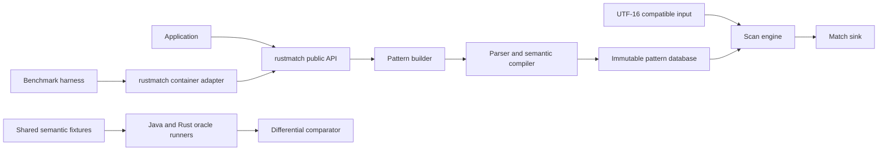

# rustmatch

[](LICENSE)

> **Status: design and compatibility planning.** There is no usable Rust
> matcher in this repository yet. The document below defines what must be true
> before `rustmatch` can honestly claim compatibility with
> [Java rmatch](https://github.com/la3lma/rmatch).

`rustmatch` is intended to be a native Rust implementation of the rmatch idea:
register many regular expressions once, compile them into shared matching
machinery, and scan large text inputs without running an independent full
search for every pattern.

The goal is semantic compatibility, not source-code similarity. The Java
implementation is the behavioral reference and an important source of lessons,
but the Rust implementation should use Rust's strengths: ownership, explicit
lifetimes, enums, dense integer-indexed storage, contiguous memory, fearless
parallelism, and a small public API. This is not a Java-to-Rust transliteration
project.

## TL;DR

### What we are building

- A pure Rust, Apache-2.0-licensed many-pattern regular-expression engine.
- A matcher with the same supported syntax and match-selection semantics as
  rmatch 2.x.
- A Rust-native API for building an immutable pattern database and reusing it
  across large inputs.
- A benchmark adapter that participates in the same correctness-gated,
  receipt-producing campaigns as Java rmatch, RE2/J, Java regex, and
  Hyperscan.
- An implementation designed from the data layout inward, not a mechanical
  port of Java classes.

### What "compatible" means

For the canonical compatibility input mode, Java rmatch and rustmatch must:

1. Accept and reject the same documented pattern language.
2. Produce the same multiset of `(pattern_id, start, end)` match events.
3. Report the longest match for each pattern and input start position.
4. Report matches from every eligible start position, including overlapping
   and nested matches.
5. Use half-open `[start, end)` offsets.
6. Apply the same ASCII definitions for shorthand classes and word boundaries,
   and the same Java single-UTF-16-unit case mapping.
7. Preserve the same build-then-scan lifecycle and failure boundaries where
   those are observable to callers.

Callback order is intentionally unspecified in both implementations and is not
part of compatibility. Rust API spelling and type structure are also not
expected to resemble Java API spelling.

There is one non-negotiable wrinkle: Java `char` and `String` positions are
UTF-16 code units, while Rust `str` is UTF-8. Exact parity therefore requires a
canonical UTF-16 compatibility input and UTF-16 offsets. The first stable API
must expose that fact honestly. An ergonomic UTF-8 facade may be added, but it
must not quietly relabel byte offsets as Java-compatible offsets.

### Intended API shape

This sketch communicates direction, not a frozen API:

```rust,ignore
use rustmatch::{MatcherBuilder, PatternId, Utf16Text};

let mut builder = MatcherBuilder::new();
builder.add(PatternId::new(1), "ERROR|WARN")?;
builder.add(PatternId::new(2), "user:[a-z]+")?;

let matcher = builder.build()?;
let input = Utf16Text::from_str("INFO user:alice WARN disk nearly full");

matcher.scan(&input, |hit| {
    println!(
        "pattern={} span={:?} text={}",
        hit.pattern_id(),
        hit.span(),
        input.decode(hit.span())?,
    );
    Ok(())
})?;
```

The lifecycle is explicit:

```text
register patterns -> build immutable matcher -> scan one or more inputs
```

No pattern mutation occurs while a compiled matcher is in use. A changed rule
set produces a new matcher.

### Definition of success

`rustmatch` is ready for a first stable release only when all of the following
are true:

- The shared semantic suite passes against Java rmatch for supported syntax,
  rejected syntax, edge cases, and generated cases.
- The Rust adapter passes the benchmark repository's correctness gate before
  any timing is retained.
- The implementation has no known input-dependent panics for valid public API
  use.
- The hot scan path performs no per-character heap allocation after warm-up.
- Single-threaded and parallel behavior are documented and tested.
- The public crate surface is small, documented, and does not expose compiler
  or automaton internals as accidental extension points.
- Every published performance claim links to reproducible receipts containing
  exact versions, inputs, hashes, machine information, and thread settings.

### Non-goals

- Recreating Java package structure or class hierarchy.
- Becoming a drop-in replacement for PCRE, `java.util.regex`, Rust `regex`,
  RE2, or Hyperscan.
- Supporting captures, backreferences, lookaround, or every regex dialect.
- Beating Hyperscan merely because both projects scan multiple patterns.
- Claiming streaming support before retention, lookback, and offset behavior
  have been specified and tested.
- Using `unsafe` as a substitute for a measured design.

---

## Product requirements document

### Document metadata

| Field | Value |
|---|---|
| Product | `rustmatch` |
| Status | Proposed |
| License | Apache License 2.0 |
| Behavioral reference | Java rmatch 2.x |
| Primary implementation language | Stable Rust |
| Primary workload | Many patterns reused over large text buffers |
| Primary quality order | Correctness, semantic parity, predictability, performance |

### Background

Conventional regex APIs are usually organized around one compiled expression
matching one input. That is excellent for the common case, but it creates a
poor scaling shape when an application must apply thousands of expressions to
the same large corpus. A straightforward loop repeatedly traverses the same
input, once per expression.

Java rmatch explores a different tradeoff. It registers a set of regular
expressions, compiles shared finite-automaton machinery, and scans the corpus
through a many-pattern pipeline. Recent exploratory measurements suggest that
this becomes useful as pattern sets and corpora grow, even though specialized
native engines still establish a much higher performance ceiling.

Rust is a natural language for a second implementation because the problem is
dominated by representation, locality, controlled allocation, and safe
parallel reads. A native Rust implementation can preserve the idea and
semantics while reconsidering every internal choice.

### Problem statement

Rust users do not currently have an implementation of rmatch's exact
many-pattern semantics that can be tested against the Java implementation and
inserted into the existing cross-engine benchmark harness. Reusing Java
through JNI would preserve code but not produce a native Rust engine, would
complicate deployment, and would conceal rather than answer the interesting
implementation questions.

We need a Rust-native library that:

- handles large, reusable pattern sets as one compiled database;
- reports the same matches as Java rmatch on its documented language;
- scales from a single worker to explicitly configured parallel execution;
- exposes enough input abstraction for future specialized buffers without
  making the ordinary string case awkward;
- can be measured fairly beside Java rmatch in the existing benchmark system.

### Product principles

1. **Semantics are a specification, not an anecdote.** Compatibility is
   established by shared fixtures and differential tests.
2. **Correctness precedes timing.** A fast run with the wrong match count is a
   rejected run.
3. **Rust-native does not mean Rust-different.** Internal design should be
   idiomatic Rust, while observable matching behavior remains compatible.
4. **Pay for what is used.** Assertions, Unicode handling, prefilters, and
   parallel execution must not impose their full cost on patterns that do not
   need them.
5. **Immutable after build.** Compilation and scanning are separate phases.
6. **No accidental public architecture.** Dense state tables, compiler stages,
   caches, and diagnostics stay private unless users have a demonstrated need.
7. **Receipts over adjectives.** Performance descriptions must be backed by
   versioned, reproducible evidence.
8. **Safe Rust first.** Any `unsafe` block requires a measured benefit, a
   documented invariant, focused tests, and independent review.

### Goals

#### G-1: Semantic compatibility

Implement the rmatch 2.x syntax and match-selection contract, including
overlap, longest-per-start behavior, line anchors, word boundaries, and the
documented ASCII-oriented character rules.

#### G-2: A native Rust product

Offer an API that feels normal to a Rust developer: builders, immutable
compiled values, typed identifiers, explicit errors, borrowed input where
possible, no global mutable engine state, and clear `Send`/`Sync` behavior.

#### G-3: Competitive many-pattern throughput

Build an architecture that can exploit shared automata, dense memory, literal
prefiltering, cache reuse, and pattern partitioning. Performance targets are
gates against regressions and against the Java reference, not promises made
before measurements exist.

#### G-4: Shared empirical infrastructure

Add rustmatch to
[rmatch-performance-measurements](https://github.com/la3lma/rmatch-performance-measurements)
using the same generated fixtures, containers, correctness checks, timing
boundaries, and receipt schema.

#### G-5: Maintainability

Keep the semantic model, compiler, execution engine, and optimization layers
separable enough that each can be tested without relying on incidental internal
state.

### Non-goals and deferred scope

| Item | Disposition |
|---|---|
| Capture groups and extraction | Not in the rmatch 2.x contract |
| Backreferences | Excluded; not regular-language machinery |
| Lookahead and lookbehind | Deferred and not compatibility promises |
| Lazy or possessive quantifiers | Deferred |
| Atomic groups | Deferred |
| Unicode property classes | Deferred |
| Locale-sensitive or multi-code-point folding | Deferred |
| Pure zero-width match reporting | Excluded from the 2.x contract |
| Mid-pattern or scoped flags | Deferred |
| Dynamic add/remove after build | Explicitly out of scope |
| Unbounded streaming | Requires a separate retention and lookback design |
| Stable automaton serialization | Potential later feature, not a first-release gate |
| C ABI, Python bindings, or WebAssembly API | Potential later projects |

### Users and jobs to be done

#### Application developer

Wants to register hundreds to tens of thousands of rules, scan large inputs,
receive pattern identity and spans, and avoid understanding automata internals.

#### Systems developer

Wants explicit control over parallelism, memory behavior, buffer ownership, and
failure propagation. May provide a specialized input implementation.

#### rmatch maintainer

Wants a second implementation that catches specification ambiguity and
behavioral bugs through differential testing.

#### Performance researcher

Wants a named, reproducible rustmatch engine lane in the cross-engine harness,
with compile time, scan time, throughput, memory, match counts, and exact
provenance.

#### Contributor

Wants a staged architecture, local correctness tests, focused benchmarks, and
clear rules for when an optimization is acceptable.

### Functional requirements

| ID | Requirement | Acceptance signal |
|---|---|---|
| FR-001 | Register a pattern with a stable caller-provided pattern ID | The ID is returned with every event from that registration |
| FR-002 | Register many patterns before build | Pattern count is limited by resources, not a small API ceiling |
| FR-003 | Build an immutable reusable matcher | Scanning cannot mutate the registered pattern set |
| FR-004 | Scan a canonical UTF-16-compatible input | Match offsets agree with Java rmatch on all shared fixtures |
| FR-005 | Report half-open spans | Every hit has `start <= end` and slices the intended text |
| FR-006 | Report longest match per pattern and start | `a+` over `aaa` reports `[0,3)`, `[1,3)`, `[2,3)` |
| FR-007 | Preserve independent pattern identity | `a` and `ab` may both report at the same start |
| FR-008 | Preserve distinct registrations | Distinct IDs or handlers remain distinguishable even for equal pattern text |
| FR-009 | Support the documented syntax table | Shared positive fixtures pass |
| FR-010 | Reject malformed and unsupported syntax at registration/build time | Shared negative fixtures fail before scanning |
| FR-011 | Remain usable after a rejected registration | A later valid registration can still be built |
| FR-012 | Support explicit single-thread execution | Results match the reference event multiset |
| FR-013 | Support explicit parallel pattern partitioning | Results match the single-thread event multiset |
| FR-014 | Propagate sink/callback failures | The scan returns the original or a documented wrapper error |
| FR-015 | Permit repeated scans with one compiled matcher | Results remain stable across inputs and repetitions |
| FR-016 | Expose a custom read-only input trait | External implementations can provide indexed symbols safely |
| FR-017 | Materialize ordinary Rust strings conveniently | The common path requires no custom trait implementation |
| FR-018 | Emit benchmark-runner JSON | Output can be archived as a standard benchmark receipt |

### Supported syntax baseline

The initial target is the documented Java rmatch 2.x surface:

| Family | Syntax and behavior |
|---|---|
| Literals | Exact sequences |
| Composition | Concatenation and `a|b` alternation |
| Repetition | `?`, `*`, `+`, `{m}`, `{m,n}`, `{m,}` |
| Groups | `(ab)` and `(?:ab)`, grouping only, no captures |
| Any symbol | `.` includes newline |
| Classes | `[abc]`, ranges, and negated classes |
| Shorthands | ASCII `\d`, `\w`, `\s` and complements |
| Anchors | `^` at input/line start, `$` at input/line end |
| Boundaries | ASCII `\b` and `\B` |
| Flags | Prefix `(?i)`, `(?s)`, combinations, and typed case-insensitive option |
| Escapes | Supported literal and control escapes from the reference contract |

Counted repetition is capped at 1,000 expanded repetitions unless a later
joint specification revision changes both implementations.

### Match semantics

The compatibility oracle compares normalized events. For a set of registered
patterns `P` and input `I`, an event is:

```text
(pattern_id, start_utf16, end_utf16)
```

For every pattern and every input start position:

1. Consider all legal consuming paths from that start.
2. If one or more paths accept, choose the greatest end position.
3. Emit one event for that pattern ID and start position.
4. Do not suppress events merely because another event overlaps or contains
   them.

Pure zero-width patterns emit no events. Assertions may constrain a consuming
match.

The event multiset is normative. Delivery order is not.

### Character and offset model

This is the first architectural decision that must be recorded formally.

Java rmatch consumes Java `char` values. Therefore its symbols and offsets are
UTF-16 code units, not Unicode scalar values and not UTF-8 bytes. A supplementary
Unicode character is two symbols to the Java engine.

The proposed canonical model is:

- `Symbol = u16`.
- `Position = u64` counting UTF-16 code units.
- Pattern text is parsed as UTF-16 code units, not as Rust Unicode scalar
  values. This preserves Java atom and quantifier behavior even around
  supplementary characters.
- The ordinary builder accepts `&str` and encodes it to canonical UTF-16 before
  parsing. A lower-level UTF-16 pattern entry point may admit isolated surrogate
  units for exhaustive compatibility testing.
- `Utf16Text` owns or borrows a stable sequence of `u16` symbols.
- `Utf16Text::from_str` encodes a Rust `&str` to UTF-16 once, outside the scan
  timing boundary.
- Match spans are UTF-16 spans and can always be decoded through the input.
- ASCII corpora have identical byte and UTF-16 offsets, which keeps the current
  benchmark scenarios straightforward.

An optional UTF-8-native facade may later maintain a checked mapping between
UTF-16 compatibility positions and UTF-8 byte ranges. If introduced, it must
make the coordinate system visible in types, for example `Utf16Span` versus
`ByteSpan`. No API may return an unqualified integer offset whose unit is
ambiguous.

### Public API requirements

The eventual public crate should expose concepts, not implementation layers:

- `MatcherBuilder`
- `Matcher`
- `PatternId`
- `PatternFlags`
- `Match` or `MatchEvent`
- `Utf16Text` and/or a carefully named compatibility input type
- a read-only `Input` trait
- parse/build/scan error types
- an explicit parallelism configuration

It should not expose:

- NFA or DFA node implementations;
- state-set caches;
- parser event handlers;
- prefilter internals;
- partition worker types;
- graph-printing helpers;
- storage arenas or node IDs other than diagnostic snapshots behind an
  unstable feature.

### Non-functional requirements

| ID | Requirement | Target or gate |
|---|---|---|
| NFR-001 | Correctness | Zero known differential failures in supported syntax |
| NFR-002 | Memory safety | Safe Rust by default; Miri-clean tests for unsafe-free core |
| NFR-003 | Allocation | No per-symbol heap allocation in steady-state scan |
| NFR-004 | Determinism | Same normalized event multiset across worker counts |
| NFR-005 | Reuse | Compiled matcher can scan repeatedly without rebuilding |
| NFR-006 | Concurrency | Immutable matcher is shareable when sink/input contracts permit |
| NFR-007 | Error quality | Parse errors include source span and actionable reason |
| NFR-008 | Observability | Optional aggregate diagnostics without hot-path logging |
| NFR-009 | Documentation | Every public item has rustdoc and at least one end-to-end example |
| NFR-010 | Toolchain | Stable Rust with an explicit MSRV policy before 1.0 |
| NFR-011 | Reproducibility | Published benchmark points have archived receipts |
| NFR-012 | Portability | Linux and macOS first; no architecture-specific correctness |
| NFR-013 | Dependency hygiene | Small dependency set, audited before releases |
| NFR-014 | Performance safety | Material regressions block optimization merges |

### Performance requirements

The project begins without invented throughput promises. Performance will be
specified as progressively stronger gates:

1. **Complexity gate:** no implementation path equivalent to scanning the
   complete corpus independently for every registered pattern.
2. **Allocation gate:** steady-state scan reuses scratch storage.
3. **Regression gate:** representative scenarios must not slow by more than the
   campaign's noise-aware threshold without an explicit tradeoff decision.
4. **Reference gate:** rustmatch should be competitive with Java rmatch on at
   least the workloads where shared many-pattern machinery is valuable.
5. **Scaling gate:** measure 1,000, 2,500, 5,000, 7,500, and 10,000 patterns on
   8 MiB and 50 MiB inputs, including thread sweeps.
6. **Honesty gate:** compile time, warm-up time, scan time, peak memory, match
   count, and total wall time remain separate metrics.

Hyperscan remains a native reference ceiling, not a promise that rustmatch will
match its specialized implementation or execution model.

### Benchmark interoperability requirements

The rustmatch runner must consume the benchmark project's existing generated
artifacts and emit one compact JSON object with at least:

- engine name and exact version or Git SHA;
- pattern count and preparation time;
- warm-up durations;
- scan durations and median;
- logical corpus throughput;
- observed matches per iteration;
- execution mode and worker count;
- process failure information.

The surrounding harness owns container identity, host metadata, input hashes,
expected counts, and receipt archival. A result is comparable only when input
hashes agree and expected and observed match counts agree.

### Release criteria

#### `0.1.0`: walking skeleton

- Public builder and scan API exists.
- Literals, concatenation, and alternation work.
- Java oracle comparison runs in CI.
- No performance claim.

#### `0.2.0`: semantic core

- Quantifiers, groups, classes, flags, anchors, and boundaries implemented.
- Positive and negative syntax matrices pass.
- Property and fuzz testing active.

#### `0.3.0`: engine architecture

- Dense state representation and reusable scratch buffers.
- Lazy deterministic-state cache or measured equivalent.
- Single-thread benchmark adapter accepted by the harness.

#### `0.4.0`: optimized and parallel

- Safe literal prefilter.
- Explicit pattern partitioning.
- Correctness parity across worker counts.
- Thread calibration receipts.

#### `1.0.0`: stable compatibility release

- Compatibility statement is backed by a versioned shared suite.
- Public API and MSRV are declared stable.
- Cross-engine benchmark campaign is reproducible.
- Security, dependency, documentation, and performance release gates pass.

### Risks and mitigations

| Risk | Consequence | Mitigation |
|---|---|---|
| UTF-16/UTF-8 ambiguity | False compatibility and unusable spans | Typed coordinate systems and a canonical UTF-16 oracle mode |
| Match semantics misunderstood | Plausible but wrong output | Golden fixtures plus differential event-multiset tests |
| Object model copied from Java | Poor locality and unidiomatic API | Architecture around dense IDs and arrays before porting behavior |
| Premature optimization | Complex wrong engine | Walking skeleton, reference interpreter, then measured optimization |
| Unsafe prefilter skips matches | Silent false negatives | Prefilter must prove necessity; differential bypass tests |
| Parallel callbacks differ | Nondeterminism or races | Normalize events in tests; explicit `Send`/`Sync` sink contracts |
| DFA state explosion | Unbounded memory | Lazy construction, budgets, metrics, and NFA fallback policy |
| Counted expansion blow-up | Build-time memory spikes | Enforce shared cap and fail early |
| Benchmark overfitting | Misleading claims | Several families, sizes, densities, corpora, and retained receipts |
| Dependency drift | Supply-chain or MSRV surprises | Minimal dependencies, lockfile, audit, and release checklist |
| Specification drift between repos | Implementations diverge | Versioned semantic fixtures consumed by both projects |

### Open product decisions

These require ADRs before their associated implementation lands:

1. Should the canonical `Utf16Text` always own `Vec<u16>`, or may it borrow a
   caller-owned UTF-16 slice?
2. Should the primary scan API invoke a sink during scanning, return an
   iterator, or offer both with different memory and ordering contracts?
3. Should parallel scanning invoke a shared concurrent sink or collect
   partition-local events and merge afterward?
4. What is the maximum supported explicit worker count, if any?
5. What state-cache budget and fallback behavior prevent pathological DFA
   growth?
6. Is compiled pattern database serialization worth stabilizing after 1.0?
7. What MSRV balances modern Rust facilities against adoption?

---

## Architecture

### Architectural thesis

The Java implementation demonstrates that the semantics and the many-pattern
pipeline work. Rustmatch should preserve those facts while changing the unit of
design from communicating heap objects to compact immutable tables plus
per-scan scratch state.

The architecture has four hard boundaries:

1. **Surface language:** parse and validate the documented regex dialect.
2. **Semantic compiler:** turn syntax into a context-aware finite automaton.
3. **Execution engine:** scan input and produce the normative event multiset.
4. **Optimization shell:** accelerate safe cases without changing the semantic
   engine's answers.

The unoptimized semantic path remains available in tests as an oracle. Every
optimization must be bypassable so its output can be compared with that path.

### System context



### Compile-time pipeline

```text
pattern text + flags
        |
        v
lexer/parser with source spans
        |
        v
validated HIR
        |
        v
normalization and bounded expansion
        |
        v
Thompson-style epsilon NFA fragments
        |
        v
shared NFA + terminal pattern sets
        |
        v
static analyses and literal hints
        |
        v
immutable PatternDatabase
```

#### Parser

Use a hand-written recursive-descent or precedence parser over canonical UTF-16
code units, with explicit source spans. The grammar is small enough that
generator complexity is not justified. The parser returns a typed AST and
never mutates automata directly.

Important properties:

- Quantifiers bind to the preceding atom, not an accumulated literal run.
- Unsupported constructs are recognized deliberately and get a specific
  error, rather than falling through as surprising literals.
- Inline flags are accepted only in the documented prefix position.
- Escapes and character-class ranges have focused validation.
- Parse errors retain canonical UTF-16 spans. When the source was a Rust
  `&str`, diagnostics map those spans back to UTF-8 byte ranges and display the
  offending fragment.

#### High-level intermediate representation

Normalize the AST into a smaller HIR:

```rust,ignore
enum Hir {
    Empty,
    Literal(Vec<u16>),
    Class(CharClassId),
    Any,
    Concat(Vec<Hir>),
    Alternate(Vec<Hir>),
    Repeat { node: Box<Hir>, min: u16, max: Option<u16> },
    Assert(Assertion),
}
```

This is illustrative. The actual representation should use arenas once sizes
justify them. HIR normalization should:

- flatten nested concatenations and alternations;
- combine adjacent literals;
- normalize flags into character predicates;
- enforce repetition bounds;
- compute nullable, minimum-length, and literal-hint properties;
- reject a pattern that can only produce a zero-width match.

#### NFA compiler

Use Thompson-style fragment construction because it is simple, auditable, and
well suited to a regular-language subset. Each node receives a dense integer
ID. Edges refer to IDs, not pointers or trait objects.

Suggested logical edge kinds:

```rust,ignore
enum Edge {
    Epsilon(StateId),
    Consume { class: CharClassId, target: StateId },
    Assert { kind: Assertion, target: StateId },
}
```

The stored form should be structure-of-arrays or compact adjacency slices,
chosen by measurement. Terminal states reference compact pattern-ID sets.

Patterns join a shared synthetic start. The compiler records enough ownership
metadata to partition patterns later without requiring runtime graph surgery.

#### Character classes

ASCII is the hot case and should have a direct representation. A candidate
layout is:

- a 128-bit ASCII membership mask;
- sorted inclusive UTF-16 ranges for non-ASCII code units;
- a negation flag or normalized complemented ranges;
- precomputed class IDs shared across patterns.

Do not assume that Rust `char` case operations match Java's single-`char`
mapping. Compatibility folding needs a generated or explicitly verified
UTF-16-code-unit mapping, with exhaustive tests over all 65,536 values.

### Pattern database

`PatternDatabase` is immutable after construction and owns:

- dense NFA tables;
- interned character classes;
- terminal pattern-ID sets;
- context-assertion metadata;
- safe literal hints;
- start-state acceleration tables;
- lazily initialized deterministic-state cache configuration;
- partition assignment metadata;
- diagnostic counters that do not affect results.

It should be cheap to share through `Arc<Matcher>` only when sharing is needed;
the API should not force an extra atomic reference count into every use.

### Execution model

#### Semantic baseline

The first correct engine should be a lock-step NFA interpreter with dense
state sets. It is not expected to be the final fast engine. It is expected to
be obviously correct and useful as an independent oracle for optimized paths.

At each input position, the engine:

1. Introduces a new candidate start when the start closure can consume the
   current symbol.
2. Advances candidates already in flight.
3. Evaluates context assertions using previous, current, and next symbols.
4. Records the greatest accepting end for each pattern and start.
5. Emits a result only when no path for that pattern/start can extend farther,
   or at end of input.

The implementation must avoid a heap object per candidate. Candidate frontiers
should use reusable vectors, generation-marked arrays, compact bitsets, or a
measured hybrid.

#### Lazy determinization

The production direction is a lazy DFA-like cache over NFA state subsets:

- A deterministic state is a sorted dense set or bitset of NFA state IDs.
- Transitions are computed on demand and cached.
- The state key includes context only when assertion-sensitive closure depends
  on it.
- ASCII transitions use direct indexed tables after materialization.
- Non-ASCII transitions use compact maps or range dispatch.
- Cache size and hit/miss/state counts are observable.
- A budget prevents uncontrolled state growth; fallback remains semantically
  exact.

Whether the final engine is best described as lazy DFA, tagged NFA, or a hybrid
is an empirical decision. The semantic interfaces should permit alternatives.

#### Match tracking

The difficult output rule is not merely acceptance. The engine must retain the
best end for each `(pattern_id, start)` until that candidate is unable to
extend. A Rust-native design should avoid Java-style nested match objects.

Candidate representations to prototype:

1. A frontier per start with compact active-state and terminal-pattern sets.
2. A ring of start slots whose storage is recycled once all paths die.
3. Batched starts sharing the same deterministic state, with start-position
   vectors.
4. Terminal deltas that update only pattern IDs newly final at a transition.

Each prototype must pass the same oracle before performance comparison.

### Assertions and context

`^`, `$`, `\b`, and `\B` are zero-width assertions that constrain consuming
matches. They belong in epsilon closure and terminal evaluation, not in a
post-hoc filter.

At position `i`, the engine can derive a small context class from:

- beginning/end of input;
- whether the previous symbol is newline;
- whether the next symbol is newline;
- whether adjacent symbols satisfy ASCII `\w`.

Only states whose closure reaches assertion edges need context-sensitive cache
keys. Pattern sets without assertions should retain the simpler hot path.

### Literal prefilter

A literal prefilter may skip impossible start positions, but false negatives
are never acceptable. The architecture therefore separates:

- extraction of a necessary literal and its offset constraints;
- proof that the hint is safe for the complete pattern;
- multi-literal scanning;
- mapping hits back to candidate starts and pattern IDs;
- the semantic engine, which verifies all candidates.

The first implementation can run without a prefilter. Later work should begin
with a simple native Aho-Corasick trie or another measured multi-literal
structure. External crates may be evaluated, but adding one must not blur
compatibility, licensing, or receipt provenance.

Every prefiltered test must also run with prefiltering disabled and compare the
complete normalized event multiset.

### Parallelism

Java rmatch partitions patterns and lets each worker scan the same immutable
input. Rustmatch should begin with the same coarse strategy because it is easy
to reason about and benchmark-compatible:

1. Assign patterns deterministically to `N` partitions.
2. Build one immutable engine database per partition or one database with
   partition views, whichever measures better.
3. Scan the same read-only input concurrently.
4. Invoke a thread-safe sink or accumulate partition-local events.
5. Return after every partition completes or a documented failure policy has
   resolved.

The default worker heuristic is a convenience, not a performance truth. The
API must permit explicit worker counts, and the benchmark harness must sweep
them independently for each scenario. No low arbitrary cap should exclude
high-core-count servers.

Future work may partition inputs, states, or both, but only after boundary
semantics and duplicate suppression are proven.

### Input architecture

The compatibility input trait should express randomly addressable UTF-16 code
units without requiring a total length:

```rust,ignore
pub trait Input: Sync {
    fn symbol_at(&self, position: u64) -> Option<u16>;

    fn decode(&self, span: Utf16Span) -> Result<String, InputError>;
}
```

This sketch leaves room for:

- owned UTF-16 text;
- borrowed UTF-16 slices;
- materialized Rust strings;
- memory-mapped or file-backed content;
- bounded-window inputs with a documented decode retention window.

It does not claim that an infinite stream can support arbitrary lookback or
substring recovery. A maximum-lookback stream adapter is a separate product
decision.

### Error architecture

Use typed, non-panicking errors for expected failure:

- `ParseError` with span and reason;
- `BuildError` for limits and resource constraints;
- `InputError` for unavailable or invalid ranges;
- `ScanError<E>` preserving a sink's error;
- `ConfigurationError` for invalid parallelism or budgets.

Internal invariants may use debug assertions. Public input must not cause an
uncontrolled panic.

### Allocation and ownership

- Compilation owns arenas and immutable tables.
- Each scan owns or borrows scratch buffers from a pool scoped to the matcher.
- Workers never mutate shared automaton tables.
- Scratch buffers are cleared and reused, not repeatedly allocated.
- Pattern IDs are caller values or compactly mapped IDs; strings do not appear
  in the hot loop.
- Match text is decoded only when the caller asks for it.
- Instrumentation is aggregated counters, not per-transition logging.

### Dependency policy

Start with `std` for the semantic core. Candidate development dependencies
include:

- [proptest](https://docs.rs/proptest/) for generated semantic cases;
- [cargo-fuzz](https://rust-fuzz.github.io/book/) for parser and engine fuzzing;
- [Criterion.rs](https://docs.rs/criterion/) for focused microbenchmarks.

Rayon, specialized hash maps, bit-vector crates, Aho-Corasick crates, and
allocator helpers should be introduced only after a local prototype shows a
clear benefit. Every dependency must have compatible licensing, active
maintenance, an acceptable MSRV, and a documented reason to exist.

### Observability

An optional diagnostic snapshot may expose aggregate facts without exposing
internal types:

- parsed and accepted pattern counts;
- NFA states and edges;
- deterministic states materialized;
- state-cache hits, misses, and evictions;
- prefilter enabled/bypassed and candidate positions produced;
- partitions and worker count;
- scratch high-water marks;
- build and scan durations when explicitly requested.

Diagnostics are disabled or near-zero-cost by default. They are not part of
match semantics.

### Proposed repository layout

```text
rustmatch/
  Cargo.toml
  Cargo.lock
  crates/
    rustmatch/                 # Small stable library API
    rustmatch-core/            # Private semantic compiler and engine
    rustmatch-compat/          # Shared-fixture and Java-oracle tooling
    rustmatch-bench-adapter/   # JSON runner for benchmark containers
    rustmatch-cli/             # Optional diagnostics and manual use
  fixtures/
    semantics/                 # Versioned positive/negative shared cases
  fuzz/
    fuzz_targets/
  benches/
  docs/
    adr/
    architecture/
    compatibility/
  README.md
  LICENSE
```

Use a Cargo workspace so members share a lockfile, target directory, metadata,
and lint policy. Keep `rustmatch-core` unpublished or private until there is a
real reason to make it an extension surface.

### Required architecture decision records

| ADR | Decision |
|---|---|
| ADR-0001 | Canonical UTF-16 symbol and offset model |
| ADR-0002 | Normative match-event selection and ordering exclusions |
| ADR-0003 | Public builder, input, and sink API |
| ADR-0004 | AST/HIR and Thompson NFA representation |
| ADR-0005 | Lazy determinization and cache budget |
| ADR-0006 | Assertion context and pay-for-use strategy |
| ADR-0007 | Literal prefilter safety contract |
| ADR-0008 | Pattern partitioning and failure propagation |
| ADR-0009 | `unsafe` admission and review policy |
| ADR-0010 | Benchmark adapter and receipt contract |

---

## Detailed implementation plan

This plan uses Alistair Cockburn's use-case style: actors and interests first,
then goal-level use cases with preconditions, guarantees, a main success
scenario, and named extensions. The delivery sequence afterward turns those
use cases into tested increments.

### System boundary

The system under design is the Rust workspace and its public library API. Java
rmatch is outside the system and acts as a semantic oracle. The benchmark
repository is outside the system and invokes a rustmatch adapter.

### Actors

| Actor | Kind | Interest |
|---|---|---|
| Application developer | Primary human | Correct, simple many-pattern matching |
| Pattern author | Supporting human | Clear syntax and useful rejection errors |
| Specialized input author | Supporting human | Stable minimal input trait |
| Benchmark harness | Primary system | Repeatable machine-readable runs |
| Java rmatch oracle | Supporting system | Normative compatibility comparison |
| Worker runtime | Supporting system | Parallel execution and clean shutdown |
| Maintainer | Primary human | Safe evolution and measurable performance |

### Use-case catalog by level

Cockburn's levels are used informally:

- **Cloud:** why the product exists.
- **Sea:** user-goal interactions.
- **Fish:** subfunctions used by sea-level cases.

| ID | Level | Goal |
|---|---|---|
| UC-0 | Cloud | Apply a large reusable rule set to large text efficiently |
| UC-1 | Sea | Build a matcher from many patterns |
| UC-2 | Sea | Scan an input and consume matches |
| UC-3 | Sea | Prove compatibility with Java rmatch |
| UC-4 | Sea | Run a reproducible cross-engine benchmark |
| UC-5 | Sea | Configure and run parallel matching |
| UC-6 | Sea | Supply a custom input implementation |
| UC-7 | Sea | Diagnose a rejected pattern |
| UC-8 | Fish | Parse and normalize one pattern |
| UC-9 | Fish | Compile shared automata |
| UC-10 | Fish | Evaluate assertions at a position |
| UC-11 | Fish | Prefilter safe candidate starts |
| UC-12 | Fish | Track and commit longest matches |

### UC-0: Apply a large reusable rule set to large text efficiently

**Scope:** rustmatch product  
**Level:** cloud  
**Primary actor:** application developer

**Stakeholders and interests**

- The developer wants correct results and aggregate throughput without
  orchestrating thousands of independent regex scans.
- Operations wants bounded, observable resource use.
- Maintainers want semantics that can be tested independently of the current
  optimization strategy.

**Preconditions**

- The workload fits the documented regular-language subset.
- Inputs can be represented through the canonical or custom input contract.

**Minimal guarantees**

- Invalid patterns do not become silently different patterns.
- A failed scan does not corrupt the compiled matcher.

**Success guarantees**

- Every eligible match event is delivered exactly once per registration.
- The matcher can be reused for later inputs.
- Performance and resource characteristics are inspectable through explicit
  diagnostics and external receipts.

**Trigger**

- The application has a stable pattern set and one or more inputs to scan.

**Main success scenario**

1. The developer registers patterns and identifiers.
2. Rustmatch validates and compiles an immutable matcher.
3. The developer supplies an input and event sink.
4. Rustmatch scans with the configured execution mode.
5. The sink receives matches with typed half-open spans.
6. Rustmatch returns success and remains reusable.

**Extensions**

- 2a. A pattern is unsupported: reject it with a source-spanned error; allow
  the builder to continue with corrected input.
- 4a. The sink fails: stop according to the documented partition policy and
  return the sink error.
- 4b. A resource budget is exhausted: use an exact fallback or return a
  documented build/scan error; never return partial success as complete.

### UC-1: Build a matcher from many patterns

**Scope:** rustmatch library  
**Level:** sea  
**Primary actor:** application developer

**Stakeholders and interests**

- The developer wants one error to identify the exact bad registration.
- The engine wants immutable, compact, optimization-ready tables.
- The benchmark harness wants preparation time separated from scan time.

**Preconditions**

- A builder exists and has not been consumed by `build`.
- Each pattern has a stable identity.

**Minimal guarantees**

- Failed registration leaves the builder in a documented usable state.
- No partially compiled matcher escapes.

**Success guarantees**

- The returned matcher contains exactly the accepted registrations.
- All automaton and prefilter data are internally consistent and immutable.

**Trigger**

- The developer calls `build` after registration.

**Main success scenario**

1. Validate builder configuration and worker count.
2. Parse every pattern into a source-spanned AST.
3. Normalize each AST into HIR and derive static properties.
4. Compile HIR fragments into dense NFA tables.
5. Join fragments under shared partition starts.
6. Intern character classes and terminal pattern sets.
7. Derive safe literal hints and start tables.
8. Validate internal invariants.
9. Return an immutable matcher and build diagnostics.

**Extensions**

- 2a. Syntax is malformed: return `ParseError` with pattern ID and span.
- 3a. Counted repetition exceeds 1,000: return a bounded-expansion error.
- 3b. Pattern is pure zero width: reject it explicitly.
- 4a. State count exceeds an implementation limit: return `BuildError`, not
  wraparound or panic.
- 7a. No universally safe literal exists: omit prefiltering for that pattern
  or partition.

**Technology and data variations**

- Single partition versus deterministic multi-partition build.
- Owned pattern strings versus borrowed registration followed by owned HIR.

**Frequency:** once per rule-set revision, reused for many scans.

### UC-2: Scan an input and consume matches

**Scope:** rustmatch library  
**Level:** sea  
**Primary actor:** application developer

**Preconditions**

- Matcher build succeeded.
- Input satisfies `Input` and remains stable for the call.
- Sink satisfies the execution mode's thread-safety contract.

**Minimal guarantees**

- No event outside the input bounds is delivered.
- Sink errors are not swallowed.
- Scratch state is reset before reuse.

**Success guarantees**

- Delivered event multiset satisfies the normative match semantics.
- The matcher can scan another input afterward.

**Trigger**

- The developer invokes `scan`.

**Main success scenario**

1. Acquire or initialize per-scan scratch storage.
2. Read input positions in increasing order.
3. Derive assertion context for each position.
4. Advance active candidate frontiers.
5. Start candidates allowed by start tables and any safe prefilter.
6. Update longest terminal ends by pattern and start.
7. Commit events whose paths can no longer extend.
8. Flush remaining final events at end of input.
9. Return scratch storage and report success.

**Extensions**

- 1a. Scratch allocation fails: return resource failure before scanning.
- 2a. Custom input reports an error: return `InputError` and do not claim a
  complete result.
- 5a. Prefilter is unavailable or unsafe: use the unfiltered semantic path.
- 7a. Sink fails: stop according to policy and preserve the original error.
- 8a. End-of-input satisfies `$` or a boundary: evaluate terminal context
  before flush.

**Technology and data variations**

- Direct ASCII transition table versus non-ASCII range dispatch.
- NFA baseline versus lazy deterministic cache.
- Immediate sink calls versus partition-local collection.

**Frequency:** potentially millions of scans per compiled matcher.

### UC-3: Prove compatibility with Java rmatch

**Scope:** compatibility tooling  
**Level:** sea  
**Primary actor:** maintainer

**Stakeholders and interests**

- Users want "compatible" to have a reproducible meaning.
- Java maintainers want discrepancies to reveal specification ambiguities, not
  merely Rust bugs.

**Preconditions**

- Named Java rmatch and rustmatch versions are available.
- A shared fixture has patterns, input, expected acceptance, and coordinate
  mode.

**Minimal guarantees**

- A harness or process failure is not reported as semantic agreement.
- Input and pattern hashes are retained.

**Success guarantees**

- Both engines accept or reject the same patterns.
- Accepted runs produce identical sorted event multisets.

**Trigger**

- CI, a semantic change, fuzz minimization, or release preparation.

**Main success scenario**

1. Materialize canonical UTF-16 fixture inputs.
2. Run the Java oracle in a pinned container/JDK.
3. Run rustmatch in a pinned container/toolchain.
4. Normalize outputs to `(pattern_id, start, end)`.
5. Sort and compare event multisets.
6. Store the fixture, versions, hashes, and result.

**Extensions**

- 2a/3a. One parser rejects: compare rejection class and fixture expectation.
- 5a. Outputs differ: minimize the pattern/input pair and retain a regression
  fixture before changing code.
- 5b. Java behavior contradicts the written contract: stop and resolve the
  specification; do not blindly clone an accidental bug.

**Frequency:** every pull request touching parser, compiler, or engine.

### UC-4: Run a reproducible cross-engine benchmark

**Scope:** rustmatch adapter plus benchmark repository  
**Level:** sea  
**Primary actor:** benchmark harness

**Preconditions**

- Scenario fixtures have been generated.
- Container image and engine version are pinned.
- Correctness expectation is known.

**Minimal guarantees**

- Compile and scan timing are not silently combined.
- A match-count mismatch invalidates timing.

**Success guarantees**

- Runner emits valid JSON metrics.
- Harness archives a receipt with full provenance.
- The result is comparable under the benchmark contract.

**Trigger**

- A campaign requests the rustmatch engine lane.

**Main success scenario**

1. Read pattern TSV and corpus files without changing bytes.
2. Build rustmatch outside scan timing.
3. Perform configured untimed warm-ups.
4. Execute configured timed repetitions.
5. Apply equivalent minimal callback work.
6. Verify the match count for every iteration.
7. Emit preparation time, scans, median, throughput, count, and mode.
8. Let the harness enrich and archive the receipt.

**Extensions**

- 1a. Scenario syntax exceeds the intersection: mark lane incomparable.
- 4a. Runtime variance is excessive: retain raw data and rerun; do not cherry
  pick one fast iteration.
- 6a. Count differs: fail the run and preserve diagnostics, not a chart point.

**Frequency:** every performance-sensitive change and release candidate.

### UC-5: Configure and run parallel matching

**Scope:** rustmatch library  
**Level:** sea  
**Primary actor:** systems developer

**Preconditions**

- Worker count is positive and supported by available resources.
- Input supports concurrent reads.

**Minimal guarantees**

- Worker failure cannot deadlock the caller.
- A partially failed scan is not reported as complete success.

**Success guarantees**

- Event multiset equals single-thread execution.
- Worker resources are reclaimed at matcher drop or explicit shutdown.

**Trigger**

- Build configuration requests more than one partition.

**Main success scenario**

1. Deterministically assign registrations to partitions.
2. Prepare partition engines.
3. Start at most the configured workers for a scan.
4. Let each worker scan the same immutable input.
5. Deliver to a concurrent sink or gather partition-local results.
6. Join all workers.
7. Return success if all partitions succeeded.

**Extensions**

- 3a. Runtime cannot create workers: fail before producing scan events where
  possible.
- 4a. One worker fails: signal cancellation, join all workers, and return the
  documented first/aggregate error.
- 5a. Sink is not thread-safe: use local collection and merge, or reject that
  execution mode at the type/API boundary.

**Frequency:** common in throughput-oriented deployments.

### UC-6: Supply a custom input implementation

**Scope:** rustmatch public API  
**Level:** sea  
**Primary actor:** specialized input author

**Preconditions**

- Input can provide stable UTF-16 symbols by position.
- Its retention and decoding behavior are documented.

**Minimal guarantees**

- Rustmatch does not assume a hidden total length.
- Rustmatch does not retain borrowed symbols beyond the scan call.

**Success guarantees**

- The custom input produces the same events as materialized text for retained
  content.

**Main success scenario**

1. Author implements `Input` and `Sync` as required.
2. Tests compare it with `Utf16Text` on the same content.
3. Matcher scans using positional reads.
4. Sink decodes spans within the input's retention contract.

**Extensions**

- 3a. Input fetch fails: propagate `InputError`.
- 4a. Requested text fell outside a bounded lookback window: decoding fails
  explicitly while span reporting remains meaningful.

### UC-7: Diagnose a rejected pattern

**Scope:** parser and public error API  
**Level:** sea  
**Primary actor:** pattern author

**Success guarantee**

- Error identifies pattern ID, source span, category, and a concise corrective
  message.

**Main success scenario**

1. Parser encounters malformed or unsupported syntax.
2. Parser records the smallest useful source span.
3. Public error attaches pattern identity.
4. Display output shows the pattern fragment and reason.
5. Builder remains usable for correction or additional registrations.

**Examples**

- `a**`: second quantifier has no quantifiable atom.
- `(?i:a)`: scoped flags are unsupported.
- `a{1001}`: expansion exceeds the compatibility cap.
- `^$`: pure zero-width match reporting is unsupported.

### Delivery strategy

Every increment must be vertically testable. Do not build every parser feature,
then every compiler feature, then discover late that the event model is wrong.
Each increment ends with a working path from pattern text to normalized events.

### Increment 0: Freeze the semantic charter

**Purpose:** Remove ambiguity before performance code exists.

**Deliverables**

- Import or mirror the versioned rmatch syntax and semantics document.
- ADR-0001 for UTF-16 symbols and typed offsets.
- ADR-0002 for match event selection.
- Machine-readable fixture schema.
- Java oracle CLI emitting sorted JSONL events and structured rejection data.
- Initial fixture families for overlap, longest match, anchors, boundaries,
  flags, escapes, invalid syntax, and supplementary Unicode code points.

**Tests**

- Java oracle fixtures are internally stable across repeated runs.
- Fixture hashes and schema validation run in CI.

**Exit criteria**

- A human can answer exactly what `a+` over `aaa` emits.
- A human can answer what offset an emoji occupies.
- Every deliberate exclusion has a negative fixture.

### Increment 1: Rust workspace and walking skeleton

**Purpose:** Establish build, quality, and end-to-end boundaries.

**Deliverables**

- Cargo workspace with resolver and workspace lints.
- `rustmatch`, `rustmatch-core`, `rustmatch-compat`, and benchmark-adapter
  placeholders.
- CI for format, Clippy, tests, rustdoc, MSRV candidate, and license checks.
- Public builder that accepts literal patterns.
- `Utf16Text`, typed spans, pattern IDs, and a collecting sink.
- Naive but correct literal scan producing normalized events.

**Tests**

- Prepare / Test / Assert structure in focused tests.
- Literal overlap and duplicate-ID policy.
- Empty input and non-BMP text.
- Public rustdoc example compiled as a test.

**Exit criteria**

- One command runs the complete workspace gate.
- A literal fixture agrees with Java oracle.
- No benchmark performance claim is made.

### Increment 2: Parser and HIR

**Purpose:** Implement the language independently of automata.

**Deliverables**

- Source-spanned lexer/parser.
- Typed AST and normalized HIR.
- Static properties: nullable, minimum consumed length, assertion presence,
  and candidate necessary literals.
- Specific unsupported-syntax errors.
- Exact repetition cap behavior.

**Tests**

- Table-driven positive and negative syntax matrix.
- Quantifier-binding regressions such as `ab?`.
- Character-class and escape boundaries.
- Exhaustive prefix-flag placement cases.
- Parser fuzz target that may return success or typed error but never panic.

**Exit criteria**

- Parser acceptance agrees with Java on the shared syntax suite.
- HIR snapshots are stable enough for compiler tests but not public API.

### Increment 3: Thompson NFA compiler

**Purpose:** Produce an obviously correct shared finite automaton.

**Deliverables**

- Dense state IDs and compact edge storage.
- Fragment builders for every consuming HIR node.
- Epsilon closure.
- Terminal pattern-ID sets.
- Shared start per partition.
- Invariant checker available in tests/debug builds.

**Tests**

- Unit tests per HIR node.
- Graph invariants: valid IDs, reachable terminals, no dangling slices.
- Multiple patterns sharing literal prefixes.
- Property test comparing NFA language acceptance to a tiny HIR interpreter
  for bounded generated inputs.

**Exit criteria**

- All non-assertion semantic fixtures pass through the NFA baseline.
- Compiler has no public node types.

### Increment 4: Longest-match execution

**Purpose:** Implement rmatch's distinguishing reporting semantics.

**Deliverables**

- Per-scan candidate frontier.
- Longest terminal tracking by pattern and start.
- Safe commit when candidates cannot extend.
- Event sink and collecting convenience API.
- Reusable scratch buffers.

**Tests**

- `a+` over `aaa` exact event set.
- Same-start independent patterns.
- Nested and overlapping matches.
- Ambiguous alternation with different accepting lengths.
- Repeated scans and sink failure recovery.

**Performance checks**

- Allocation profile confirms no per-symbol heap allocation after warm-up.
- Record baseline throughput without setting a release promise.

**Exit criteria**

- Event multisets agree with Java for all non-assertion fixtures.

### Increment 5: Assertions and exact character behavior

**Purpose:** Complete semantic parity.

**Deliverables**

- Assertion edges for beginning/end of line and word/non-word boundary.
- Context classification using adjacent UTF-16 code units.
- Context-sensitive epsilon closure only where required.
- Exact ASCII shorthand classes.
- Verified Java-compatible single-code-unit case folding.

**Tests**

- Assertions at input edges, line edges, alternations, and groups.
- Adversarial cases where one alternative fails an assertion and another
  remains valid.
- Exhaustive ASCII shorthand and boundary table.
- Exhaustive 65,536-code-unit folding comparison with a generated Java oracle.
- Assertion-free benchmark verifies pay-for-use isolation.

**Exit criteria**

- Entire shared semantic suite passes.
- No assertion-related post-hoc match killing exists.

### Increment 6: Lazy deterministic-state cache

**Purpose:** Improve locality and avoid repeatedly interpreting NFA edges.

**Deliverables**

- Canonical state-set representation prototypes.
- On-demand transition materialization.
- Direct ASCII transition path.
- Cache statistics and configurable budget.
- Exact NFA fallback on budget pressure.

**Experiment sequence**

1. Sorted `Vec<StateId>` key.
2. Dense bitset for state counts where it wins.
3. Hybrid small-vector/bitset if measurements justify complexity.
4. Hashing and interning strategy comparison.

**Tests**

- Every optimized run compared with NFA baseline output.
- Forced tiny cache budgets and eviction/fallback.
- Context-sensitive and context-free key separation.
- Property tests across random pattern/input sets.

**Performance gate**

- Merge only a representation that improves representative scans without a
  material regression in build time or memory.

### Increment 7: Safe start acceleration and literal prefilter

**Purpose:** Avoid starting work where a match is impossible.

**Deliverables**

- One- and two-symbol start tables.
- Necessary-literal extractor with proof metadata.
- Native multi-literal prefilter prototype.
- Candidate-position and pattern mapping.
- Automatic bypass for assertions or patterns without safe hints.

**Tests**

- Prefilter on/off differential suite.
- Patterns where a tempting literal is not actually necessary.
- Alternation, optional prefix, repetition, and case-folding adversaries.
- Corpus ending inside a literal.
- Mixed filterable/unfilterable pattern sets.

**Performance gate**

- Activation threshold is measured across pattern counts and corpus sizes.
- A prefilter that helps 10,000 literals but harms mixed 1,000-pattern cases is
  activated selectively, not universally.

### Increment 8: Parallel pattern partitions

**Purpose:** Expose scalable throughput without changing results.

**Deliverables**

- Explicit worker/partition configuration.
- Deterministic partition assignment.
- Worker runtime and clean teardown.
- Defined sink error and cancellation behavior.
- Optional partition-local collection path.

**Tests**

- Event multiset equality for worker counts 1, 2, 3, CPU count, and oversubscribed
  values.
- Sink failures in every partition.
- Repeated creation/drop to detect worker leaks.
- Thread sanitizer or Loom-style model tests where practical.

**Performance gate**

- Run scenario-specific thread sweeps; never assume core count or 1.5 times
  core count is universally optimal.
- Record memory bandwidth saturation and compile-memory cost.

### Increment 9: Benchmark harness integration

**Purpose:** Make rustmatch a first-class cross-engine lane.

**Deliverables**

- Minimal benchmark runner binary.
- Container image pinned to Rust toolchain and crate/Git version.
- Make targets or harness commands parallel to existing engines.
- Receipt parser support for rustmatch.
- Single-thread and calibrated-throughput lanes.

**Campaigns**

- Pattern counts: 1,000, 2,500, 5,000, 7,500, 10,000.
- Corpus sizes: 8 MiB and 50 MiB.
- Families: diverse literals and the validated mixed-regex intersection.
- Match densities: zero, sparse, and denser controlled cases.
- Modes: NFA baseline, optimized single-thread, and calibrated parallel.

**Exit criteria**

- Every retained rustmatch receipt passes expected match count.
- Plots can include rustmatch without a one-off data conversion.
- Exact worker counts and engine version are available in the campaign record.

### Increment 10: Hardening

**Purpose:** Turn a promising engine into a dependable library.

**Deliverables**

- Property tests expanded beyond parser grammar.
- Fuzz targets for parser, compiler, scan, and oracle differential behavior.
- Miri lane for core tests.
- Dependency audit and license report.
- Memory and cache-budget soak tests.
- Panic policy audit.
- Complete public rustdoc and examples.

**Adversarial families**

- Deeply nested groups up to a configured parser limit.
- Alternation and repetition combinations aimed at state growth.
- Long common prefixes and suffixes.
- Assertion-dense patterns.
- All-invalid and mixed-validity registrations.
- Supplementary Unicode and unmatched surrogate code units in raw UTF-16
  inputs.
- Sink failure after zero, one, and many delivered events.

**Exit criteria**

- No known correctness discrepancy is waived as "just an edge case."
- Every resource limit fails explicitly.

### Increment 11: Release preparation

**Purpose:** Publish only what the project can support.

**Deliverables**

- Compatibility matrix naming Java rmatch reference version.
- Stable API review and public-surface audit.
- MSRV declaration and CI lane.
- SemVer and deprecation policy.
- Changelog and migration notes.
- crates.io name and ownership verification.
- Reproducible package contents via `cargo package --list`.
- Signed tag and GitHub release.
- Benchmark campaign for the exact release artifact.

**Release gate**

- The packaged crate, not merely the worktree, passes unit, semantic,
  integration, rustdoc, and benchmark smoke tests.
- Documentation describes limitations as prominently as strengths.

### Pull-request protocol

Every behavior or performance change should follow this sequence:

1. **Prepare:** add or identify a failing fixture, property, or benchmark.
2. **Test:** run the smallest focused test, then the full semantic suite.
3. **Assert:** state the expected event multiset or performance gate explicitly.
4. Implement the smallest coherent change.
5. Run format, Clippy, tests, rustdoc, and fuzz smoke lanes.
6. For hot-path changes, run the benchmark regression campaign on the
   designated machine.
7. Compare receipts, not console impressions.
8. Update ADRs and this plan when architecture changes.

Performance work must include correctness evidence. Correctness work that
touches the hot path must include performance evidence.

### Definition of done for an implementation task

- Public behavior is documented.
- Focused tests use explicit Prepare / Test / Assert comments where that makes
  multi-stage intent easier to review.
- Differential fixtures exist when Java compatibility is relevant.
- Error behavior is tested, not inferred.
- No new public item exists without rustdoc.
- No new dependency exists without rationale and license/MSRV review.
- No `unsafe` exists without a local safety argument and benchmark receipt.
- Full workspace gate passes.
- Performance-sensitive changes pass the agreed regression threshold.

### Immediate next actions

1. Review and approve the UTF-16 compatibility model.
2. Convert the Java syntax/semantics document into a versioned shared fixture
   schema.
3. Specify the Java oracle JSONL protocol.
4. Create the Cargo workspace and walking-skeleton API.
5. Implement literals end to end before broadening syntax.
6. Add a placeholder rustmatch engine adapter to the benchmark repository.

---

## Relationship to Java rmatch

Java rmatch remains an independent implementation and the initial behavioral
reference. Rustmatch should credit its concepts and lessons while avoiding two
bad outcomes:

- copying internal Java artifacts that Rust does not need;
- changing observable semantics merely because a different behavior is easier
  in Rust.

When the written contract, Java behavior, and a sensible Rust design disagree,
the disagreement must become an explicit specification decision and regression
fixture. Compatibility is a maintained relationship, not a one-time porting
milestone.

## License

Copyright 2026 Bjorn Remseth.

Licensed under the [Apache License, Version 2.0](LICENSE).
