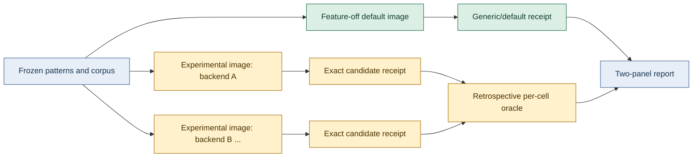

# Default and experimental benchmark products

**Status:** contract and runners implemented; first exclusive-host campaign pending

**Applies to:** public comparisons produced after 2026-08-07

**Historical evidence:** unchanged and labeled under its original protocol

## Purpose

Rustmatch publishes two intentionally different benchmark products.

1. **Rustmatch generic/default** measures the ordinary public `MatcherBuilder`
   with its defaults. It is the robust answer to “what should a user expect
   without workload-specific tuning?”
2. **Rustmatch experimental oracle** retrospectively selects the fastest exact
   opt-in backend for each measured expression/corpus cell. It answers “what
   has this implementation demonstrated when an expert chooses for this exact
   workload?” It is a capability showcase, not an automatic-selector claim.

The experimental product is deliberately unfair in Rustmatch's favor. That is
acceptable only because the unfairness is visible in the product name,
receipts, charts, tables, and prose.

## Separation model

The default image is built without experimental Cargo features. Every
experimental backend is measured separately. A report may select a winner only
from passing exact candidate receipts for the same frozen cell. It must retain
all candidates, including slower candidates and explicit ineligibility.

## Generic/default contract

- Engine identity: `rustmatch-rust-default`.
- Benchmark product: `generic-default-v1`.
- Builder: exactly `MatcherBuilder::new()`, pattern registration, then
  `build()`; no worker, cache, prefilter, cohort, or experimental override.
- Cargo features: no experimental feature.
- Selection policy: `none-default-settings`.
- Claims: general behavior over the published matrix, subject to the matrix's
  documented limits.
- Aggregation: every correctness-passing matrix cell is included. Missing or
  failed cells are visible and cannot be silently discarded.

## Experimental-oracle contract

- Engine identity: `rustmatch-rust-experimental` for candidate receipts and
  `rustmatch-rust-experimental-oracle` for the selected summary.
- Benchmark product: `experimental-oracle-v1`.
- Selection policy: `retrospective-best-exact-per-cell`.
- Selection knowledge: the exact expression set, corpus, and retained candidate
  measurements are available to the oracle.
- Claims: demonstrated narrow-workload capability only. No robustness,
  automatic selection, or default-performance claim is permitted.
- Aggregation: one winner per cell from all passing candidates. Ineligible,
  refused, failed, and slower candidates remain linked from the selected row.
- Comparability: the same semantic caveats used for Java rmatch, RegexSet, and
  Hyperscan remain in force. Oracle selection does not make unlike output
  contracts fair.

The first registered candidate is `assertion-prefix-v1`, exposed through the
separate H43-X2 matcher and `RequireSpecialized`. A cell where that backend
cannot activate is ineligible, not a zero-time result and not permission to
silently substitute the generic lane. Future exact experimental matcher types
may join the candidate registry under new stable backend identifiers.

## Required receipt fields

Both products record the frozen revision, toolchain, input identity, event
count and digest, preparation time, all warm-ups, all retained measurements,
median scan time, and throughput. Product receipts additionally record:

- `benchmark_product`;
- `selection_policy`;
- `workload_tuned`;
- `selected_backend`;
- `robustness_claim`;
- exact feature profile; and
- backend-specific activation evidence.

The experimental oracle summary records every candidate receipt and digest,
the selected receipt, the selection metric, and this warning:

> Retrospective workload-specific oracle selection. This result demonstrates
> capability, not default behavior, automatic selection quality, or robustness
> on unseen workloads.

## Publication rules

1. Generic/default and experimental-oracle results appear in separate panels
   with distinct colors and names. They are never averaged together.
2. The default panel appears first and remains the primary README number.
3. Experimental charts must say “oracle-selected” in the title and legend;
   “Rustmatch” alone is insufficient.
4. A table row identifies the selected backend. Hover text is not sufficient.
5. Failed or ineligible experimental cells are shown as such; the report does
   not shrink its denominator without saying so.
6. Historical benchmark series keep their frozen definitions. This split
   creates new series rather than relabeling old receipts.
7. No experimental result enters the optimization progress graph unless the
   underlying optimization is separately admitted and merged into the default
   matcher.

## Admission boundary

Strong experimental results justify research, documentation, and an explicit
opt-in API. They do not authorize default routing. Moving a backend into the
generic product still requires the unchanged semantic, resource, regression,
and G9 admission process against the current default baseline.

## Implemented commands

The feature-off benchmark binary exposes `generic-run`. The feature-on binary
exposes `experimental-run` and requires one explicit backend identifier; the
first identifier is `assertion-prefix-v1`. The external measurement harness
builds these binaries into physically separate images and reduces retained
experimental candidate receipts with
`tools/select_rustmatch_experimental_oracle.py`.

Local tests cover product-identity separation, default feature isolation,
static and dynamic experimental ineligibility, exact experimental activation,
receipt validation, and oracle selection. These tests certify the machinery,
not performance. New public numbers require a fresh exclusive-host campaign
under this contract.
