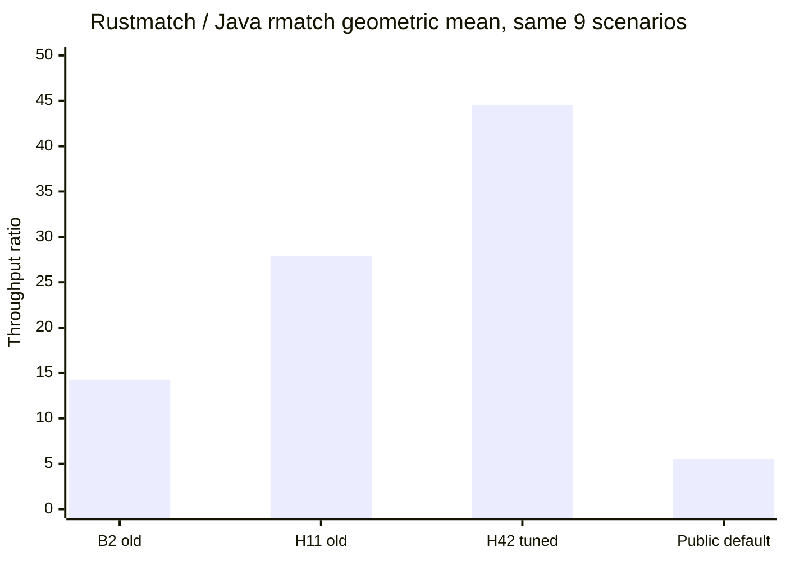
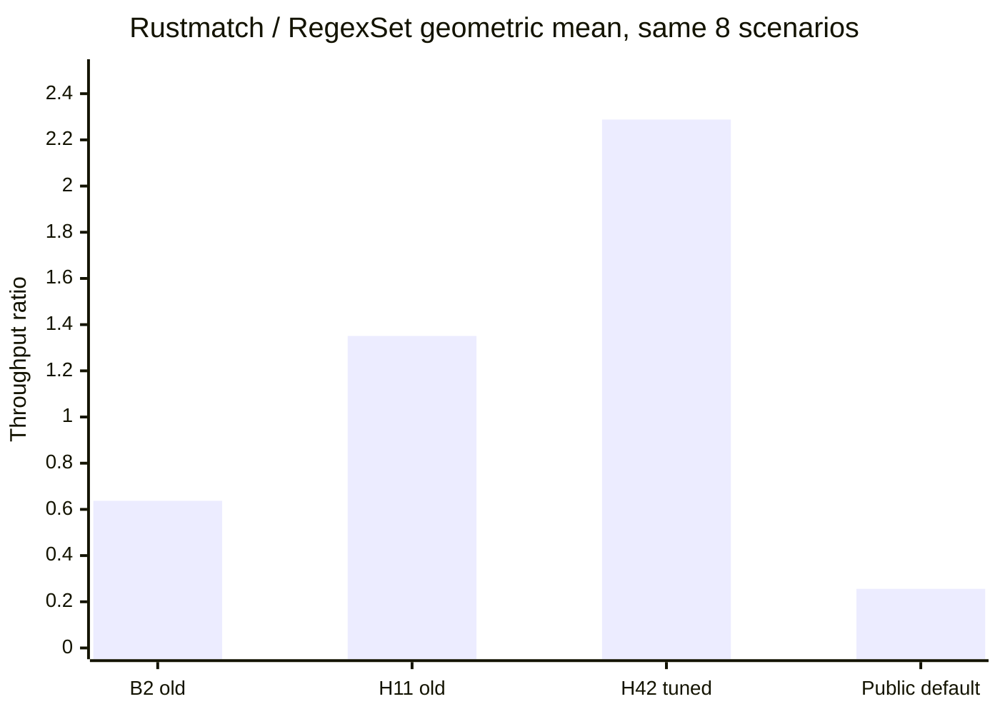
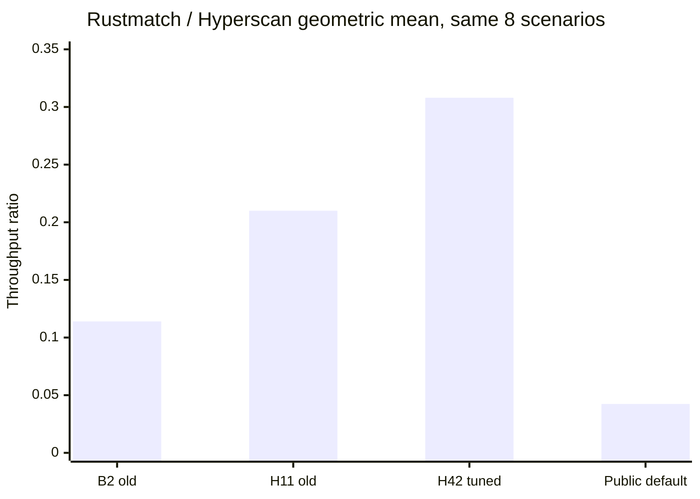
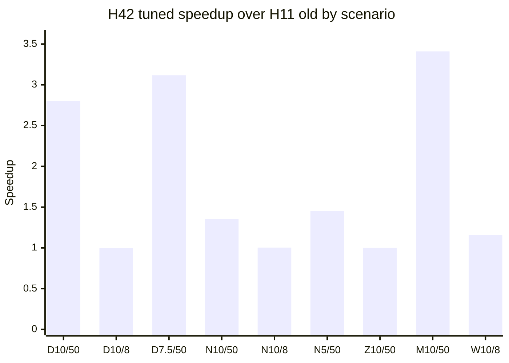
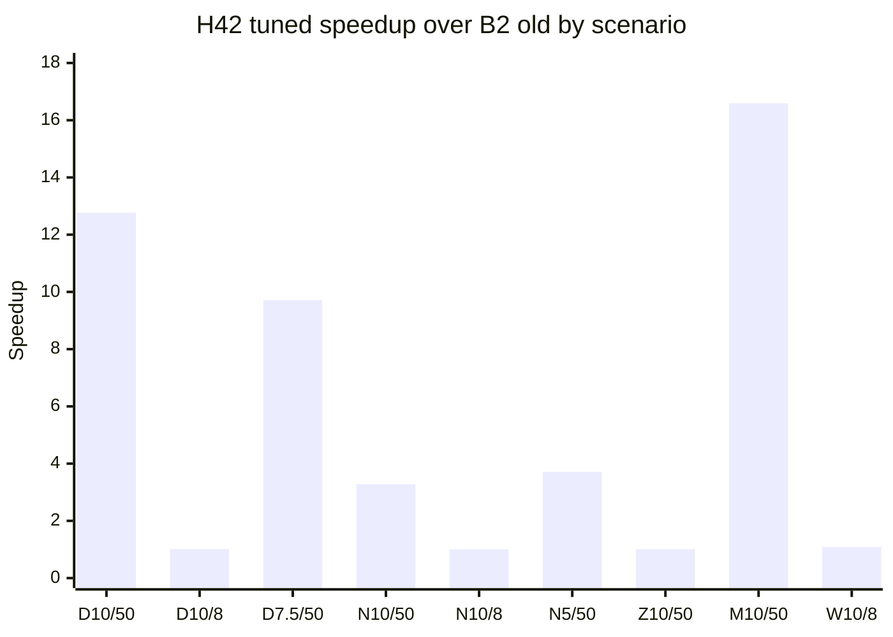

# Retained cross-engine and Rustmatch-generation comparison

**Status:** reviewed synthesis of previously collected evidence 
**Review date:** 2026-08-09 
**New benchmark runs:** none 
**Primary current product:** public one-worker default at `7dd80c0` 
**Current tuned production snapshot:** H43 at `a5b86c2`; ordinary overlap
retains H42 values 
**Historical Rustmatch snapshots:** H11 at `bacd5c4` and B2 at `da755b0`

## Scope and reading rules

This report makes every comparison supported by the retained data visible. It
does not fill missing cells, rerun a competitor, or silently combine unlike
benchmark products.

- Java rmatch and Rustmatch emit the same complete `(pattern_id, start, end)`
  event contract on these shared fixtures.
- RegexSet reports native set membership, not Rustmatch's complete overlapping
  event stream. Its ratios are diagnostic speed references.
- Hyperscan is also a native-reference diagnostic with a different contract.
- The public-default series uses one worker and no overrides. H42 and H11 use
  the best retained throughput among their measured worker counts. Their
  difference is therefore useful capacity evidence, but H42/public-default is
  not a code-only evolution series.
- H43 is current production by an explicit owner-authorized merge. Its
  ordinary matcher retains H42's tuned path and overlap values. Formal H43 R3
  remains rejected; this report does not relabel it as a certified pass.
- H42, H11, and the public default reuse unchanged retained competitor values
  from B2. Only Rustmatch changed.
- H43's explicit matcher is merged but remains non-default, feature-gated, and
  owner-exception labeled. Its two assertion cells have no exact retained Java,
  RegexSet, or Hyperscan counterparts and remain outside the aggregate table.

The normalized nine-scenario source matrix is available as
[`retained-cross-engine-comparison.csv`](retained-cross-engine-comparison.csv).

## Executive comparison

Ratios are Rustmatch throughput divided by the named engine. All four rows in
this table use the same exact nine-scenario overlap: nine Java cells, eight
RegexSet cells, and eight Hyperscan cells. Values above `1.0x` favor Rustmatch.

| Rustmatch series | Worker/configuration policy | / Java GM | / RegexSet GM | / Hyperscan GM |
|---|---|---:|---:|---:|
| Public default `7dd80c0` | one worker, no override | **5.539x** | 0.256x | 0.0424x |
| H42 tuned `c6f221b` | best retained measured worker count | **44.543x** | **2.288x** | 0.308x |
| H11 old `bacd5c4` | best retained measured worker count | **27.893x** | **1.351x** | 0.210x |
| B2 old `da755b0` | retained B2 selected worker profile | **14.273x** | 0.637x | 0.114x |

On this exact overlap, H42 is 1.597x faster geometrically than H11 and 3.121x
faster than B2 Rustmatch. Those aggregate gains are not uniform: mixed regex
and large diverse-literal scenarios account for much of the movement, while
the 8 MiB dense, 8 MiB diverse, and zero-output cells are nearly flat.

### Same-contract Java comparison

### Diagnostic RegexSet comparison

### Diagnostic Hyperscan comparison

The public-default bars are deliberately lower because they describe the
one-worker product, not an automatically tuned worker policy. They are still
the correct headline for what an unconfigured user receives.

## Exact scenario overlap

All throughput values are Mbit/s. `N/A` means that no retained measurement
shares the exact scenario; it is not an estimate of zero.

| Scenario | Public default | H42 tuned | H11 old | B2 old | Java | RegexSet | Hyperscan |
|---|---:|---:|---:|---:|---:|---:|---:|
| Diverse literals, 10k, 50 MiB | 3,319.959 | 59,216.494 | 21,140.011 | 4,637.786 | 518.621 | 3,927.589 | 179,401.330 |
| Diverse literals, 10k, 8 MiB | 1,156.190 | 3,992.679 | 4,002.389 | 3,928.776 | 213.026 | N/A | 39,696.035 |
| Diverse literals, 7.5k, 50 MiB | 3,900.903 | 70,760.722 | 22,702.110 | 7,285.015 | 559.081 | 4,205.039 | N/A |
| Dense literals, 10k, 50 MiB | 678.467 | 10,705.533 | 7,918.385 | 3,262.662 | 132.195 | 14,606.483 | 21,413.355 |
| Dense literals, 10k, 8 MiB | 555.641 | 3,397.337 | 3,388.217 | 3,382.045 | 105.485 | 2,402.802 | 18,719.555 |
| Dense literals, 5k, 50 MiB | 945.317 | 13,501.841 | 9,307.434 | 3,638.606 | 145.779 | 69,753.058 | 28,539.015 |
| Zero output, 10k, 50 MiB | 5,501.476 | 5,460.938 | 5,458.975 | 5,412.628 | 1,994.547 | 7,202.698 | 486,317.545 |
| Mixed regex, 10k, 50 MiB | 4,258.154 | 79,893.126 | 23,428.283 | 4,815.533 | 662.754 | 2,942.209 | 21,967.340 |
| Wuthering, 10k, 8 MiB | 360.050 | 1,766.789 | 1,528.531 | 1,623.410 | 55.279 | 2,464.900 | 1,267.470 |

### H42 tuned ratios and Rustmatch evolution

| Scenario | H42/H11 | H42/B2 | H42/Java | H42/RegexSet | H42/Hyperscan |
|---|---:|---:|---:|---:|---:|
| Diverse literals, 10k, 50 MiB | 2.801x | 12.768x | 114.181x | 15.077x | 0.330x |
| Diverse literals, 10k, 8 MiB | 0.998x | 1.016x | 18.743x | N/A | 0.101x |
| Diverse literals, 7.5k, 50 MiB | 3.117x | 9.713x | 126.566x | 16.828x | N/A |
| Dense literals, 10k, 50 MiB | 1.352x | 3.281x | 80.983x | 0.733x | 0.500x |
| Dense literals, 10k, 8 MiB | 1.003x | 1.005x | 32.207x | 1.414x | 0.181x |
| Dense literals, 5k, 50 MiB | 1.451x | 3.711x | 92.619x | 0.194x | 0.473x |
| Zero output, 10k, 50 MiB | 1.000x | 1.009x | 2.738x | 0.758x | 0.011x |
| Mixed regex, 10k, 50 MiB | 3.410x | 16.591x | 120.547x | 27.154x | 3.637x |
| Wuthering, 10k, 8 MiB | 1.156x | 1.088x | 31.961x | 0.717x | 1.394x |

The chart abbreviations are `D` diverse, `N` dense, `Z` zero-output, `M`
mixed regex, and `W` Wuthering; the two numbers are pattern count and input
size in MiB.

## What the scenario deltas say

- **Mixed regex is the strongest current result.** H42 is 3.410x over H11,
  16.591x over B2, 27.154x over RegexSet, and 3.637x over Hyperscan.
- **Large diverse literals improved substantially.** The two 50 MiB scenarios
  are 2.801x and 3.117x over H11, but Hyperscan still leads the 10,000-pattern
  cell by about 3.03x.
- **Dense literals remain mixed.** H42 beats RegexSet at 10,000 patterns on
  8 MiB, but reaches only 19.4% of RegexSet at 5,000 patterns on 50 MiB.
- **Zero-output scanning is the clearest Hyperscan deficit.** H42 is 75.8% of
  RegexSet but only 1.12% of Hyperscan, and it is essentially unchanged from
  both older Rustmatch generations.
- **Wuthering demonstrates policy sensitivity.** H42 tuned beats Hyperscan by
  1.394x, while the one-worker public default reaches only 28.4% of Hyperscan.
- **Java is consistently behind Rustmatch.** Every retained current-default,
  H42, H11, and B2 overlap cell favors Rustmatch under the same event contract.

## Experimental assertion capability

H43-X1.5 used the same source revision for control and explicit specialized
configuration. It is not merged or published, and its formal disposition is
`investigate` because preparation on the 2 MiB target regressed 2.688833%.

| Exact assertion scenario | Public/default control | Explicit matcher | Control-to-explicit speedup | Java | RegexSet | Hyperscan |
|---|---:|---:|---:|---:|---:|---:|
| 1,000 patterns, 1 MiB | 0.992 Mbit/s | 230.480 Mbit/s | **232.54x** | N/A | N/A | N/A |
| 1,000 patterns, 2 MiB | 0.994 Mbit/s | 456.151 Mbit/s | **456.05x** | N/A | N/A | N/A |

These rows prove a narrow Rust-on-Rust opportunity. They do not support a
claim that the explicit matcher beats any named competitor on those exact
workloads. The absence is visible rather than replaced with a nearby B2 cell.

## Coverage inventory

| Evidence layer | Rustmatch coverage | Java | RegexSet | Hyperscan | Meaning |
|---|---:|---:|---:|---:|---|
| Current public default | 9 | 9 | 8 | 8 | latest unconfigured product on exact overlap |
| H42 tuned production | 9 | 9 | 8 | 8 | latest production engine with measured worker selection |
| H11 historical | 9 | 9 | 8 | 8 | directly comparable old Rustmatch overlap |
| B2 historical full dataset | 43 unique scenarios | 38 | 35 | 39 | broadest retained competitor coverage |
| H43-X1.5 assertion experimental | 2 targets | 0 | 0 | 0 | exact control/candidate only; cross-engine data sparse |

## Full historical B2 cell appendix

This appendix exposes the broadest old-Rustmatch dataset. It is not relabeled
as current Rustmatch. Ratios are old B2 Rustmatch divided by the competitor;
`N/A` marks an unmeasured pairing.

| Historical B2 scenario | Old Rustmatch Mbit/s | / Java | / RegexSet | / Hyperscan |
|---|---:|---:|---:|---:|
| diverse-literals-1000-50m | 18,883.470 | 19.657x | 0.158x | 0.0501x |
| diverse-literals-1000-8m | 16,092.765 | 20.920x | 0.174x | 0.0626x |
| diverse-literals-10000-50m | 4,637.786 | 8.943x | 1.181x | 0.0259x |
| diverse-literals-10000-8m | 3,928.776 | 18.443x | N/A | 0.0990x |
| diverse-literals-2500-50m | 16,966.019 | 19.778x | 0.498x | 0.0562x |
| diverse-literals-2500-8m | 11,372.966 | 23.831x | N/A | 0.0619x |
| diverse-literals-5000-50m | 8,587.511 | 13.006x | 1.065x | 0.0275x |
| diverse-literals-5000-8m | 4,773.465 | N/A | 0.627x | 0.0495x |
| diverse-literals-7500-50m | 7,285.015 | 13.030x | 1.732x | N/A |
| diverse-literals-7500-8m | 4,183.996 | N/A | N/A | 0.0753x |
| diverse-literals-dense-1000-50m | 5,698.070 | N/A | 0.0058x | 0.191x |
| diverse-literals-dense-1000-8m | 4,652.492 | 22.135x | 0.0300x | 0.181x |
| diverse-literals-dense-10000-50m | 3,262.662 | 24.681x | 0.223x | 0.152x |
| diverse-literals-dense-10000-8m | 3,382.045 | 32.062x | 1.408x | 0.181x |
| diverse-literals-dense-5000-50m | 3,638.606 | 24.960x | 0.0522x | 0.127x |
| diverse-literals-dense-5000-8m | 3,536.753 | 28.611x | 0.218x | 0.145x |
| diverse-literals-zero-1000-50m | 20,121.592 | 8.758x | 0.207x | 0.0411x |
| diverse-literals-zero-1000-8m | 20,139.359 | 8.894x | 0.223x | 0.0369x |
| diverse-literals-zero-10000-50m | 5,412.628 | 2.714x | 0.751x | 0.0111x |
| diverse-literals-zero-10000-8m | 5,413.800 | N/A | N/A | 0.0098x |
| diverse-literals-zero-5000-50m | 9,464.472 | 4.650x | 1.310x | 0.0181x |
| diverse-literals-zero-5000-8m | 9,445.639 | N/A | 1.321x | 0.0168x |
| mixed-regex-1000-50m | 19,291.086 | 19.329x | 2.593x | 0.0577x |
| mixed-regex-1000-8m | 17,319.571 | 21.266x | 2.368x | 0.127x |
| mixed-regex-10000-50m | 4,815.533 | 7.266x | 1.637x | 0.219x |
| mixed-regex-2500-50m | 18,603.952 | 19.906x | 2.673x | N/A |
| mixed-regex-5000-50m | 9,433.291 | 11.223x | 1.871x | 0.131x |
| mixed-regex-5000-8m | 7,125.130 | 14.313x | N/A | 0.488x |
| mixed-regex-7500-50m | 8,404.519 | 11.575x | 1.925x | 0.234x |
| mixed-regex-7500-8m | 5,702.751 | 13.849x | 1.380x | 0.819x |
| mixed-regex-dense-1000-50m | 6,816.872 | 24.699x | 0.0164x | 1.222x |
| mixed-regex-dense-1000-8m | 5,567.868 | 22.730x | 0.0875x | N/A |
| mixed-regex-dense-10000-50m | 3,514.989 | 20.122x | N/A | 3.845x |
| mixed-regex-dense-10000-8m | 3,522.563 | 24.183x | N/A | 4.798x |
| mixed-regex-dense-5000-50m | 3,750.637 | 19.916x | 0.0802x | 2.225x |
| mixed-regex-dense-5000-8m | 3,751.152 | 22.932x | 0.353x | 2.767x |
| mixed-regex-zero-10000-50m | 5,336.843 | 2.301x | 0.739x | 0.0078x |
| mixed-regex-zero-10000-8m | 5,299.684 | 2.313x | 0.758x | 0.0063x |
| mixed-regex-zero-5000-50m | 9,274.262 | 4.045x | 1.288x | 0.0131x |
| mixed-regex-zero-5000-8m | 9,557.260 | 4.196x | 1.360x | N/A |
| wuthering-literals-1000-8m | 8,700.443 | 19.534x | N/A | 1.682x |
| wuthering-literals-10000-8m | 1,623.410 | 29.367x | 0.659x | 1.281x |
| wuthering-literals-5000-8m | 3,289.201 | 28.787x | 0.829x | 1.681x |

The original full-dataset aggregate geometric means were 13.769x versus Java
across 38 cells, 0.463x versus RegexSet across 35 cells, and 0.128x versus
Hyperscan across 39 cells. Those aggregates use different coverage from the
nine-scenario charts and must not be substituted for them.

## Provenance

- [Current public-default and experimental snapshot](default-vs-experimental-results.md)
- [H42 current-production overlap](../experiments/h42-cross-engine-snapshot.md)
- [H11 historical overlap](../experiments/h11-cross-engine-snapshot.md)
- [H43-X1.5 formal result](../experiments/h43-x1-5-formal-admission-result.md)
- B2 retained Java table: `rust-vs-java-rmatch.csv`, SHA-256
  `40787d5cb83b00bb11a7c92d461f0426b23ce3e9cebb8a0b4f2bda2ff4956be1`
- B2 retained RegexSet table: `rust-vs-regexset-diagnostic.csv`, SHA-256
  `3384831f82e827e1f578a4f9aaa7f89782d926cc2caddd09373580e4fcab9284`
- B2 retained Hyperscan table: `rust-vs-native-reference-diagnostic.csv`,
  SHA-256
  `62e685b53c0c7af83825a785e76c2300d3bb088875320828fe522bfaac7790f3`

No new timing was executed to produce this report. Every number is copied or
derived from the retained, reviewed evidence named above.
