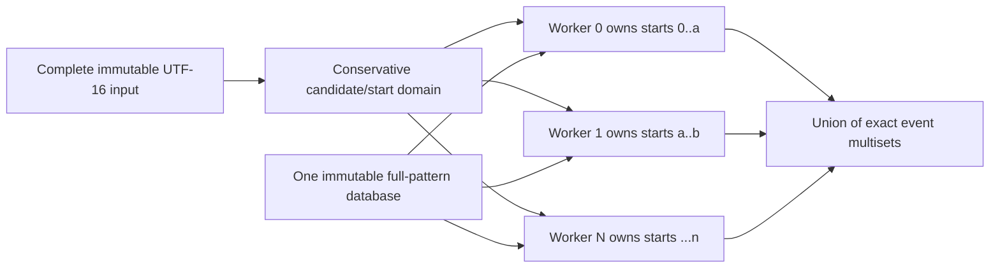

# B2-H-0006 exact input-parallel scanning design review

**Status:** semantic construction resolved; diagnostic evidence required

**Reviewed production baseline:** H11 exact measured source
`bacd5c46d934cd5526dcab78af88e375b2f13370`

**Scope:** theoretical and source-level assessment only; no optimization is
authorized by this document

## Executive conclusion

Exact input-parallel scanning is possible without input overlap, speculative
DFA state reconciliation, duplicate suppression, or ordered event merging.
Rustmatch already defines a scan as the independent longest consuming match
for every `(pattern identity, input start)` pair. Workers can therefore own
disjoint ranges of **start positions** while retaining read-only access to the
complete input. A match that starts in one range may read and end arbitrarily
far beyond that range.

This construction resolves the semantic blocker recorded for B2-H-0006. It
does not yet establish a performance opportunity. H11 already replaced
partition-local full-corpus literal discovery with one parallel shared
candidate pass. On H11's retained 50 MiB cells, total semantic starts are only
about 1.01 to 1.02 times the union candidate count, so the partition-local
prefix checks already route almost every candidate to one pattern partition.
The original expectation that input parallelism would remove sixteen to
thirty-two complete corpus traversals is therefore stale for H11-eligible
workloads.

The next justified action is a bounded diagnostic that answers two questions:

1. After H11, which workloads still spend enough time in semantic verification
   or repeated start-domain work for input parallelism to recover at least 5%?
2. Can a shared full-pattern database with worker-local scratch and a bounded
   cache policy outperform H11's smaller pattern partitions without a guard
   regression or unacceptable memory multiplication?

No production implementation should begin unless both questions pass.

## Why start ownership is exact

Let an input contain `n` UTF-16 code units and let the legal consuming start
domain be:

```text
S = { 0, 1, ..., n - 1 }
```

Partition `S` into disjoint half-open ranges `S0 ... Sk` whose union is `S`.
Worker `i` runs the existing anchored-at-start semantic engine for every start
in `Si`, against the complete immutable input and complete applicable pattern
set. It does **not** stop matching at the end of `Si`.

For each pattern identity `p` and start `s`, ADR-0002 defines at most one event:
the greatest accepted consuming end `e`. Exactly one worker owns `s`, that
worker observes the same suffix and context as the serial engine, and it runs
until the same dead state or input end. It therefore emits exactly the serial
event `(p, s, e)`, if one exists. Taking the union of worker outputs gives the
serial event multiset.



### Boundary cases

| Concern | Exact rule |
|---|---|
| Unbounded repetition | A worker may read to input end. Only the start is range-bounded, never the match end. |
| Match crossing a range boundary | The worker that owns the start emits it. No overlap or reconciliation is needed. |
| Line anchors and word boundaries | Assertion evaluation receives the full input and absolute position, preserving global left/right context. |
| Pure zero-width patterns | Registration already rejects them. Assertions may constrain a consuming match and remain covered. |
| Duplicate pattern text | Caller IDs remain distinct database ordinals, so equal text still emits separate events. |
| Duplicate events | Start ranges are disjoint, so no two workers can emit the same `(pattern_id, start, end)` event. |
| Event order | ADR-0002 explicitly leaves callback order unspecified. Correctness is multiset equality, so worker vectors may be concatenated without a global sort. |
| UTF-16 | Ranges are in UTF-16 code-unit indices, which are already the engine's public coordinate system. Isolated surrogates require no special boundary rule. |
| Failure before callbacks | As in I8, workers buffer locally, all workers join, and errors or panics are resolved before serial callback delivery. |

This is simpler than speculative parallel DFA membership. Ko et al. partition a
single continuing DFA run and must infer each chunk's unknown incoming state.
Rustmatch restarts matching independently at every input start, so a start
owner always begins at the database root. The paper remains useful evidence
that input partitioning can scale, but its speculation and chunk-composition
machinery are not needed for this construction.

## Source fit

Most of the semantic engine is already close to range-capable:

- `scan_without_assertions_nfa` and `scan_without_assertions_cached` accept an
  arbitrary start iterator.
- literal prefilter construction already scans explicit start ranges;
- H11's shared candidate bitmap is immutable after construction and can expose
  candidates from a bounded word range;
- `Utf16Text` and every compiled database table are immutable and naturally
  shareable;
- the assertion path is the notable exception because it hard-codes
  `0..units.len()`, but its assertion helpers already consume the complete
  input and absolute positions.

The semantic code change should therefore be small: make every engine path
consume a bounded start domain and add adversarial parity tests. The larger
uncertainty is the compiled and scan-local state layout.

## Performance model after H11

### What H11 already removed

H11 scans a compatible large literal corpus once to construct a union candidate
bitmap, using up to eight disjoint input-word shards. Each existing pattern
partition then filters only those candidates through its necessary-prefix
table before semantic verification.

Retained candidate receipts show:

| H11 cell | Union candidates | Total semantic starts | Starts/candidate |
|---|---:|---:|---:|
| Sparse 50 MiB, 16 workers | 55,748 | 56,652 | 1.016 |
| Sparse 50 MiB, 24 workers | 55,748 | 56,668 | 1.017 |
| Dense 50 MiB, 16 workers | 696,850 | 708,150 | 1.016 |
| Dense 50 MiB, 32 workers | 696,850 | 708,350 | 1.017 |

Those ratios mean H11 already avoids nearly all repeated semantic admission in
these cells. Input parallelism cannot claim H11's earlier 2.16x-to-7.96x gain
again.

### What input parallelism might still improve

- It can distribute uneven candidate density by input range rather than being
  limited to one worker per pattern partition.
- A single multi-pattern database can process all patterns for one start in one
  deterministic/NFA traversal instead of entering separate partition engines.
- It can eliminate repeated candidate-bitmap iteration and partition-prefix
  probes.
- It may help non-H11 paths that still scan the full start domain per pattern
  partition, including start-table, all-start, and assertion-bearing workloads.
- It provides a path to using more cores without increasing the number of
  pattern partitions and their associated prefilter/candidate structures.

### What can erase the gain

- A full-pattern database has a larger root closure, transition working set,
  and terminal array than one pattern partition.
- `Scratch` scales with database states and patterns and must be private to each
  concurrent worker.
- The lazy deterministic cache is mutable and scan-local. Giving every worker
  the current 8,192-state budget multiplies the current four-MiB direct-table
  ceiling by worker count; dividing one total budget may cause full-database
  fallback.
- Workers over different input ranges may independently materialize many of
  the same deterministic states.
- Equal byte ranges can be badly imbalanced when candidate or match density is
  uneven.
- H11's candidate-construction pass may already dominate sparse large-literal
  cells, leaving little semantic work for a second parallel axis to accelerate.

Hyperscan's runtime design reinforces the scratch issue rather than solving it:
its compiled database is shareable, but every concurrent scanning context
requires separate preallocated scratch. Rustmatch should likewise account
worker-local scratch explicitly rather than hide it behind throughput.

## Designs considered

### Recommended diagnostic: one database, disjoint start domains

Compile one database containing the complete pattern set. Build one immutable
candidate/start plan, partition that plan into contiguous disjoint start
domains, and scan the domains concurrently with worker-local scratch and cache.

This is the only first experiment that tests the intended algorithmic change:
one combined automaton plus input-axis parallelism.

### Not recommended: transpose the existing partition loop

An input worker could scan every existing pattern partition over its own range.
That preserves exactness, but every partition is then entered by every worker,
replicating caches and setup while retaining essentially the same semantic
transition work. It tests scheduling more than algorithmic work reduction.

### Not recommended: overlapped byte slices

Overlapped slices require a maximum match length or unbounded reconciliation,
duplicate suppression, and careful assertion context. Start ownership makes
all of that unnecessary.

### Not recommended initially: speculative continuing DFA chunks

The PA-09 construction solves membership for a DFA state that flows across
chunks. Rustmatch's event contract is a fresh anchored computation for every
start, so speculative incoming-state maps add complexity without addressing
the current engine's work shape.

## Staged strategy

### Stage S: executable semantic proof

Add a private start-domain parameter to every engine path. The default remains
the complete domain. Before any timing:

1. Compare the union of 1, 2, 3, 8, and oversubscribed start-domain scans with
   the serial event multiset.
2. Place matches immediately before, on, and after every shard boundary.
3. Include unbounded repetitions whose accepted end crosses several shards.
4. Include line anchors, word boundaries, duplicate pattern text with distinct
   IDs, isolated surrogates, empty input, one-unit input, and the maximum
   practical boundary indices.
5. Exercise worker-spawn failure, worker panic, sink panic, repeated scans, and
   no-callback-before-error behavior.

Stage S passes only with exact event identity for every shard count and no
public behavior change. It should remain a diagnostic commit, not an admitted
optimization.

### Stage P: phase and headroom diagnostic

On exact H11, add benchmark-only phase accounting for:

- candidate/start-plan construction;
- partition-prefix routing;
- semantic verification;
- maximum and summed worker time;
- cache states, fallbacks, and table bytes;
- scratch, candidate, and event-buffer retained bytes.

Measure at least:

- one sparse and one dense H11-eligible 50 MiB cell;
- one start-table or all-start cell where H11 does not activate;
- one assertion-bearing cell;
- one event-heavy Wuthering cell;
- one zero-output and one 8 MiB guard.

Stop H-0006 if the serial fraction plus removable worker tail is below 5% on
all plausible targets. This avoids building a full-database path when H11 has
already consumed the opportunity.

### Stage D: benchmark-only full-database prototype

If Stage P shows headroom, build a diagnostic axis that is explicitly selected
by benchmark code and leaves the production/default path byte-identical:

1. Compile one immutable full-pattern database and compatible prefilter.
2. Construct one candidate bitmap in parallel.
3. Partition bitmap words by measured candidate count, not merely equal input
   length, while keeping each worker's start range contiguous.
4. Give each worker private `Scratch`, event storage, and deterministic cache.
5. Concatenate worker event vectors after all workers join.
6. Record both a fixed-total cache policy and a bounded per-worker policy as
   diagnostic alternatives; neither may silently redefine the public budget.

The first sweep should use 1, 2, 4, 8, and 16 input workers. It should compare
against current H11 at H11's best retained pattern-worker count, not against
the old pre-H11 baseline.

### Stage G: guarded candidate, only after a positive diagnostic

A fresh G9 authorization should freeze exactly one selective production shape.
Likely activation dimensions are:

- minimum input size;
- start-plan kind;
- candidate count and density;
- compiled state/pattern count;
- assertion presence;
- requested workers;
- projected scratch and cache bytes.

The existing H11 path remains fallback. Admission requires exact event parity,
at least 5% repeatable gain on declared targets, no demonstrated regression,
the unchanged 3% absolute veto, full memory accounting, and a retained lab note
regardless of outcome.

## Decision

B2-H-0006 is no longer blocked on semantic design. The exact construction is
**disjoint ownership of starts over the complete input**, not overlapped input
slices.

It remains blocked on measured post-H11 headroom and state-locality economics.
The most efficient next move is Stage P followed, only if positive, by the
benchmark-only Stage D prototype. Direct production implementation would be
premature because H11 already captured most repeated traversal on the workloads
that originally motivated this hypothesis.

## Sources

- [ADR-0002: normative event semantics](../adr/0002-match-event-semantics.md)
- [ADR-0008: current pattern-partition parallelism](../adr/0008-parallel-pattern-partitions.md)
- [H11 accepted recovery](b2-h-0011-private-prefilter-recovery.md)
- [Ko et al., speculative parallel DFA membership](https://arxiv.org/abs/1210.5093)
- [Hyperscan runtime scratch model](https://intel.github.io/hyperscan/dev-reference/runtime.html)
- [`regex-automata::Input` bounded and anchored searches](https://docs.rs/regex-automata/latest/regex_automata/struct.Input.html)
