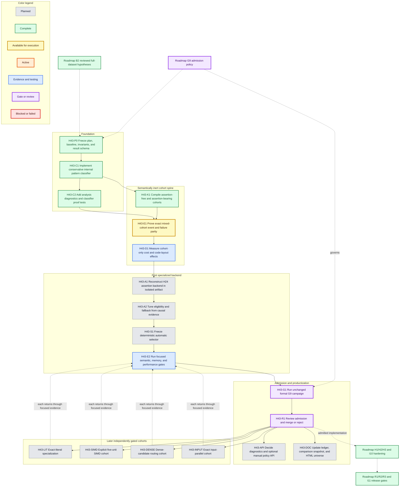
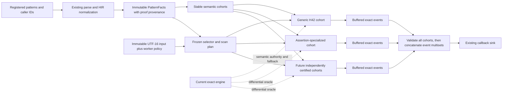
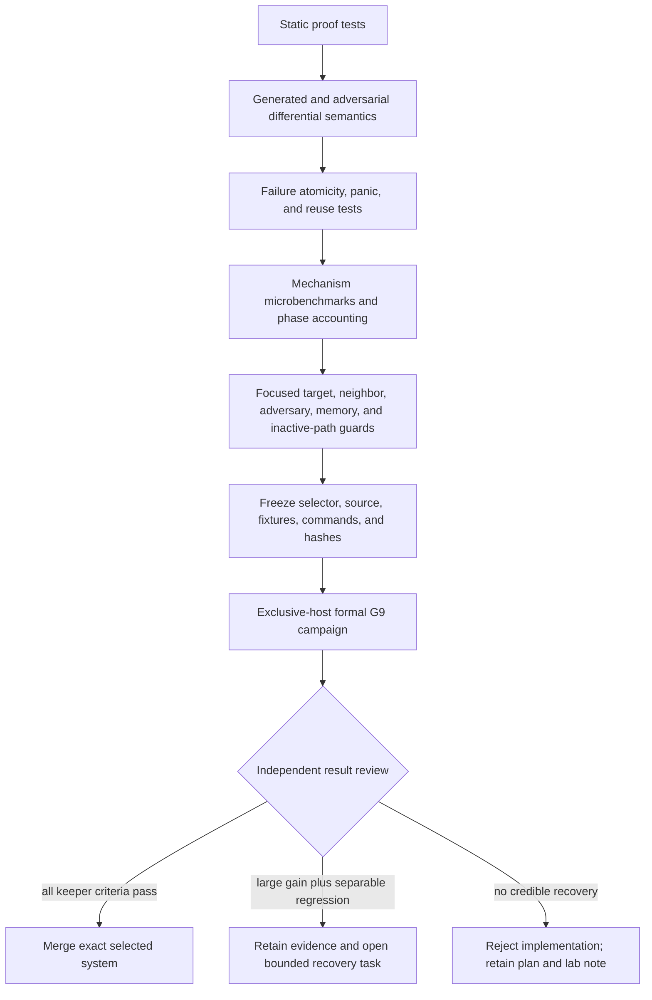

# B2-H-0043 cohort-aware matcher engineering plan

**Status:** H43-C1, H43-C2, and H43-K1 complete; H43-E1 available<br>
**Plan owner:** rustmatch maintainers  
**Created:** 2026-08-06  
**Current source baseline:** `79cc8e9b4438cb4cabd482789715a16ff9a834d8`  
**Decision policy:** [optimization-decision-policy.md](../optimization-decision-policy.md)  
**Historical evidence:** [optimization-attempt-ledger.md](../optimization-attempt-ledger.md)  
**Parent portfolio:** [post-h11-future-optimization-portfolio.md](post-h11-future-optimization-portfolio.md)

## Executive decision

Rustmatch should explore a **cohort-aware exact matcher**, not a single global
replacement algorithm. The builder will conservatively classify immutable
properties of each registered pattern, group eligible patterns into semantic
cohorts, and run each cohort through an independently certified exact backend.
The observable result remains the union of the same longest consuming event
for every `(pattern identity, input start)` pair.

This path is justified by unusually strong but uneven historical signals:

- H24 accelerated assertion-heavy targets by roughly 200x to 406x and improved
  preparation by 15.39% to 45.30%, but missed admission on one adversarial
  peak-RSS stratum.
- H11 recovered the H9 shared-candidate opportunity and retained gains up to
  695.703% without guard failure.
- H42 recovered the SIMD opportunity with target gains of 30.305% to 175.971%
  and mixed/neighbor gains of 43.986% to 235.754%, but only after repeated
  work to separate the fast path from inactive-path code-layout regressions.
- H39, H40, and the H12 through H38 recovery series show that a correct runtime
  selector is insufficient by itself. Artifact layout, preparation cost,
  scratch memory, and inactive-path code generation are part of the design.

The program therefore begins with classification and semantically inert cohort
plumbing. It does not begin by restoring a rejected fast path. Every later
backend must prove exactness and value independently, then pass the unchanged
G9 admission process as part of the complete selected system.

## Goals

1. Preserve the current public match-event semantics for every supported
   pattern mixture, input, worker count, and failure mode.
2. Make immutable pattern-set features explicit and testable without using
   benchmark identity, timing observations, or corpus-specific labels.
3. Allow a specialized backend to serve only the cohort for which its proof
   and performance evidence apply.
4. Recover large special-case gains without imposing regressions on patterns
   that remain on the current H42 path.
5. Keep the public API conservative until automatic selection has survived a
   formal campaign.
6. Leave a durable result and evidence record for every completed, rejected,
   blocked, or superseded task.

## Non-goals

- No heuristic may change which events are emitted.
- No task may relax or retune an existing historical guardrail.
- No selector may inspect benchmark names, expected output, corpus identity,
  prior timing, or machine-local evidence paths.
- The first increment will not expose a public backend-selection enum.
- A specialized path will not be merged merely because one target is very
  fast. It must satisfy the current decision policy for its complete admitted
  configuration.
- Cohorting does not authorize approximate matching, partial callback delivery,
  hidden retries, or silent fallback after an externally visible failure.

## Semantic invariants

The following properties are non-negotiable across every task:

| Invariant | Required behavior |
|---|---|
| Event identity | Preserve caller `PatternId`, start, and greatest consuming end exactly. |
| Event multiplicity | Equal pattern text under distinct IDs remains distinct; no cohort may deduplicate registrations. |
| Event order | Callback order remains unspecified, but the complete event multiset must be identical. |
| Failure atomicity | Workers and cohorts buffer results; no callback occurs until all applicable scans succeed. |
| Exact authority | The current exact NFA/cache machinery remains the semantic authority and conservative fallback. |
| UTF-16 | Classification and scanning use the canonical UTF-16 code-unit model, including isolated surrogates. |
| Assertions | Anchor and boundary decisions retain full-input context and absolute positions. |
| Reuse | A compiled matcher remains immutable and reusable after successful scans and documented failures. |
| Selection stability | A built matcher's static cohort assignment cannot change between scans. |
| Honest evidence | Every receipt identifies source, inputs, host state, selector version, cohort counts, and activated backend. |

## Task dependency graph

Color carries the same status vocabulary as the repository roadmap. Solid
arrows are execution dependencies. Dotted arrows are evidence or policy inputs
that do not themselves authorize execution.



## Proposed runtime architecture

The classifier produces proof-bearing facts, not a backend recommendation.
The frozen selector maps those facts and documented scan facts to eligible
backends. Any unproved or unsupported case takes the current exact generic
path.



### Initial static facts

The first classifier should derive only facts already justified by HIR or
compiled-table analysis:

- assertion use and assertion kinds;
- nullable or pure-zero-width status;
- minimum and finite maximum consuming width;
- exact literal status;
- necessary literal/prefix and its proof source;
- ASCII-only status where provable;
- prefix length and distinct prefix count;
- estimated NFA state and terminal counts;
- whether the current literal filter, start table, shared candidate union, and
  five-unit SIMD predicate are structurally eligible.

Unknown must be represented explicitly. An unknown fact never becomes an
optimistic `true` and never selects a specialized backend.

### Allowed dynamic scan facts

The first automatic selector may use input length, requested worker count,
available CPU features, deterministic cohort size, and a bounded candidate
density sample already defined by the runtime. It may not use elapsed time,
benchmark/corpus names, expected results, file paths, environment-specific
allowlists, or feedback from prior scans.

## Evidence and admission funnel



## Cross-graph dependencies

| This plan | External node or document | Dependency |
|---|---|---|
| H43-P0 through H43-D1 | Roadmap B2 | B2 supplies the reviewed historical hypotheses and prevents unaudited optimization work. |
| H43-G1 and H43-R1 | Roadmap G9 plus the current decision policy | The selector and activated backend are judged as one candidate under unchanged guards. |
| H43-E1 | ADR-0001 and ADR-0002 | UTF-16 coordinates and complete longest-event semantics define parity. |
| H43-E1 and H43-API | ADR-0003 and ADR-0008 | Public API minimalism, worker behavior, buffering, and failure handling constrain the design. |
| H43-A1 | H24/H25 and H12-H38 evidence in the optimization ledger | Reuse the demonstrated mechanism and known failure surfaces; do not rediscover them by blind tuning. |
| H43-SIMD | H40 and merged H42 evidence | Existing SIMD code remains intact; a cohort may clarify eligibility but must not duplicate the backend. |
| H43-INPUT | B2-H-0006 design | Start ownership is the exact semantic construction; performance headroom must still be demonstrated. |
| Any admitted change | Roadmap H1/H2/H3 and I10 | Property, fuzz, Miri, API, dependency, security, MSRV, and soak evidence must remain green. |
| Release-facing result | Roadmap R1/R2/R3 and I11 | Packaged artifact, current comparisons, compatibility, and release review must use the merged revision. |

## Result-update contract

Every task below contains an **Implementation result** block. When work starts,
change its status to `active` and update the Mermaid class. When it stops:

1. record the exact source and baseline commits;
2. record commands, fixture and plan hashes, and retained artifact links;
3. summarize semantic, performance, memory, and inactive-path outcomes;
4. state `complete`, `rejected`, `blocked`, or `superseded` with the decisive
   reason;
5. update downstream availability and the dependency graph colors;
6. regenerate the HTML universe with `cargo xtask optimization-ledger`;
7. reload the already-open system-browser tab using the refresh command in the
   final section.

Historical evidence is immutable. A later recovery links to the earlier result
instead of rewriting it.

## H43-P0: Freeze plan, baseline, invariants, and result schema

**Scope:** program  
**Level:** cloud  
**Status:** complete  
**Primary actor:** optimization program maintainer  
**Supporting actors:** semantic reviewer, performance reviewer

**Goal**

Create an executable, dependency-ordered program that can recover special-case
performance without weakening exactness or admission rules.

**Preconditions**

- B1 and B2 are complete.
- H42 and the release-preparation merge are present on public `main`.
- Historical accepted and rejected evidence remains available.

**Minimal guarantee**

No production source, benchmark threshold, or retained evidence is changed.

**Success guarantee / postconditions**

- Stable task IDs, dependencies, invariants, evidence expectations, and result
  fields exist in this document.
- Exactly one implementation task, H43-C1, is available at plan creation.
- Specialized backends remain gated behind semantic and diagnostic tasks.

**Main success scenario**

1. Freeze the current mainline source identity.
2. Summarize the historical opportunity and failure modes.
3. Define semantic and selector invariants.
4. Build the dependency DAG and cross-roadmap links.
5. Define task-level evidence and result-update contracts.
6. Render the Markdown and Mermaid diagrams into the HTML universe.

**Expected evidence**

- This Markdown source and its hash-bound HTML/Mermaid render.
- Clean `cargo xtask verify-optimization-ledger` after rendering.
- Browser inspection of the generated document.

**Dependencies:** roadmap B2 and G9; optimization ledger; ADR-0001 through
ADR-0003 and ADR-0008.

**Implementation result**

- **Result:** complete on 2026-08-06.
- **Implementation commit:** `4ff72637fa3e47078ac1fefc5737aed63416adee`.
- **Source baseline:** `79cc8e9b4438cb4cabd482789715a16ff9a834d8`.
- **Outcome:** the cohort-aware program is decomposed into independently
  falsifiable semantic, diagnostic, specialization, selector, and admission
  tasks. No production code or performance threshold changed.
- **Evidence:** this document, generated HTML mirror, Mermaid SVG assets, and
  repository verification recorded with the implementing change.

## H43-C1: Implement conservative internal pattern classifier

**Scope:** rustmatch compiler internals  
**Level:** sea  
**Status:** complete  
**Primary actor:** matcher compiler  
**Supporting actors:** optimization engineer, semantic reviewer

**Goal**

Produce stable proof-bearing `PatternFacts` and aggregate `PatternSetAnalysis`
without changing partitioning, execution, public API, or emitted events.

**Preconditions**

- H43-P0 is complete.
- The exact H42 compile and scan behavior is the baseline.
- Every proposed fact has a conservative derivation from HIR or compiled data.

**Minimal guarantee**

If derivation is uncertain, record `Unknown` or ineligible. Existing matcher
construction and scans remain byte-for-byte behaviorally equivalent.

**Success guarantee / postconditions**

- Internal immutable facts exist for every accepted registration.
- Duplicate text with distinct IDs retains separate fact records.
- Facts are deterministic across build order replays and worker counts.
- No classifier field directly names or selects a backend.

**Main success scenario**

1. Define small internal enums/structs with explicit unknown states.
2. Derive assertion, width, literal, prefix, ASCII, and size facts during the
   existing HIR/compile flow.
3. Aggregate counts and eligibility facts without changing registration order.
4. Expose facts only through test or benchmark internals.
5. Add table-driven unit tests for every derivation and uncertainty boundary.
6. Run formatting, clippy, unit, property, and differential tests.

**Extensions**

- A fact requires expensive analysis: omit it in this task.
- Two derivations disagree: fail an internal invariant test; do not choose the
  more permissive result.
- Adding dormant metadata changes an inactive guard: capture the discrepancy
  and stop before H43-K1.

**Expected evidence**

- Classifier truth tables and property tests.
- Deterministic analysis snapshots for representative mixed pattern sets.
- Full `cargo xtask ci` output.
- A no-behavior-change differential receipt and focused inactive-path timing
  smoke sufficient to detect gross layout effects.

**Dependencies:** H43-P0; UC-1, UC-8, UC-9, and UC-11 evidence contracts.

**Implementation result**

- **Result:** complete on 2026-08-06.
- **Implementation:** added an on-demand, feature-gated `MatcherBuilder`
  diagnostic that derives immutable `PatternDiagnostics` and stable
  assertion-free/assertion-bearing ID lists from normalized HIR. Facts cover
  assertion kinds, nullability, minimum/maximum consumed width, ASCII-only
  reachability, a bounded exact-literal proof, a conservative necessary prefix,
  filterability, registration ordinal, and HIR-node count.
- **Isolation result:** diagnostics are computed only when repository tooling
  explicitly asks. They are not retained by the builder or matcher and are not
  consulted by compilation, registration-order partitioning, scan dispatch,
  callbacks, or the public release API. Default-feature builds compile the
  complete cohort module out.
- **Semantic evidence:** four focused tests pass, including stable sorting,
  duplicate text with distinct IDs, all assertion-kind facts, finite/unbounded
  width boundaries, the 32-unit exact-prefix cap, worker-count invariance, and
  identical events after diagnostic inspection.
- **Repository evidence:** `cargo xtask ci` passes the full workspace, clippy,
  fuzz-target linting, 55 library tests, 33 public-spine tests, Java oracle and
  differential fixtures, rustdoc, MSRV, HTML/ledger freshness, and benchmark
  smoke. `cargo test -p rustmatch --no-default-features` separately passes 50
  library tests, properties, the public spine, and doctests with classification
  absent. The Mermaid inventory test now asserts this plan's three diagrams.
- **Decision:** C1 passes. Authorize H43-C2 diagnostics/schema work. Do not yet
  authorize H43-K1 cohort compilation or any specialized backend.

## H43-C2: Add analysis diagnostics and classifier proof tests

**Scope:** internal observability  
**Level:** sea  
**Status:** complete<br>
**Primary actor:** optimization engineer  
**Supporting actors:** benchmark harness, maintainer

**Goal**

Make classification inspectable and falsifiable before it controls execution.

**Preconditions**

- H43-C1 passes functional and inactive-path checks.
- Fact vocabulary is stable enough to serialize in a versioned diagnostic.

**Minimal guarantee**

Diagnostics reveal no hidden selector and do not alter public API stability.

**Success guarantee / postconditions**

- A versioned benchmark/test-only report records facts, cohort candidates, and
  proof provenance.
- Near-boundary, unknown, and adversarial patterns are represented explicitly.
- Reports are deterministic and safe to retain in evidence bundles.

**Main success scenario**

1. Define a versioned diagnostic schema.
2. Emit per-pattern and aggregate facts under `benchmark-internals` or tests.
3. Add golden snapshots for literal, assertion, mixed, Unicode, nullable, and
   unfilterable sets.
4. Add mutations that cross one classification boundary at a time.
5. Verify schema stability and deterministic serialization.

**Expected evidence**

- Versioned schema and golden reports.
- Boundary-mutation test matrix.
- Documentation mapping each fact to its conservative proof.

**Dependencies:** H43-C1; benchmark evidence schema conventions from B1/B2.

**Implementation result**

- **Result:** complete at implementation commit
  `e00de88b81f23d5286d7109a3a5628ab91e925d6`, with the impossible-HIR golden
  extension retained at `9934b7efb72fd5a8393e1e8433ca3561296695d0`.
- **Report surface:** the unpublished benchmark adapter now accepts
  `cohort-report PATTERNS.tsv`. It reads UTF-8 patterns, validates IDs and
  syntax through `MatcherBuilder::add`, calls the on-demand C1 diagnostic, and
  emits schema version 1. It deliberately does **not** call `build` or `scan`.
- **Retention boundary:** reports contain stable pattern IDs, registration
  ordinals, and FNV-1a source/expression digests rather than raw regular
  expressions. Cohort summaries and pattern facts remain in registration
  order. `serde(deny_unknown_fields)` rejects accidental unversioned fields.
- **Golden evidence:**
  `rustmatch-bench/fixtures/cohort/h43-c2-patterns.tsv` and
  `h43-c2-expected.json` bind 18 registrations across literals, duplicate text
  under distinct IDs, all four assertion kinds, predicates, Unicode,
  nullability, bounded and unbounded repetition, alternation, case folding,
  the 32-unit proof cap, and an impossible normalized HIR.
- **Boundary evidence:** one focused mutation matrix proves the following
  neighboring transitions without enabling execution:

  | Boundary | Frozen examples | Expected diagnostic change |
  |---|---|---|
  | Assertion-free to assertion-bearing | `abc` / `^abc` | Cohort and `line-start` only; required prefix remains three units. |
  | Exact literal to wildcard suffix | `abc` / `ab.` | Exact proof disappears, required prefix falls to two, and dot makes the consumed domain non-ASCII. |
  | Exact-proof cap | 32 / 33 `x` units | Exact proof changes from 32 to absent while the conservative prefix remains capped at 32. |
  | Finite to unbounded width | `(?:ab){2,4}` / `(?:ab)+` | Maximum status changes from finite eight units to unbounded. |
  | Prefix filter floor | `ab` / `abc` | Filterability changes only at the existing three-unit floor. |
  | ASCII to Unicode literal | `abc` / `é` | ASCII-domain fact changes; Unicode remains an exact one-unit UTF-16 literal. |
  | Possible to impossible HIR | `abc` / `()` | Minimum becomes absent and maximum status becomes explicit `impossible`. |

- **Proof provenance:** schema v1 records the proof algorithm for each fact:

  | Fact | Conservative proof recorded in the receipt |
  |---|---|
  | Cohort and assertion kinds | Exhaustive walk of normalized HIR assertion nodes. |
  | Nullability | Normalized HIR nullability metadata. |
  | Consumed width | Conservative recursive HIR width algebra with finite, unbounded, and impossible states kept distinct. |
  | ASCII-only domain | Exhaustive consumed-symbol and predicate-domain walk. |
  | Necessary prefix | Conservative required-prefix derivation capped at 32 UTF-16 units. |
  | Complexity | Saturating normalized-HIR node count. |

- **Focused verification:** all 33 benchmark-adapter tests pass, including
  golden equality, byte-stable repeated serialization, strict unknown-field
  rejection, exact command arity, and the boundary matrix. The release command
  exactly reproduces the checked-in golden JSON.
- **Repository verification:** `cargo xtask ci` passes formatting, clippy,
  fuzz-target linting, 55 library tests, 33 public-spine tests, compatibility
  and Java differential evidence, rustdoc, MSRV, generated evidence freshness,
  and benchmark smoke. `cargo test -p rustmatch --no-default-features`
  separately passes 50 library tests, properties, 33 public-spine tests, and
  doctests with all cohort/report internals absent.
- **Decision:** C2 passes. Classification is now inspectable, hash-bound, and
  falsifiable before it can control execution. H43-K1 is dependency-ready, but
  no cohort matcher has been compiled and no performance claim is made here.

## H43-K1: Compile assertion-free and assertion-bearing cohorts

**Scope:** matcher construction and scan orchestration  
**Level:** sea  
**Status:** complete<br>
**Primary actor:** matcher builder and scanner  
**Supporting actors:** application sink, semantic reviewer

**Goal**

Prove that one registration set can be split into stable cohorts and recombined
exactly while every cohort still uses the current generic backend.

**Preconditions**

- H43-C1 supplies deterministic assertion facts.
- Current global PatternId and failure semantics are documented by ADR-0002,
  ADR-0003, and ADR-0008.

**Minimal guarantee**

Unknown or unsupported patterns remain on one generic fallback cohort. No
specialized code runs.

**Success guarantee / postconditions**

- Assertion-free and assertion-bearing cohorts compile independently while
  retaining global caller identities.
- All cohort scans buffer before callback delivery.
- The union is exactly equivalent to the unsplit baseline event multiset.
- A one-cohort build preserves the ordinary source path as closely as
  practical rather than paying generic abstraction overhead unconditionally.

**Main success scenario**

1. Assign stable global registration ordinals and cohort-local ordinals.
2. Compile both cohorts with the existing generic engine.
3. Build a scan plan from immutable cohort metadata.
4. Scan every applicable cohort into private event buffers.
5. Resolve errors and worker panics before invoking the sink.
6. Translate cohort-local terminals to original caller IDs.
7. Concatenate successful event multisets without imposing event order.

**Extensions**

- One cohort is empty: omit it and preserve the one-cohort fast path.
- Cohort compile fails: return the existing build error; no matcher escapes.
- Any scan fails or panics: discard all buffered events and return the defined
  error or panic behavior before sink delivery.
- Sink fails during final delivery: preserve the existing documented sink
  failure semantics.

**Expected evidence**

- Global/local ID mapping invariant tests.
- One-cohort and mixed-cohort differential event hashes.
- Failure-before-callback, panic, repeated-scan, and sink-failure tests.
- Allocation and preparation accounting for one and two cohorts.

**Dependencies:** H43-C1; UC-1, UC-2, UC-5, UC-9, and UC-12.

**Implementation result**

- **Result:** complete at implementation commit
  `acc56efcb21f4c4360579b70949e1b217c34df08`.
- **Isolation boundary:** cohort compilation is available only through the
  unpublished `benchmark-internals` control and is disabled by default. A
  normal build retains the prior builder, matcher layout, and scan dispatch;
  a no-default-feature build compiles the complete cohort control, layout, and
  diagnostics out. No specialized backend or public policy API was added.
- **Construction:** mixed registrations are stably divided from normalized HIR
  facts into assertion-free and assertion-bearing vectors. Each vector is
  compiled independently by the unchanged `compile_partitions`, NFA, and
  prefilter machinery. The original `PatternId` remains in every cohort NFA,
  so no scan-time local-to-global translation table can corrupt identity.
- **Resource policy:** deterministic proportional allocation gives each
  non-empty cohort at least one partition, never exceeds its pattern count,
  and preserves the requested concurrency as an upper bound by executing
  cohorts sequentially. The configured state-cache budget is split once across
  all partitions and conserved exactly. Test-only diagnostics expose cohort
  pattern/partition counts, spawned workers, retained database/prefilter bytes,
  total cache budget, and whether delivery is buffered.
- **One-cohort path:** when either cohort is empty, the original registration
  vector goes directly through the ordinary compiler and scan path. One
  partition therefore remains unbuffered; ordinary multi-partition behavior is
  unchanged.
- **Failure atomicity:** a mixed matcher builds a private result for the first
  cohort, completes and joins the second cohort, and only then performs serial
  callback delivery. A second-cohort spawn error, scan error, or worker panic
  discards every first-cohort event. Sink panics occur only after all cohort
  workers finish, and the immutable matcher remains reusable.
- **Focused evidence:** seven new matcher tests cover deterministic bounded
  partition allocation, stable global IDs, assertion separation, exact budget
  accounting, retained-byte accounting, worker counts 1/2/4/8, repeated event
  parity, direct one-cohort behavior, second-cohort failure and panic
  atomicity, sink panic, and matcher reuse. The complete feature-enabled
  library suite passes 62 tests plus properties, Miri lifecycle, 33 public
  walking-spine tests, and doctests.
- **Retained harness evidence:**
  `rustmatch-bench/fixtures/cohort/h43-k1-patterns.tsv` and
  `h43-k1-corpus.txt` contain eight interleaved registrations with duplicate
  text and all four assertion kinds. The release harness now accepts explicit
  `cohort-WORKERS` mode. Baseline `4` and `cohort-4` each emitted 17 events with
  identical digest
  `multiset64:a6b644ea5a0b8933:1ca4e5c7d1d962fa:20d01fc02c06ec5d`.
  Activation diagnostics distinguish the paths: baseline used three spawned
  workers and four assertion cache bypasses; cohort mode used two spawned
  workers, two assertion bypasses, 13 cache states, and retained 4,144
  prefilter bytes while preserving four total partitions, 2,316 database
  bytes, and the 8,192-state budget. These figures prove path activation and
  accounting only; K1 makes no performance claim.
- **Repository verification:** `cargo xtask ci` passes formatting, strict
  workspace clippy, fuzz-target checks, all workspace tests, rustdoc, MSRV,
  generated ledger/HTML freshness, the complete Java 2.0.0-RC1 compatibility
  oracle, differential evidence I1 through I5, and benchmark smoke.
  `cargo test -p rustmatch --no-default-features` and strict no-default clippy
  separately pass with 50 library tests and all cohort execution code absent.
- **Decision:** K1 passes as a semantically inert implementation spine.
  Authorize H43-E1 to attempt the broader generated/adversarial parity gate.
  Do not authorize H43-D1 timing, H43-A1 specialization, selector work, or any
  merge claim from this result alone.

## H43-E1: Prove exact mixed-cohort event and failure parity

**Scope:** semantic gate  
**Level:** system  
**Status:** available evidence gate; not started<br>
**Primary actor:** semantic reviewer  
**Supporting actors:** Java oracle, generated test harness, fuzz harness

**Goal**

Demonstrate that cohorting itself is semantically invisible before any new
backend is introduced.

**Preconditions**

- H43-C2 and H43-K1 are complete.
- A baseline mode can execute the same registrations without cohorting.

**Minimal guarantee**

Any mismatch blocks all downstream specialization and preserves the failing
input, seed, source identity, and diagnostic report.

**Success guarantee / postconditions**

- Baseline and cohort modes produce identical normalized event multisets.
- Build errors, scan errors, panics, callback behavior, and matcher reuse agree.
- Classification boundaries are covered by generated and adversarial cases.

**Main success scenario**

1. Run retained Java compatibility fixtures in both modes.
2. Generate mixed assertion/non-assertion sets with duplicate IDs/text,
   overlaps, repetitions, flags, and Unicode edge cases.
3. Exercise empty, one-unit, large, output-heavy, and no-match inputs.
4. Sweep worker counts including oversubscription.
5. Inject worker, allocation, and sink failures where supported.
6. Compare normalized events, errors, callback counts, and reuse behavior.
7. Retain seeds and hashes for every executed family.

**Expected evidence**

- Differential fixture manifests and event hashes.
- Property/fuzz seeds and shrinking output for failures.
- Fault-injection and callback-atomicity receipts.
- Full CI, Miri-focused, and fuzz-target build results.

**Dependencies:** H43-C2, H43-K1; roadmap semantic gate S0 and hardening H1.

**Implementation result**

- **Result:** not started.
- **Evidence:** pending.
- **Decision:** pending.

## H43-D1: Measure cohort-only cost and code-layout effects

**Scope:** diagnostic performance and resources  
**Level:** system  
**Status:** planned evidence task  
**Primary actor:** performance reviewer  
**Supporting actors:** exclusive-host benchmark runner, profiler

**Goal**

Decide whether semantically inert cohort plumbing is cheap and stable enough to
support specialization, and identify layout-sensitive costs before they are
misattributed to a new algorithm.

**Preconditions**

- H43-E1 passes.
- Baseline and cohort-only revisions are source-frozen.
- The ordinary path still runs the H42 backend.

**Minimal guarantee**

No result is admitted from a contaminated host or from a cell whose intended
path activation is unproved.

**Success guarantee / postconditions**

- Preparation, scan, allocation, peak RSS, binary size, and compile-time deltas
  are measured separately.
- One-cohort inactive guards and true mixed-cohort workloads are distinguished.
- The team either authorizes H43-A1 or rejects/reworks the cohort skeleton.

**Main success scenario**

1. Freeze commands, fixtures, source hashes, and path-activation diagnostics.
2. Run one-cohort assertion-free guards where cohorting should collapse away.
3. Run assertion-only and mixed-cohort construction/scan cells.
4. Measure preparation, scanning, allocations, RSS, and binary/code size.
5. Profile stable regressions above noise.
6. Repeat layout-sensitive cells across independent builds when needed.
7. Review against the unchanged decision policy.

**Expected evidence**

- Hash-bound benchmark plan and receipts.
- Activation reports proving whether one or two cohorts executed.
- Phase/resource comparison and profiles for stable regressions.
- Written authorize/rework/reject decision.

**Dependencies:** H43-E1; G9 evidence discipline; lessons from H9-H42.

**Implementation result**

- **Result:** not started.
- **Evidence:** pending.
- **Decision:** pending.

## H43-A1: Reconstruct H24 assertion backend in an isolated artifact

**Scope:** candidate specialized backend  
**Level:** sea  
**Status:** planned  
**Primary actor:** optimization engineer  
**Supporting actors:** compiler/codegen reviewer, profiler

**Goal**

Recover the demonstrated assertion-prefix speed mechanism while preventing it
from perturbing the ordinary H42 backend when no assertion cohort activates.

**Preconditions**

- H43-D1 authorizes specialization.
- H24/H25 source and evidence are reproducible.
- The assertion cohort is semantically exact under the generic backend.

**Minimal guarantee**

The specialized backend is opt-in internally and can be disabled at build or
scan planning time without changing the generic engine.

**Success guarantee / postconditions**

- The H24 mechanism exists behind an assertion-cohort boundary.
- Generic-only builds/scans do not link or dispatch through the new hot code
  unless required by the chosen artifact strategy.
- Target path activation is explicit and exact fallback remains available.

**Main success scenario**

1. Reconstruct the smallest causally supported H24 mechanism from retained
   evidence, not from memory or broad refactoring.
2. Place the backend behind a narrow internal trait/function boundary.
3. Test compile-unit, feature, or link-section isolation alternatives.
4. Retain the current generic assertion path for fallback and differential
   comparison.
5. Add activation counters unavailable in normal release APIs.
6. Run mechanism microbenchmarks before broad campaign work.

**Extensions**

- Isolation itself costs more than the target benefit: stop and retain the
  causal evidence.
- The recovered mechanism cannot reproduce H24: profile and compare source,
  compiler, and fixture identity before changing the algorithm.
- Generic guards move while the backend is inactive: treat this as a design
  defect, not benchmark noise.

**Expected evidence**

- Source correspondence to H24 and a mechanism-level differential test.
- Code-size, symbol, and disassembly evidence for inactive-path isolation.
- Microbenchmark reproduction of the expected assertion opportunity.
- Generic-path inactive guard measurements.

**Dependencies:** H43-D1; H24/H25 and recovery-series evidence.

**Implementation result**

- **Result:** not started.
- **Evidence:** pending.
- **Decision:** pending.

## H43-A2: Tune eligibility and fallback from causal evidence

**Scope:** conservative assertion-cohort eligibility  
**Level:** sea  
**Status:** planned  
**Primary actor:** selector designer  
**Supporting actors:** profiler, semantic and performance reviewers

**Goal**

Separate the pattern/input conditions that produce assertion-backend gains
from conditions that cause regressions, without benchmark-specific tuning.

**Preconditions**

- H43-A1 reproduces the mechanism and isolates the generic path.
- Activation, phase, and resource diagnostics are trustworthy.

**Minimal guarantee**

Uncertain or boundary cases use the generic exact backend.

**Success guarantee / postconditions**

- Each eligibility predicate has a causal rationale and an adversarial
  near-boundary test.
- Regressions are attributed to candidate density, prefix structure, memory,
  setup, or code layout rather than hidden workload names.
- A finite selector candidate is ready to freeze.

**Main success scenario**

1. Construct a feature matrix from static facts and allowed scan facts.
2. Vary one feature at a time around H24 target and adversarial families.
3. Measure mechanism phases, allocations, RSS, and scan throughput.
4. Profile both sides of every stable sign change.
5. Define conservative eligibility and fallback boundaries.
6. Add near-boundary guards before measuring the final rule.

**Expected evidence**

- Causal feature matrix with confidence/noise treatment.
- Profiles and phase accounting for each sign-changing boundary.
- Adversarial and neighbor fixtures created before final measurement.
- Proposed selector rule with no benchmark-specific inputs.

**Dependencies:** H43-A1; current decision policy's investigate outcome.

**Implementation result**

- **Result:** not started.
- **Evidence:** pending.
- **Decision:** pending.

## H43-S1: Freeze deterministic automatic selector

**Scope:** internal execution policy  
**Level:** sea  
**Status:** planned  
**Primary actor:** matcher scan planner  
**Supporting actors:** maintainer, evidence reviewer

**Goal**

Convert the causally justified eligibility rule into a deterministic,
versioned selector that cannot be retuned after formal measurement begins.

**Preconditions**

- H43-A2 supplies a finite rule and predeclared boundary guards.
- All selected and fallback paths are exact.

**Minimal guarantee**

Any unsupported CPU, unknown fact, resource concern, or failed precondition
selects the generic backend.

**Success guarantee / postconditions**

- Selector inputs and outputs are versioned and diagnostic.
- Same source, pattern set, input length, worker policy, and CPU feature set
  produce the same plan.
- The selector is frozen before H43-E2 and cannot learn from formal results.

**Main success scenario**

1. Encode the reviewed rule in one narrow module.
2. Record a selector schema/version in diagnostics and receipts.
3. Add exhaustive decision-table and near-boundary tests.
4. Verify that forbidden information is unavailable to the selector.
5. Freeze source, fixtures, commands, and expected activation map.

**Expected evidence**

- Selector decision table and deterministic snapshots.
- Forbidden-input code review checklist.
- Frozen activation manifest and source hash.

**Dependencies:** H43-A2; H43-C2 diagnostic schema.

**Implementation result**

- **Result:** not started.
- **Evidence:** pending.
- **Decision:** pending.

## H43-E2: Run focused semantic, memory, and performance gates

**Scope:** pre-formal candidate evidence  
**Level:** system  
**Status:** planned evidence gate  
**Primary actor:** evidence runner  
**Supporting actors:** semantic, performance, and resource reviewers

**Goal**

Fail cheaply before the full formal campaign while minimizing false negatives
and preserving the exact candidate that would enter G9.

**Preconditions**

- H43-S1 is frozen.
- The candidate source and benchmark plan hashes are fixed.

**Minimal guarantee**

Focused evidence cannot approve a merge. It can only authorize or stop the
formal campaign.

**Success guarantee / postconditions**

- Exact event parity passes on selected, fallback, mixed, and near-boundary
  families.
- Target opportunity, ordinary guards, memory, and inactive-path guards are
  all represented.
- A single unchanged candidate is either authorized for G9 or rejected/
  investigated with retained evidence.

**Main success scenario**

1. Run classifier and selector truth tests.
2. Run mixed-cohort semantic/failure differential suites.
3. Run mechanism microbenchmarks.
4. Run target, neighbor, adversary, ordinary-path, output-heavy, preparation,
   allocation, RSS, and code-size cells.
5. Repeat any borderline result according to the predeclared noise policy.
6. Review the complete focused bundle without changing the candidate.

**Expected evidence**

- Hash-bound focused plan, state snapshots, receipts, and event hashes.
- Selected-path activation for every cell.
- Semantic, time, allocation, RSS, and code-size summaries.
- Formal-window authorize/stop decision.

**Dependencies:** H43-S1; H43-E1; H43-D1.

**Implementation result**

- **Result:** not started.
- **Evidence:** pending.
- **Decision:** pending.

## H43-G1: Run unchanged formal G9 campaign

**Scope:** formal admission evidence  
**Level:** system  
**Status:** planned gate  
**Primary actor:** exclusive-host campaign runner  
**Supporting actors:** host guard, independent reviewer

**Goal**

Judge the complete frozen cohort-aware candidate using the current G9 policy,
without changing historical thresholds or selector boundaries.

**Preconditions**

- H43-E2 authorizes the exact frozen candidate.
- Exclusive host, service snapshot, command set, fixtures, source, selector,
  and plan hashes are recorded.
- All competing workloads are stopped for the campaign duration.

**Minimal guarantee**

Contaminated cells are rejected and retained; they are never admitted or
silently rerun into the same evidence identity.

**Success guarantee / postconditions**

- Every required target, guard, neighbor, adversary, preparation, resource,
  and correctness stratum has an accepted receipt or an explicit campaign
  failure.
- Services are restored exactly to the approved snapshot.
- The complete result bundle is ready for independent review.

**Main success scenario**

1. Capture the clean host and service snapshot.
2. Verify all frozen hashes and activation expectations.
3. Run the guarded formal plan.
4. Monitor processes, Docker events, GPU, host load, errors, and receipts.
5. Reject and preserve any contaminated in-flight cell.
6. Validate counts, hashes, event identities, and service restoration.
7. Produce the immutable review bundle.

**Expected evidence**

- Complete guarded-window artifacts and accepted receipts.
- Preserved rejected-window evidence, if any.
- Final semantic/performance/resource summary and service restoration proof.

**Dependencies:** H43-E2; roadmap G9; external campaign machinery.

**Implementation result**

- **Result:** not started.
- **Evidence:** pending.
- **Decision:** pending.

## H43-R1: Review admission and merge or reject

**Scope:** owner and independent review  
**Level:** system  
**Status:** planned gate  
**Primary actor:** repository owner  
**Supporting actors:** semantic, performance, API, and release reviewers

**Goal**

Reach an explicit, evidence-backed keeper, investigate, or reject decision for
the complete cohort-aware candidate.

**Preconditions**

- H43-G1 has a complete validated bundle.
- No candidate code changed after the frozen formal source identity.

**Minimal guarantee**

No source enters `main` without an explicit decision and retained evidence.

**Success guarantee / postconditions**

- `keeper`: merge the exact reviewed source, then run current mainline CI and
  hardening checks.
- `investigate`: retain the candidate and discrepancy evidence, open one
  bounded recovery task, and do not merge.
- `reject`: retain the report and lab note, remove candidate code from the
  merge path, and preserve reusable classifier/cohort work only if it passed
  its own independent gate.

**Main success scenario**

1. Verify source and evidence hashes.
2. Review semantic, performance, memory, code-size, and inactive-path results.
3. Apply the current decision policy without moving historical goalposts.
4. Record dissent, uncertainty, and large opposing effects.
5. Issue one explicit decision.
6. Merge only the exact certified keeper and verify post-merge CI.

**Expected evidence**

- Signed-off review note and decision rationale.
- Exact commit/PR identity for a keeper, or retained rejection/recovery record.
- Post-merge CI and mainline verification when applicable.

**Dependencies:** H43-G1; current decision policy; repository branch policy.

**Implementation result**

- **Result:** not started.
- **Evidence:** pending.
- **Decision:** pending.

## H43-API: Decide diagnostics and optional manual policy API

**Scope:** public API review  
**Level:** sea  
**Status:** planned  
**Primary actor:** application developer  
**Supporting actors:** API reviewer, maintainer

**Goal**

Expose only the minimum stable information/control justified by an admitted
automatic system.

**Preconditions**

- H43-R1 has reviewed at least one certified specialized backend.
- Selector vocabulary and failure behavior are stable.

**Minimal guarantee**

If public control is not clearly beneficial and supportable, keep it internal.

**Success guarantee / postconditions**

- The review decides whether to expose `pattern_set_analysis()` and policies
  equivalent to `Auto` and `Conservative`.
- Any future `Require(backend)` mode returns a typed ineligibility error rather
  than silently choosing another backend.
- No unstable internal cost-model detail becomes a compatibility promise.

**Main success scenario**

1. Gather concrete user/debugging needs from admitted evidence.
2. Draft minimal types and compatibility guarantees.
3. Test manual requests, ineligibility, fallback, serialization, and rustdoc.
4. Review SemVer and support burden.
5. Accept, revise, or decline the public surface.

**Expected evidence**

- API proposal or explicit no-API decision.
- Compiled examples, rustdoc, compatibility review, and error tests if accepted.

**Dependencies:** H43-R1; ADR-0003; roadmap H2 and R3.

**Implementation result**

- **Result:** not started.
- **Evidence:** pending.
- **Decision:** pending.

## H43-DOC: Update ledger, comparison snapshot, and HTML universe

**Scope:** durable project communication  
**Level:** sea  
**Status:** planned  
**Primary actor:** maintainer  
**Supporting actors:** benchmark reviewer, release reviewer

**Goal**

Make the latest reviewed outcome visible without erasing failed attempts or
presenting stale cross-engine numbers.

**Preconditions**

- H43-R1 has issued a decision.
- Any keeper is merged and its source identity is final.

**Minimal guarantee**

Rejected experiments remain in the ledger and are not shown on the merged-only
progress graph.

**Success guarantee / postconditions**

- The optimization ledger records every H43 task outcome.
- If performance code merged, the Rustmatch-versus-Java/RegexSet/Hyperscan
  summary is regenerated from current Rustmatch measurements and unchanged
  validated competitor receipts.
- Markdown, HTML, Mermaid assets, and browser-visible pages agree.

**Main success scenario**

1. Add result identities and evidence links to the ledger source.
2. Regenerate the improvement-only progress graph.
3. Update cross-engine summary data only from validated receipts.
4. Update this plan's task results and graph colors.
5. Regenerate and verify the HTML universe.
6. Refresh the open browser tab.

**Expected evidence**

- Current ledger JSON, Markdown, HTML, and SVG.
- Current README/comparison snapshot if a keeper changed performance.
- Passing HTML-universe and ledger verification.

**Dependencies:** H43-R1; optimization ledger renderer; release comparison
contract.

**Implementation result**

- **Result:** not started.
- **Evidence:** pending.
- **Decision:** pending.

## Later cohort use cases

The later tasks reuse H43-C1 through H43-R1. They are deliberately not expanded
into implementation work until the first assertion specialization proves that
cohorting is worth its fixed complexity.

| ID | Goal | Preconditions | Postconditions | Expected evidence | External dependency |
|---|---|---|---|---|---|
| H43-LIT | Use a minimal exact-literal backend for provably exact literal cohorts. | First cohort system admitted; literal proof is exact. | Literal cohort is exact, isolated, selected conservatively, and independently gated. | Literal/mixed differential events; short/large input, setup, memory, and inactive guards. | UC-8/UC-11 and current literal hints. |
| H43-SIMD | Make existing five-unit SIMD eligibility an explicit cohort without duplicating H42. | H42 remains baseline and CPU dispatch is proven. | Cohort metadata clarifies activation while H42 code remains the one implementation. | H42 parity, CPU-feature matrix, ordinary and mixed guards. | H40/H42 evidence. |
| H43-DENSE | Route only causally proven dense-candidate cohorts to a distinct scheduler. | Candidate density can be sampled without semantic effect. | Dense path improves selected workloads and ordinary routing is isolated. | Density boundary matrix, profiles, target/neighbor/ordinary guards. | H39 evidence. |
| H43-INPUT | Apply exact start-ownership input parallelism where semantic work, not candidate construction, dominates. | B2-H-0006 Stage P shows headroom and scratch budget is bounded. | Disjoint start domains preserve exact events and pass resource/performance gates. | Boundary semantics, skew, scratch/RSS, worker sweeps, full G9. | B2-H-0006 design and ADR-0008. |

## Program risks and kill criteria

| Risk | Early signal | Mitigation | Kill or redirect condition |
|---|---|---|---|
| Cohort abstraction slows generic H42 path | Stable one-cohort inactive guard regression | Preserve one-cohort direct path; isolate modules/artifacts; inspect codegen | Stop before specialization if causal recovery cannot meet policy. |
| Classifier becomes heuristic folklore | Rules lack proof provenance or require workload names | Explicit unknown states; one proof source per fact; boundary mutation tests | Reject any unprovable eligibility input. |
| Specialized backend changes semantics | Differential mismatch or callback-before-error | Exact generic oracle; buffering; global ID invariants | Immediate block; preserve minimized counterexample. |
| Large gain hides severe minority regressions | Opposing target/guard effects | Apply investigate outcome; profile sign-changing boundaries | Do not merge until regression cause is separated or accepted by unchanged rule. |
| Preparation or memory erases scan gain | Build, allocation, RSS, or code-size guard fails | Phase accounting; artifact isolation; conservative minimum scale | Reject path for automatic selection if total-cost gate cannot pass. |
| Selector overfits retained fixtures | Rule references names, hashes, paths, or post-hoc cutoffs | Freeze features and near-boundary guards before formal run | Invalidate candidate and restart selector task from clean evidence. |
| Public API fossilizes internals | Proposed enum mirrors experimental backend names | Delay API; expose analysis/conservative policy only if stable | Keep API internal when SemVer/support case is weak. |
| Test cycle is too slow | Formal failures discover basic mechanism issues | Static models, microbenchmarks, phase diagnostics, focused funnel | Improve early model, but never replace final exact/formal gates. |

## Execution order

H43-C1, H43-C2, and H43-K1 are complete. The next best goal is **H43-E1 only**:
prove broader generated, adversarial, compatibility, failure, and reuse parity
between the ordinary and cohort modes. K1's retained smoke is implementation
evidence, not a substitute for that semantic campaign. H43-D1 may measure
cohort-only plumbing cost only after E1 passes. H43-A1 remains forbidden until
both H43-E1 and H43-D1 explicitly authorize it.

The plan favors quick, cheap falsification at higher abstraction levels, but
every survivor still goes through exact differential tests and the full formal
admission gate. Early models may stop bad ideas; they may not certify good
ones.

## HTML rendering and browser refresh

Regenerate the ledger and complete HTML universe after every result update:

```bash
cargo xtask optimization-ledger
cargo xtask verify-optimization-ledger
```

The rendered plan is:

```text
docs/html-universe/repository/docs/experiments/b2-h-0043-cohort-aware-matcher-plan.html
```

Open it in the macOS default browser:

```bash
open docs/html-universe/repository/docs/experiments/b2-h-0043-cohort-aware-matcher-plan.html
```

Refresh an already-open matching Safari or Google Chrome tab without creating
a duplicate. If neither browser has the page, the helper opens it in Safari,
the macOS system browser used for this plan:

```bash
osascript scripts/refresh-html-universe-tab.applescript \
  "$PWD/docs/html-universe/repository/docs/experiments/b2-h-0043-cohort-aware-matcher-plan.html"
```

The implementation workflow should run the renderer first, then use AppleScript
to reload the existing system-browser tab so the visible HTML never lags the
checked-in Markdown result record.
