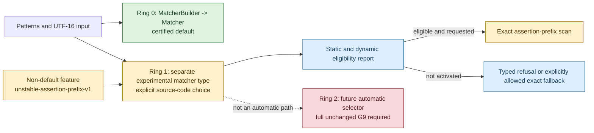
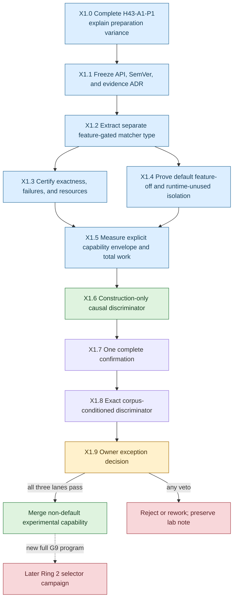

# H43 explicit assertion-prefix capability strategy

**Status:** X1.8 causal investigation complete; owner exception review available<br>
**Owner direction:** preserve the measured 205x-409x scan opportunity for
deliberate use without changing ordinary matcher performance<br>
**Policy relationship:** additive experimental product contract; the rejected
H43-A1 ruling remains unchanged<br>
**Production default:** current certified `Matcher` and `MatcherBuilder`

## Decision thesis

H43-A1 is not suitable for automatic admission under the existing G9-v3
contract. That does not imply that its exact assertion-prefix mechanism has no
product value. It means that the mechanism and the default matcher must have
different admission boundaries.

Rustmatch should therefore expose the mechanism, if it passes the gates below,
as a separately named experimental matcher type behind a narrow non-default
Cargo feature. Ordinary callers must not acquire a new field, branch, planner,
or automatic selector. Expert callers must make an unmistakable source-code
choice and must be able to observe whether specialization actually ran.

This preserves both facts:

- H43-A1 remains machine-rejected and cannot be relabeled or used to move the
  existing benchmark goalposts.
- An exact mechanism that measured about 205x at 1 MiB and 409x at 2 MiB can
  still become an honest, explicitly requested capability.

## Three-ring product boundary



| Ring | Caller action | Performance contract | Current status |
|---|---|---|---|
| 0: certified default | Use `MatcherBuilder` and `Matcher` normally. | Existing G9-v3 rules, including the unchanged greater-than-three-percent veto. | Production. |
| 1: explicit capability | Enable one narrow feature and instantiate a distinct experimental type. | Exactness and resources are absolute; performance is a published capability envelope and total-work utility contract. | Proposed. |
| 2: automatic selection | No caller action. | Must pass the same complete formal G9 campaign as every default optimization. | Not authorized. |

Ring 1 is not a waiver for Ring 0. It is a different, explicit API whose costs
cannot reach callers that do not construct it.

## Why a separate type is mandatory

The earlier illustrative design placed an `ExperimentalBackend` choice on
`MatcherBuilder`. That is too close to the default path for the first product
version. A new builder field, matcher enum variant, object-layout change, or
scan-time branch could perturb code generation even when the experimental
policy is not selected.

The first implementation should instead use a separately compiled module and
type, for example:

```rust,ignore
#[cfg(feature = "unstable-assertion-prefix-v1")]
use rustmatch::experimental::assertion_prefix_v1::{
    AssertionPrefixMatcherBuilder, ScanPolicy,
};

let mut builder = AssertionPrefixMatcherBuilder::new();
builder.add(PatternId::new(1), r"\bABCDE[0-9]+")?;
let matcher = builder.build()?;

let report = matcher.scan_with_policy(
    &input,
    ScanPolicy::RequireSpecialized,
    |matched| matches.push(matched),
)?;
assert!(report.specialized_backend_activated());
```

Names remain provisional until the API freeze. The important properties are:

- no method, field, enum, or dispatch branch is added to normal `Matcher`;
- the feature is narrow and versioned, rather than a broad
  `experimental-backends` switch;
- enabling the feature alone changes no normal construction or scan behavior;
- using the distinct type is the caller's deliberate second key; and
- the scan API returns activation and fallback facts instead of hiding them.

Cargo features are unified across a dependency graph. A downstream crate can
therefore cause a feature to be enabled without the application author making
a deliberate performance choice. The feature flag alone is not evidence of
intent. Constructing the separate type is.

A companion `rustmatch-experimental` crate would provide still stronger
packaging isolation, but it would initially require exposing or splitting
private compiler and engine internals. That creates more default-code churn
than the same-crate separate-type design. Reconsider a companion crate only
after the v1 capability proves useful and needs an independent release cadence.

## Eligibility and caller control

### Static analysis

Construction must publish a typed analysis of the pattern set. The first
version may compile only when:

- an assertion-bearing cohort exists;
- every assertion-bearing pattern proves the same nonzero five-unit ASCII
  consumed prefix after its leading assertion;
- the assertion-bearing cohort has at least 256 patterns; and
- retained candidate storage is bounded with checked arithmetic.

Static ineligibility returns a typed build error. It must not silently create a
normal matcher, because the caller explicitly asked for this capability.

### Dynamic policy

Input length and bounded sample density are scan facts. The API should make
their consequence explicit through one of two policies:

| Policy | Behavior |
|---|---|
| `RequireSpecialized` | Run only if the frozen dynamic eligibility rule will activate the specialized path. Otherwise return a typed refusal before delivering callbacks. |
| `AllowExactFallback` | Permit the generic exact path, but return a report containing the fallback reason. |

The initial dynamic rule should retain the evidence-tested minimum input of one
MiB of UTF-16 units and the bounded 64 Ki-unit sample below the frozen density
ceiling. It may be changed only by a new versioned policy with its own evidence.

No workload name, fixture hash, expected output, timing history, machine
identity, or post-hoc cutoff may influence construction or routing. A future
expert `ForceSpecialized` policy may be considered only after v1 is certified;
it may bypass performance heuristics but never semantic or resource
preconditions.

## Two different performance questions

The default and explicit APIs answer different questions and must not share a
single ambiguous pass/fail summary.

### Default isolation question

Does adding the capability impose any cost on ordinary `Matcher` users?

The answer must be no under the existing strict guardrails. Both configurations
must be tested:

1. feature absent; and
2. feature present through Cargo unification, while only normal `Matcher` is
   constructed.

The normal matcher must retain its object layout, scanner call graph,
normalized hot-symbol disassembly, semantics, and benchmark behavior. Any
repeatable default regression above the existing threshold rejects the
experimental packaging, regardless of the specialized gain.

### Explicit capability question

Is the deliberately selected backend valuable within its declared envelope?

Report setup and scan time separately, and also evaluate total user work:

```text
T_total(N) = T_build + N * T_scan
```

Freeze at least `N = 1` and `N = 10` before measurement. This makes a setup
cost visible without allowing a millisecond-scale setup variance to erase a
multi-second scan saving, or allowing a large scan multiplier to hide an
unbounded setup cost. Publish the break-even scan count.

The first capability claim is deliberately narrow:

- exact assertion-prefix cohort described above;
- sparse eligible inputs of at least one MiB;
- one-worker scan unless later worker evidence is frozen separately; and
- measured scan opportunity of about 205x at 1 MiB and 409x at 2 MiB from the
  rejected H43-A1 investigation, not yet a production promise.

An activated target or near-boundary cell that is repeatably slower by more
than three percent means the eligibility envelope is wrong and must be narrowed
or the capability rejected. Inactive or fallback cells remain visible, but do
not veto Ring 0 when Ring 0 is independently proven unchanged.

## Three admission lanes

| Lane | Required evidence | Veto |
|---|---|---|
| A: default safety | Feature-off and feature-on/runtime-unused builds; public API diff; size/layout checks; hot-symbol disassembly; normal correctness suite; B0 and frozen ordinary performance guards. | Any semantic change, new normal dispatch, artifact/layout drift without explanation, or current-threshold regression. |
| B: explicit exactness | Differential event multisets; UTF-16 boundaries; assertions; callback panic/reuse; failure atomicity; fuzz/property checks; overflow; bounded allocations and RSS. | Any mismatch, panic/reuse defect, unchecked growth, silent fallback, or false activation report. |
| C: explicit utility | Target, short, dense, prefix-mismatch, ordinary, adversarial, and near-boundary cells; AB/BA preparation; `T_total(1)`, `T_total(10)`, break-even, allocation and RSS receipts. | Non-repeatable gain, severe unexplained regression inside the declared activated envelope, or a misleading capability claim. |

Passing all three lanes can authorize merging a non-default experimental
capability. It cannot authorize automatic selection.

## Incremental execution program



### X1.0: resolve the preparation uncertainty

Run the already planned phase-local AB/BA microscope with at least 31 builds
per order. Preserve H43-A1's rejection either way. A neutral result removes an
implementation uncertainty; a real setup cost becomes part of `T_build` and
the published break-even calculation rather than a hidden default cost.

### X1.1: freeze the contract before source changes

Record an ADR covering the feature name, separate type, instability/versioning
policy, static build errors, scan policies, activation report, and three-lane
gates. Update the API/versioning document: a supported default API remains
stable, while the versioned experimental capability has an explicit change and
removal policy.

### X1.2: extract, do not integrate

Move the benchmark-only H43-A1 mechanism into a new feature-gated module. Reuse
the existing private compiler and engine through narrow `pub(crate)` seams. Do
not add a variant to `Matcher`, a field to `MatcherBuilder`, or a branch to the
normal scan path. Keep `benchmark-internals` separate from the user-facing
experimental feature.

### X1.3-X1.5: certify independently

Run semantic/resource certification first so performance cannot excuse a
correctness defect. Then prove both default configurations unchanged. Only
after those gates pass should the exclusive-host utility window measure the
specialized envelope.

### X1.6: isolate the construction signal

Measure the generic and separate assertion matcher in one feature-on
executable with the same pattern set and no corpus or scan work inside the
timed interval. Retain registration, compile, complete preparation, structure,
and allocation receipts. A result below the existing investigation threshold
can remove the construction hypothesis from the blocker list, but cannot
rewrite X1.5.

### X1.7: run one complete confirmation

Run the single prospectively named complete confirmation without changing the
source, matrix, thresholds, or analyzer. Preserve an automatic veto even when
the explicit target economics remain exceptional.

### X1.8: isolate any confirmation-only preparation blocker

If the confirmation produces a narrow preparation-only veto, retain the exact
corpus and allocator preconditioning while removing scanning from the measured
process. Repeat once over the byte-exact rejected library source. This
discriminator may explain the veto but cannot relabel the confirmation.

### X1.9: make one narrow merge decision

If all lanes pass, the owner may authorize a merge containing only the
non-default v1 capability, its tests, evidence, lab note, and cautionary docs.
The optimization ledger should show it as an explicit experimental capability,
not as a default cumulative improvement. Cross-engine README numbers remain
the certified default numbers unless a separate clearly labeled opt-in table
is added.

## Reject and rework criteria

Reject or rework the experimental packaging before publication if any of the
following occurs:

- any event, UTF-16, assertion, callback, failure, or reuse mismatch;
- any feature-off or feature-on/runtime-unused normal-path regression;
- normal `Matcher` layout or hot dispatch changes merely because the feature
  exists;
- benchmark-specific routing, timing-derived selection, or silent fallback;
- candidate memory is not bounded by input length with checked arithmetic;
- the measured target gain is not reproducible under a fresh frozen window;
- total-work economics do not support the documented use case;
- a repeatable severe regression exists inside the claimed activated envelope
  and callers cannot avoid it honestly; or
- documentation implies that the experimental backend is universal, default,
  or already represented by the main comparison table.

## Promotion rule

The explicit switch is not a shortcut to automatic selection. Promotion to
Ring 2 requires a new frozen selector, causal near-boundary guards, and the same
complete formal G9 campaign required of any default optimization. Every H43-A1
rejection and every Ring 1 adverse cell remains part of that review.

## Completed prototype and immediate next action

H43-A1-P1 completed with neutral phase-local construction effects and exact
allocation and structure equivalence. Its [reviewed result](h43-a1-p1-result.md)
authorizes both H43-A2 and the X1.1 contract. [ADR-0009](../adr/0009-explicit-experimental-matcher.md)
freezes the separate-type boundary and authorizes an isolated source prototype.

H43-X2 implementation `ff1ac2f` extracted the mechanism behind the versioned
feature and separate matcher type. Its [reviewed result](h43-x2-result.md)
records passing local exactness plus feature-off and
feature-on/runtime-unused default-isolation gates.

X1.5 completed the full explicit-capability utility plan in a clean
exclusive-host window. Its [reviewed result](h43-x1-5-formal-admission-result.md)
records 232.54x and 456.05x paired target scan speedups, exact boundary and
fallback behavior, identical allocation probes, complete default safety, and
passing `T_total(1)` and `T_total(10)`. One 2 MiB preparation metric regressed
2.688833%, so the unchanged outcome is `investigate`, not publication or merge.

X1.6 then isolated exact separate-type construction from corpus I/O and scan
work in a frozen same-pattern discriminator. Its
[reviewed result](h43-x1-6-construction-discriminator-result.md) found the
specialized path 0.808000% slower in complete preparation, below the unchanged
2% boundary, with equal allocation probes and passing calibrations. The X1.5
construction blocker did not reproduce.

X1.7 R3 then completed the one prospectively authorized full confirmation. It
retained approximately 231.62x and 460.49x target scan speedups and complete
default safety, but the 2 MiB preparation metric regressed 5.792673% and
triggered the unchanged veto. The R3 result remains permanently rejected.

X1.8 retained exact corpus preconditioning and reproduced construction twice,
including once over the exact R3 library source. Complete preparation was only
0.717444% and 0.976161% slower, below 2%, so the veto-sized magnitude did not
reproduce. The next action is X1.9 owner review: leave the capability unmerged
or authorize a documented production exception. No more unchanged timing or
source tuning is justified.
