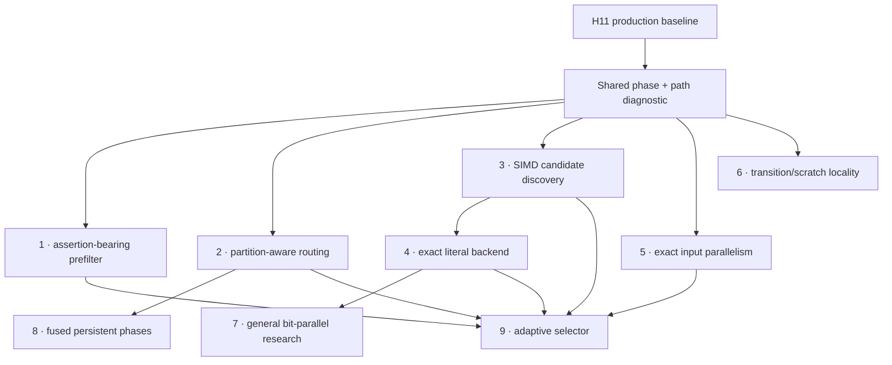

# Post-H11 future optimization portfolio

**Status:** reviewed portfolio; no implementation authorized

**Reviewed production baseline:** H11 exact measured source
`bacd5c46d934cd5526dcab78af88e375b2f13370`

**Review date:** 2026-07-26

## Executive conclusion

There is no single remaining optimization that dominates every workload.
H11 changed the shape of the problem:

- Rustmatch now beats Java rmatch on all nine current same-contract overlap
  cells, by a 27.893x geometric mean.
- Rustmatch is competitive with RegexSet overall, but still loses sharply on
  some dense and zero-output literal cells.
- Rustmatch reaches 0.210x Hyperscan's geometric-mean throughput on the eight
  current overlap cells. The largest gaps are literal-heavy; Rustmatch already
  wins the retained mixed-regex and Wuthering cells.
- H11 removed most repeated literal-corpus traversal on eligible large inputs,
  reducing the incremental case for immediately replacing pattern parallelism
  with input parallelism.
- Assertion-bearing pattern sets still disable every prefilter. The retained
  1,000-pattern `\bword…\b` guard scans all starts and takes roughly 76 seconds
  over 8 MiB. That is the clearest currently known high-upside, bounded-cost
  opportunity.

The recommended experiment order is therefore:

1. conservative assertion-bearing literal prefiltering;
2. partition-aware routing of H11 shared candidates;
3. SIMD candidate discovery;
4. an exact literal-only backend;
5. exact input-parallel semantic scanning, after its post-H11 phase gate;
6. transition and scratch locality;
7. a general bit-parallel engine research track;
8. fused persistent phases, only with new evidence; and
9. a workload selector only after at least two alternative paths have passed
   independently.

This order is a decision about the **next unit of evidence**, not a claim that
rank one has the greatest theoretical ceiling. It favors measured opportunity,
causal clarity, and reversible implementation over speculative maximum speed.

## Evidence that controls the ranking

### The gaps are workload-specific

The [current H11 comparison](h11-cross-engine-snapshot.md) reports:

| Workload | Rust/Hyperscan | Rust/RegexSet | Interpretation |
|---|---:|---:|---|
| Sparse literals, 10,000, 50 MiB | 0.118x | 5.382x | H11 is strong against RegexSet, but scalar candidate discovery remains far behind Hyperscan |
| Dense literals, 5,000, 50 MiB | 0.326x | 0.133x | A specialized exact-literal path has a large observable target |
| Zero-output literals, 10,000, 50 MiB | 0.011x | 0.758x | Fast rejection and vectorized scanning matter more than event delivery |
| Mixed regex, 10,000, 50 MiB | 1.067x | 7.963x | A wholesale general-engine replacement is not the first priority |
| Wuthering literals, 10,000, 8 MiB | 1.206x | 0.620x | No one literal strategy wins every corpus |

Competitor ratios nominate experiments; they do not admit production code.
RegexSet and Hyperscan also expose different output contracts, so their results
are diagnostic opportunity signals rather than Rustmatch acceptance gates.

### H11 moved the bottleneck

H11 builds one union candidate bitmap with at most eight input shards. Every
pattern partition then iterates those candidates and applies its private
necessary-prefix test before running the unchanged semantic engine. In the
four retained 50 MiB H11 target cells, total semantic starts were only
1.016x-1.017x the union candidate count.

That is excellent selectivity, but it leaves two separable costs:

1. every semantic partition still probes every union candidate; and
2. union candidate discovery still executes a scalar per-start prefix test.

Partition-aware routing attacks the first cost. SIMD candidate discovery
attacks the second. They must be tested separately so a result has a causal
interpretation.

### Several attractive mechanisms are already closed

The retained B2 diagnostics found:

- thread spawn itself consumed only 0.0320% of scan time; lifecycle plus join
  was 2.4618%, mostly the slower worker's tail;
- removable static partition skew was only 1.7699% at eight workers and
  1.4288% at twelve, with no stable predictor;
- external callback cost and vector growth were far below 1%, despite a large
  event buffer;
- doubling cache budget reduced fallback by about 5% but changed throughput by
  only +0.43% and -0.83%, while cache-miss rate rose 25.92% and 19.79%.

Persistent pools, load-aware pattern partitioning, event batching, and larger
caches therefore stay closed unless a successor changes the mechanism rather
than merely retuning the rejected design.

## Ranking method

The ratings are deliberately ordinal:

- **Opportunity** estimates end-to-end speedup potential in the workloads that
  actually activate the path.
- **Confidence** measures how directly retained source, profile, and benchmark
  evidence supports the mechanism.
- **Breadth** is the portion of Rustmatch workloads likely to benefit.
- **Cost** includes implementation, testing, portability, and maintenance.
- **Risk** combines semantic, regression, memory, and performance-selection
  risk.

The order is reviewed judgment, not a pseudo-precise formula. A high-ceiling
research project can rank below a modest diagnostic when it costs much more to
learn whether the premise is true.

| Rank | Candidate | Opportunity | Confidence | Breadth | Cost | Risk | Why this position |
|---:|---|---|---|---|---|---|---|
| 1 | Assertion-bearing conservative prefilter | Very high | High | Narrow | Medium-low | Medium | Source-proven 76-second cliff; reuses false-positive-only I7 machinery and unchanged semantic verification |
| 2 | Partition-aware H11 candidate routing | Medium-high | Medium | Medium | Medium | Low-medium | Explicit H11 successor; removes per-candidate probes across 16-32 partitions without changing matching semantics |
| 3 | SIMD shared candidate discovery | High | Medium | Medium | Medium-high | Medium | Directly replaces H11's scalar corpus pass and targets the largest Hyperscan literal gaps |
| 4 | Exact literal-only backend | Very high | Medium | Medium | High | High | Can bypass NFA/cache verification entirely on a strict literal subset; dense and zero-output gaps justify the cost |
| 5 | Exact input-parallel semantic scanning | High | Medium-low | Broad | High | High | Semantics are resolved, but H11 already captured the original repeated-traversal opportunity on eligible cells |
| 6 | Transition-table and scratch locality | Medium | Medium-low | Broad | Medium-high | Medium-high | H5 proves capacity is not the answer; a measured representation hypothesis is still missing |
| 7 | General bit-parallel regex engine | Very high | Low | Broad subset | Very high | Very high | Literature and Hyperscan establish a credible ceiling, but exact Rustmatch event semantics make this a research program |
| 8 | Fused persistent planning and semantic phases | Low-medium | Low | Medium | High | Medium-high | A pool alone is refuted; only barrier/data-movement fusion could make this a materially new mechanism |
| 9 | Adaptive workload-path selector | Compound | Dependency-blocked | Broad | Medium | High | Selection adds no speed itself and must wait for independently proven alternative paths |

## Candidate assessments

### 1. Assertion-bearing conservative prefilter

**Mechanism.** Today `Prefilter::compile` returns immediately when any
assertion is present. For a pattern such as `\bword0001\b`, however, the
leading assertion consumes no input and the literal still begins at the
pattern's start. Necessary-literal analysis can conservatively step past
leading zero-width assertions, build the existing candidate plan, and pass
only candidate starts to the unchanged assertion-aware NFA engine. The
prefilter remains false-positive-only and never creates an event.

**Why it leads.** The exact retained fixture is both expensive and structurally
simple: 1,000 boundary-delimited literals, 8 MiB, all-start scan, roughly
76 seconds. A strict first experiment can require every pattern to have a
structurally proven literal immediately after supported leading assertions.
Alternation, optional prefixes, unknown offsets, and mixed unfilterable
patterns remain on the current fallback.

**Main risks.** Necessary-literal extraction must distinguish zero-width
assertions from consuming or optional prefixes. Boundary and line-anchor
adversaries, UTF-16 isolated surrogates, input edges, alternation, repeated
assertions, and mixed databases need exact multiset parity.

**Next evidence.** Freeze a diagnostic-only candidate that enables the current
literal bitmap for the existing assertion-bypass fixture and reports candidate
density, assertion-NFA time, retained bytes, and exact event identity. Target
gain remains at least 5%; every assertion-free and unfilterable guard must
remain on its byte-identical path.

### 2. Partition-aware H11 candidate routing

**Mechanism.** Compile a global mapping from each conservative prefix bucket to
an eligible partition bitmask or compact partition list. During shared
candidate discovery, attach the route once, then give each semantic partition
only its candidate stream. The exact semantic engine still verifies every
admitted start.

**Why it ranks highly.** Current H11 gives each of 16-32 partitions the complete
union candidate iterator even though only about 1.6%-1.7% more semantic starts
than candidates survive in total. The H10/H11 review explicitly identified
partition masks as the first shared-path successor.

**Main risks.** A dense mask table can cost several MiB, hash collisions can
fan candidates out, and materializing per-partition vectors can trade probes
for allocation and writes. Non-ASCII inputs must remain conservative.

**Next evidence.** First add phase counters for union discovery, partition
prefix probes, semantic verification, and worker tails. Authorize a routing
prototype only if removable routing time exceeds 5% on at least one declared
target.

### 3. SIMD shared candidate discovery

**Mechanism.** Replace the scalar `UnionLiteralFilter::allows_start` loop with
portable vectorized UTF-16 prefix detection, retaining a scalar fallback and
the exact semantic verifier. Keep ISA-specific implementations isolated and
selected by runtime feature detection.

The `aho-corasick` packed searcher documents that vectorized multi-substring
search can be much faster than Aho-Corasick for small pattern sets, while also
documenting architecture and pattern-count limits. Hyperscan's published FDR
design combines SIMD multi-string shift-or filtering with exact verification.
Those designs support the direction, not a plug-compatible implementation:
Rustmatch has UTF-16 code-unit input, thousands of patterns, and different
event semantics.

**Main risks.** Pattern bucketing, lane tails, unaligned ranges, non-ASCII
conservatism, x86-64/aarch64 parity, and scalar-fallback codegen all need
guards. The H11 history makes inactive-path binary shape a first-class
regression risk.

**Next evidence.** Benchmark only shared candidate discovery, not the entire
semantic engine, across sparse, dense, zero-output, short-input, non-ASCII, and
one-worker controls. Continue only when the phase-level gain can produce at
least 5% end-to-end headroom.

### 4. Exact literal-only backend

**Mechanism.** Under a strict classifier, compile databases containing only
exact consuming literals into a multi-pattern automaton that emits all
overlapping occurrences and caller pattern IDs directly. Fixed literal length
makes the longest match for one pattern and start unambiguous; duplicate text
still maps to each distinct caller ID.

This is materially different from I7's rejected sparse Aho-Corasick-style
**prefilter**. That prototype paid trie candidate-generation cost and then
entered the semantic engine. A true literal backend replaces both phases for
eligible databases. The maintained `aho-corasick` implementation demonstrates
linear multi-pattern automata, overlapping-match support, and multiple
space/time representations, but its byte-oriented API is not directly
Rustmatch's raw UTF-16 contract.

**Main risks.** Raw UTF-16 symbols, duplicates, overlapping results, flags,
memory growth, build time, output-heavy behavior, and dependency policy make
this a substantial feature. The initial classifier should exclude assertions,
predicates, alternation, repetition, and case-insensitive syntax.

**Next evidence.** Build a diagnostic u16 exact-literal backend for the current
literal corpus family, compare exact event multisets and preparation cost, and
measure sparse, dense, zero-output, and Wuthering cells before discussing
production integration.

### 5. Exact input-parallel semantic scanning

The [B2-H-0006 design review](b2-h-0006-input-parallel-design.md) resolves its
semantic blocker by assigning disjoint **start positions**, not input slices,
to workers that retain access to the complete immutable input. It remains
blocked on post-H11 opportunity and worker-local scratch/cache economics.

The next step stays Stage P from that review. A full-database prototype is
justified only if semantic work, repeated routing, or worker tails expose at
least 5% removable headroom after H11.

### 6. Transition-table and scratch locality

H5 showed that simply enlarging the deterministic cache is counterproductive:
fallback fell modestly, throughput did not improve materially, and hardware
miss rates rose sharply. The remaining credible direction is representation,
not capacity: narrower indices, hot/cold table separation, structure-of-arrays
layouts, generation-stamped scratch, or state ordering by observed transition
frequency.

No one layout is yet evidence-ranked. The next action is a cache-line and
working-set profile tied to concrete structures. A broad rewrite without that
profile would be untestable optimization folklore.

### 7. General bit-parallel regex engine

Hyperscan reports SIMD bit representations for finite-automata state and
multi-string shift-or matching. The literature also contains multicore
AVX-accelerated bit-parallel multi-pattern algorithms. A Rustmatch successor
could represent a bounded NFA state set in machine or SIMD words and advance
many states without pointer-heavy edge traversal.

This has strategic upside, especially if exact-literal specialization proves
the value of a second engine. It also has the largest semantic and engineering
surface: longest match per pattern and start, complete overlap enumeration,
assertions, UTF-16 predicates, terminal identity, large state sets, fallback,
and memory bounds. It belongs in a research branch after lower-cost paths.

### 8. Fused persistent planning and semantic phases

H2 rejects a persistent pool whose purpose is thread-spawn removal: spawn was
0.0320%, and most join time represented actual worker-tail work. The only
credible successor would keep workers alive **and** fuse candidate discovery,
routing, and semantic consumption to remove a measured barrier or intermediate
materialization.

That is a different mechanism, but there is no evidence yet that its removable
phase cost exceeds 5%. It remains dormant until the common phase diagnostic
shows such a barrier.

### 9. Adaptive workload-path selector

A classifier may eventually choose among private scan, H11 shared candidates,
assertion-prefilter, exact-literal, and input-parallel paths using immutable
compiled features plus input size and candidate density. It must not be built
first. Each path needs independent correctness and performance evidence, and
the selector needs its own boundary and misclassification guards.

## Closed and watch-list directions

| Direction | Current ruling |
|---|---|
| Persistent pool for spawn avoidance | Closed by H2; spawn share was 0.0320% |
| Static load-aware pattern partitioning | Closed by H3; removable skew stayed below 2% with no stable predictor |
| Event callback/buffer speed optimization | Closed as a throughput path by H4; keep the 43.78 MiB buffer as a separate memory concern |
| Larger or adaptive cache budget | Closed by H5; worse locality offset the small fallback reduction |
| Reusing I7's sparse trie as another prefilter | Closed; candidate generation dominated the native profile |
| More cores without changing work | Closed as a strategy; I8 and B1 show plateaus and reversals |
| PGO, LTO, or broad inlining annotations | Not a standalone hypothesis; H11 requires binary-shape auditing for every hot-path candidate, not indiscriminate compiler directives |
| Threshold or goalpost relaxation | Forbidden; G9-v2 changes learning disposition, not admission thresholds |

## Recommended program

1. Add one benchmark-only phase diagnostic reusable by ranks 1, 2, 3, 5, 6,
   and 8. It must not alter production behavior.
2. Freeze the assertion-bearing prefilter as the next causal experiment because
   it already has a source-proven target and a strict fallback boundary.
3. Use the same diagnostic to decide whether routing or SIMD owns more of H11's
   remaining large-literal critical path. Do not combine them.
4. Prototype the exact-literal backend only after the lightweight H11
   successors, unless its isolated microbenchmark demonstrates a much larger
   end-to-end opportunity.
5. Return to H-0006 only after Stage P; semantic feasibility alone is not
   performance evidence.
6. Keep bit-parallel execution as a research track and the selector as a
   dependency-blocked integration step.

Every experiment receives a retained lab note whether it improves, regresses,
or is inconclusive. Only an exact candidate that passes correctness, its frozen
target floor, every guard, and the unchanged regression veto may enter the
production source tree.

## Sources

- [H11 current cross-engine snapshot](h11-cross-engine-snapshot.md)
- [B2-H-0006 exact input-parallel design](b2-h-0006-input-parallel-design.md)
- [I7 retained prefilter evidence](../evidence/i7/37f6981/README.md)
- [I8 retained parallel-partition evidence](../evidence/i8/ef61173/README.md)
- [G9-v2 optimization decision policy](../optimization-decision-policy.md)
- [`aho-corasick` multi-pattern automaton documentation](https://docs.rs/aho-corasick/latest/aho_corasick/)
- [`aho-corasick` packed SIMD search documentation](https://docs.rs/aho-corasick/latest/aho_corasick/packed/)
- [Hyperscan: A Fast Multi-pattern Regex Matcher](https://www.usenix.org/system/files/nsdi19-wang-xiang.pdf)
- [Kusudo, Ino, and Hagihara: bit-parallel multiple-pattern search](https://doi.org/10.1016/j.jpdc.2014.11.003)
