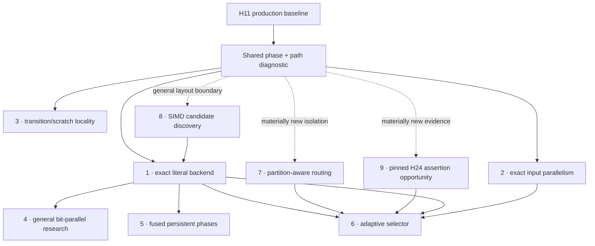

# Post-H11 future optimization portfolio

**Status:** H24 pinned; H39 and H40 rejected; exact literal backend next

**Reviewed production baseline:** H11 exact measured source
`bacd5c46d934cd5526dcab78af88e375b2f13370`

**Review date:** 2026-08-04

## H24-H38 pin update

The assertion-prefix mechanism remains an exceptional opportunity: H24 retained
roughly 200x-406x target scan gains and improved preparation 15.39%-45.30%.
A 144-process follow-up did not reproduce H24's original 2.360% peak-RSS order
signal. H25-H38 nevertheless failed to produce a materially distinct artifact
that retained H24's gains and passed every unchanged guard. The
[H26-H38 recovery review](b2-h-0026-terminal-memory-layout-recovery.md) closes
the current construction/layout route without merge.

H24 is therefore **pinned, not abandoned**. It remains visible as retained
research evidence but is not the active next experiment. Reopening it requires
materially new evidence, such as an independently justified stable production
layout policy or a genuinely different construction representation; repeating
or tuning the rejected artifacts is not authorized.

## H39 routing result

[B2-H-0039 partition-aware routing](b2-h-0039-partition-routing.md) exposed
8.383%-11.425% removable routing share on dense targets, then retained
4.894%-9.529% dense scan gains in a bounded exact candidate. It did not pass
the frozen production screen: dense-16 missed the five-percent target by
0.106 percentage points, while the inactive Wuthering guard regressed 3.822%
in scan and 3.456% in process wall. Both exceeded the unchanged automatic
veto. H39 is rejected before full G9 and H11 remains production.

The route mechanism remains positive evidence, not an active retry. Reopen it
only with a materially different stable representation or isolation method;
do not tune the frozen threshold or waive the guard.

## H40 SIMD result

[B2-H-0040 exact SIMD candidate discovery](b2-h-0040-simd-candidate-discovery.md)
proved unusually strong algorithmic value. Its exact isolated AVX2 kernel was
4.413x-4.641x faster than scalar candidate planning. The bounded production
recovery retained 22.937%-63.445% scan gains and 19.519%-41.658% wall gains on
all four targets, with every target pair positive.

H40 still failed its unchanged production screen. The inactive Wuthering
candidate-after stratum regressed 5.272% in scan and 3.321% in peak RSS, while
the ordinary candidate-before wall stratum regressed 2.266%. Neither guard
executes SIMD. The recovery already restored scalar sampling, exact accepted
build provenance, and private hot-function mnemonic identity. H40 is therefore
rejected before full G9 rather than retuned into benchmark-specific placement.

SIMD remains valuable retained research evidence, but it is no longer the
active next experiment. Reopen it only with a generally applicable stable
production-layout boundary or inside a materially different exact literal
engine. The exact literal-only backend is now the highest-ranked independent
candidate.

## Executive conclusion

There is no single remaining optimization that dominates every workload.
H11 changed the shape of the problem:

- Rustmatch now beats Java rmatch on all nine current same-contract overlap
  cells, by a 27.893x geometric mean.
- Rustmatch is competitive with RegexSet overall, but still loses sharply on
  some dense and zero-output literal cells.
- Rustmatch reaches 0.210x Hyperscan's geometric-mean throughput on the eight
  current overlap cells. The largest gaps are literal-heavy; Rustmatch already
  wins the retained mixed-regex and Wuthering cells.
- H11 removed most repeated literal-corpus traversal on eligible large inputs,
  reducing the incremental case for immediately replacing pattern parallelism
  with input parallelism.
- Assertion-bearing pattern sets still disable every prefilter. The retained
  1,000-pattern `\bword…\b` guard scans all starts and takes roughly 76 seconds
  over 8 MiB. H24 proved the opportunity but its current recovery route is
  pinned after H38.

The recommended experiment order is therefore:

1. an exact literal-only backend;
2. exact input-parallel semantic scanning, after its post-H11 phase gate;
3. transition and scratch locality;
4. a general bit-parallel engine research track;
5. fused persistent phases, only with new evidence;
6. a workload selector only after at least two alternative paths have passed
   independently;
7. partition-aware routing, only after materially new isolation evidence;
8. SIMD candidate discovery, only after a general layout boundary or inside a
   materially different exact literal engine; and
9. the pinned H24 assertion opportunity, only after materially new evidence.

This order is a decision about the **next unit of evidence**, not a claim that
rank one has the greatest theoretical ceiling. It favors measured opportunity,
causal clarity, and reversible implementation over speculative maximum speed.

## Evidence that controls the ranking

### The gaps are workload-specific

The [current H11 comparison](h11-cross-engine-snapshot.md) reports:

| Workload | Rust/Hyperscan | Rust/RegexSet | Interpretation |
|---|---:|---:|---|
| Sparse literals, 10,000, 50 MiB | 0.118x | 5.382x | H11 is strong against RegexSet, but scalar candidate discovery remains far behind Hyperscan |
| Dense literals, 5,000, 50 MiB | 0.326x | 0.133x | A specialized exact-literal path has a large observable target |
| Zero-output literals, 10,000, 50 MiB | 0.011x | 0.758x | Fast rejection and vectorized scanning matter more than event delivery |
| Mixed regex, 10,000, 50 MiB | 1.067x | 7.963x | A wholesale general-engine replacement is not the first priority |
| Wuthering literals, 10,000, 8 MiB | 1.206x | 0.620x | No one literal strategy wins every corpus |

Competitor ratios nominate experiments; they do not admit production code.
RegexSet and Hyperscan also expose different output contracts, so their results
are diagnostic opportunity signals rather than Rustmatch acceptance gates.

### H11 moved the bottleneck

H11 builds one union candidate bitmap with at most eight input shards. Every
pattern partition then iterates those candidates and applies its private
necessary-prefix test before running the unchanged semantic engine. In the
four retained 50 MiB H11 target cells, total semantic starts were only
1.016x-1.017x the union candidate count.

That is excellent selectivity, but it leaves two separable costs:

1. every semantic partition still probes every union candidate; and
2. union candidate discovery still executes a scalar per-start prefix test.

Partition-aware routing attacks the first cost. SIMD candidate discovery
attacks the second. They must be tested separately so a result has a causal
interpretation.

### Several attractive mechanisms are already closed

The retained B2 diagnostics found:

- thread spawn itself consumed only 0.0320% of scan time; lifecycle plus join
  was 2.4618%, mostly the slower worker's tail;
- removable static partition skew was only 1.7699% at eight workers and
  1.4288% at twelve, with no stable predictor;
- external callback cost and vector growth were far below 1%, despite a large
  event buffer;
- doubling cache budget reduced fallback by about 5% but changed throughput by
  only +0.43% and -0.83%, while cache-miss rate rose 25.92% and 19.79%.

Persistent pools, load-aware pattern partitioning, event batching, and larger
caches therefore stay closed unless a successor changes the mechanism rather
than merely retuning the rejected design.

## Ranking method

The ratings are deliberately ordinal:

- **Opportunity** estimates end-to-end speedup potential in the workloads that
  actually activate the path.
- **Confidence** measures how directly retained source, profile, and benchmark
  evidence supports the mechanism.
- **Breadth** is the portion of Rustmatch workloads likely to benefit.
- **Cost** includes implementation, testing, portability, and maintenance.
- **Risk** combines semantic, regression, memory, and performance-selection
  risk.

The order is reviewed judgment, not a pseudo-precise formula. A high-ceiling
research project can rank below a modest diagnostic when it costs much more to
learn whether the premise is true.

| Rank | Candidate | Opportunity | Confidence | Breadth | Cost | Risk | Why this position |
|---:|---|---|---|---|---|---|---|
| 1 | Exact literal-only backend | Very high | Medium | Medium | High | High | H40 proves large literal-path headroom; a whole exact backend can remove both candidate generation and NFA/cache verification behind a materially different boundary |
| 2 | Exact input-parallel semantic scanning | High | Medium-low | Broad | High | High | Semantics are resolved, but H11 already captured the original repeated-traversal opportunity on eligible cells |
| 3 | Transition-table and scratch locality | Medium | Medium-low | Broad | Medium-high | Medium-high | H5 proves capacity is not the answer; a measured representation hypothesis is still missing |
| 4 | General bit-parallel regex engine | Very high | Low | Broad subset | Very high | Very high | Literature and Hyperscan establish a credible ceiling, but exact Rustmatch event semantics make this a research program |
| 5 | Fused persistent planning and semantic phases | Low-medium | Low | Medium | High | Medium-high | A pool alone is refuted; only barrier/data-movement fusion could make this a materially new mechanism |
| 6 | Adaptive workload-path selector | Compound | Dependency-blocked | Broad | Medium | High | Selection adds no speed itself and must wait for independently proven alternative paths |
| 7 | Partition-aware H11 candidate routing | Medium-high | High | Medium | Medium | Medium-high | H39 proved dense gains but failed its target and the inactive Wuthering guard; revisit only with materially new isolation evidence |
| 8 | SIMD shared candidate discovery | Very high | High | Medium | Medium-high | Medium-high | H40 retained 22.9%-63.4% target gains but exhausted its bounded inactive-layout recovery; reopen only through a general boundary or a different exact engine |
| 9 | Pinned H24 assertion-prefix opportunity | Very high | Very high | Narrow | High | Medium-high | H24 proved 200x-406x gains, but H25-H38 exhausted the current construction/layout recovery route |

## Candidate assessments

### 9. Pinned assertion-bearing conservative prefilter

**Measured ruling.** H12 validated this mechanism but failed admission. All
targets and correctness gates passed; Wuthering crossed the automatic veto
even though it cannot execute the assertion path. See the
[retained result](b2-h-0012-assertion-prefilter-result.md). The active rank-one
item is now recovery and isolation, not a rerun of the rejected artifact.

**Mechanism.** Today `Prefilter::compile` returns immediately when any
assertion is present. For a pattern such as `\bword0001\b`, however, the
leading assertion consumes no input and the literal still begins at the
pattern's start. Necessary-literal analysis can conservatively step past
leading zero-width assertions, build the existing candidate plan, and pass
only candidate starts to the unchanged assertion-aware NFA engine. The
prefilter remains false-positive-only and never creates an event.

**Why it leads.** The exact retained fixture is both expensive and structurally
simple: 1,000 boundary-delimited literals, 8 MiB, all-start scan, roughly
76 seconds. A strict first experiment can require every pattern to have a
structurally proven literal immediately after supported leading assertions.
Alternation, optional prefixes, unknown offsets, and mixed unfilterable
patterns remain on the current fallback.

**Main risks.** Necessary-literal extraction must distinguish zero-width
assertions from consuming or optional prefixes. Boundary and line-anchor
adversaries, UTF-16 isolated surrogates, input edges, alternation, repeated
assertions, and mixed databases need exact multiset parity.

**Next evidence.** None is currently authorized. Reopen only after materially
new evidence supplies a stable production-layout policy or a genuinely new
construction representation. Any successor still requires ordinary-path
binary identity, exact semantics, and every unchanged numeric gate.

### 7. Partition-aware H11 candidate routing

**Measured ruling.** H39 passed its diagnostic headroom gate and retained real
dense gains, but failed its immutable focused production screen. Dense-16
improved 4.894%, below the five-percent target; dense-32 improved 9.529%.
The inactive Wuthering guard regressed 3.822% in scan and 3.456% in wall, with
both order strata negative. See the
[retained H39 result](b2-h-0039-partition-routing.md).

**Mechanism.** Compile a global mapping from each conservative prefix bucket to
an eligible partition bitmask or compact partition list. During shared
candidate discovery, attach the route once, then give each semantic partition
only its candidate stream. The exact semantic engine still verifies every
admitted start.

**Why it ranks highly.** Current H11 gives each of 16-32 partitions the complete
union candidate iterator even though only about 1.6%-1.7% more semantic starts
than candidates survive in total. The H10/H11 review explicitly identified
partition masks as the first shared-path successor.

**Main risks.** A dense mask table can cost several MiB, hash collisions can
fan candidates out, and materializing per-partition vectors can trade probes
for allocation and writes. Non-ASCII inputs must remain conservative.

**Next evidence.** None is currently authorized. Reopen only if a materially
different representation or stable isolation method can preserve the dense
gain without inactive-path regression. The unchanged target and veto remain.

### 8. SIMD shared candidate discovery

**Measured ruling.** H40 passed its isolated headroom gate and retained exact
22.937%-63.445% complete-scan gains in a bounded recovery. It failed the
unchanged focused production screen when the inactive Wuthering
candidate-after stratum regressed 5.272% in scan and 3.321% in peak RSS. The
ordinary candidate-before wall stratum also crossed the investigation
boundary. See the
[retained H40 result](b2-h-0040-simd-candidate-discovery.md).

**Mechanism.** Replace the scalar `UnionLiteralFilter::allows_start` loop with
portable vectorized UTF-16 prefix detection, retaining a scalar fallback and
the exact semantic verifier. Keep ISA-specific implementations isolated and
selected by runtime feature detection.

The `aho-corasick` packed searcher documents that vectorized multi-substring
search can be much faster than Aho-Corasick for small pattern sets, while also
documenting architecture and pattern-count limits. Hyperscan's published FDR
design combines SIMD multi-string shift-or filtering with exact verification.
Those designs support the direction, not a plug-compatible implementation:
Rustmatch has UTF-16 code-unit input, thousands of patterns, and different
event semantics.

**Main risks.** Pattern bucketing, lane tails, unaligned ranges, non-ASCII
conservatism, x86-64/aarch64 parity, and scalar-fallback codegen all need
guards. The H11 history makes inactive-path binary shape a first-class
regression risk.

**Next evidence.** None is currently authorized. Do not retune H40 or tune
function placement. Reopen only after a generally applicable stable
production-layout boundary is independently justified, or reuse the exact
kernel inside a materially different exact literal engine that must pass fresh
unchanged guards.

### 1. Exact literal-only backend

**Mechanism.** Under a strict classifier, compile databases containing only
exact consuming literals into a multi-pattern automaton that emits all
overlapping occurrences and caller pattern IDs directly. Fixed literal length
makes the longest match for one pattern and start unambiguous; duplicate text
still maps to each distinct caller ID.

This is materially different from I7's rejected sparse Aho-Corasick-style
**prefilter**. That prototype paid trie candidate-generation cost and then
entered the semantic engine. A true literal backend replaces both phases for
eligible databases. The maintained `aho-corasick` implementation demonstrates
linear multi-pattern automata, overlapping-match support, and multiple
space/time representations, but its byte-oriented API is not directly
Rustmatch's raw UTF-16 contract.

**Main risks.** Raw UTF-16 symbols, duplicates, overlapping results, flags,
memory growth, build time, output-heavy behavior, and dependency policy make
this a substantial feature. The initial classifier should exclude assertions,
predicates, alternation, repetition, and case-insensitive syntax.

**Next evidence.** This is now the active rank-one diagnostic. Freeze a raw-u16
exact-literal backend on assay-disjoint and established literal families,
compare exact overlapping event multisets and preparation cost, and measure
sparse, dense, zero-output, Wuthering, and inactive mixed-regex cells before
discussing production integration.

### 2. Exact input-parallel semantic scanning

The [B2-H-0006 design review](b2-h-0006-input-parallel-design.md) resolves its
semantic blocker by assigning disjoint **start positions**, not input slices,
to workers that retain access to the complete immutable input. It remains
blocked on post-H11 opportunity and worker-local scratch/cache economics.

The next step stays Stage P from that review. A full-database prototype is
justified only if semantic work, repeated routing, or worker tails expose at
least 5% removable headroom after H11.

### 3. Transition-table and scratch locality

H5 showed that simply enlarging the deterministic cache is counterproductive:
fallback fell modestly, throughput did not improve materially, and hardware
miss rates rose sharply. The remaining credible direction is representation,
not capacity: narrower indices, hot/cold table separation, structure-of-arrays
layouts, generation-stamped scratch, or state ordering by observed transition
frequency.

No one layout is yet evidence-ranked. The next action is a cache-line and
working-set profile tied to concrete structures. A broad rewrite without that
profile would be untestable optimization folklore.

### 4. General bit-parallel regex engine

Hyperscan reports SIMD bit representations for finite-automata state and
multi-string shift-or matching. The literature also contains multicore
AVX-accelerated bit-parallel multi-pattern algorithms. A Rustmatch successor
could represent a bounded NFA state set in machine or SIMD words and advance
many states without pointer-heavy edge traversal.

This has strategic upside, especially if exact-literal specialization proves
the value of a second engine. It also has the largest semantic and engineering
surface: longest match per pattern and start, complete overlap enumeration,
assertions, UTF-16 predicates, terminal identity, large state sets, fallback,
and memory bounds. It belongs in a research branch after lower-cost paths.

### 5. Fused persistent planning and semantic phases

H2 rejects a persistent pool whose purpose is thread-spawn removal: spawn was
0.0320%, and most join time represented actual worker-tail work. The only
credible successor would keep workers alive **and** fuse candidate discovery,
routing, and semantic consumption to remove a measured barrier or intermediate
materialization.

That is a different mechanism, but there is no evidence yet that its removable
phase cost exceeds 5%. It remains dormant until the common phase diagnostic
shows such a barrier.

### 6. Adaptive workload-path selector

A classifier may eventually choose among private scan, H11 shared candidates,
assertion-prefilter, exact-literal, and input-parallel paths using immutable
compiled features plus input size and candidate density. It must not be built
first. Each path needs independent correctness and performance evidence, and
the selector needs its own boundary and misclassification guards.

## Closed and watch-list directions

| Direction | Current ruling |
|---|---|
| Persistent pool for spawn avoidance | Closed by H2; spawn share was 0.0320% |
| Static load-aware pattern partitioning | Closed by H3; removable skew stayed below 2% with no stable predictor |
| Event callback/buffer speed optimization | Closed as a throughput path by H4; keep the 43.78 MiB buffer as a separate memory concern |
| Larger or adaptive cache budget | Closed by H5; worse locality offset the small fallback reduction |
| Reusing I7's sparse trie as another prefilter | Closed; candidate generation dominated the native profile |
| More cores without changing work | Closed as a strategy; I8 and B1 show plateaus and reversals |
| PGO, LTO, or broad inlining annotations | Not a standalone hypothesis; H11 requires binary-shape auditing for every hot-path candidate, not indiscriminate compiler directives |
| Threshold or goalpost relaxation | Forbidden; G9-v2 changes learning disposition, not admission thresholds |

## Recommended program

1. Freeze a diagnostic exact-literal backend contract before production work.
   Bind raw UTF-16, duplicate IDs, overlapping events, build cost, retained
   bytes, and strict eligibility in advance.
2. Require exact parity and phase-level headroom capable of at least five
   percent end-to-end gain before authorizing integration.
3. Retain sparse, dense, zero-output, Wuthering, short-input, mixed-regex, and
   one-worker guards without threshold changes.
4. Return to H-0006 only after Stage P; semantic feasibility alone is not
   performance evidence.
5. Revisit H39, H40, or H24 only with materially new evidence. H40 specifically
   requires a generally applicable layout boundary or a different exact engine,
   not another placement-tuned SIMD artifact.
6. Keep bit-parallel execution as a research track and the selector
   dependency-blocked until independently admitted alternatives exist.

Every experiment receives a retained lab note whether it improves, regresses,
or is inconclusive. Only an exact candidate that passes correctness, its frozen
target floor, every guard, and the unchanged regression veto may enter the
production source tree.

## Sources

- [H11 current cross-engine snapshot](h11-cross-engine-snapshot.md)
- [B2-H-0006 exact input-parallel design](b2-h-0006-input-parallel-design.md)
- [I7 retained prefilter evidence](../evidence/i7/37f6981/README.md)
- [I8 retained parallel-partition evidence](../evidence/i8/ef61173/README.md)
- [G9-v2 optimization decision policy](../optimization-decision-policy.md)
- [`aho-corasick` multi-pattern automaton documentation](https://docs.rs/aho-corasick/latest/aho_corasick/)
- [`aho-corasick` packed SIMD search documentation](https://docs.rs/aho-corasick/latest/aho_corasick/packed/)
- [Hyperscan: A Fast Multi-pattern Regex Matcher](https://www.usenix.org/system/files/nsdi19-wang-xiang.pdf)
- [Kusudo, Ino, and Hagihara: bit-parallel multiple-pattern search](https://doi.org/10.1016/j.jpdc.2014.11.003)
