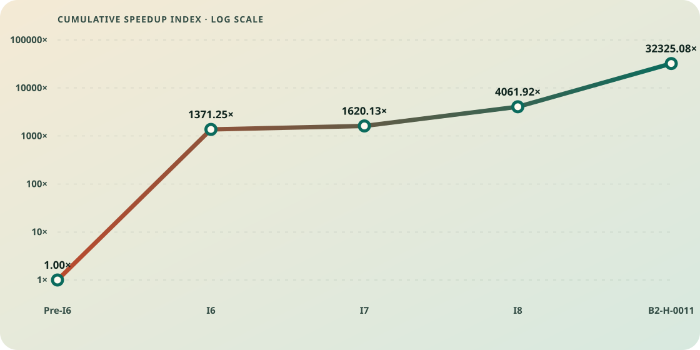

# Optimization attempt ledger

> Generated from [`optimization-attempts.json`](optimization-attempts.json). Do not edit this file directly. Last reviewed: **2026-07-26**.

## Decision policy

**G9-v2**, effective **2026-07-26**. [Read the complete policy](optimization-decision-policy.md).

Correctness and exact event semantics remain prerequisites. A demonstrated guard regression above 3% automatically vetoes admission. A demonstrated regression above 2% through 3% requires investigation: the candidate is not merged, receives no progress credit, and must produce a retained causal follow-up. Performance-motivated complexity normally must produce at least a repeatable 5% target improvement.

- Merged: every correctness and admission gate passes; the production baseline advances.
- Investigate: a demonstrated guard regression is above 2% through 3%, or a reviewed high-discrepancy result contains unusually large opposing effects with plausible separable causes. No code is admitted and the baseline does not move.
- Rejected: correctness fails, a guard regression exceeds 3%, or evidence closes the mechanism without sufficient unresolved value. An automatic artifact veto does not erase a separately documented algorithmic signal.
- Inconclusive: evidence cannot establish the required target gain, regression, or causal direction.
- Only merged attempts enter the efficiency-progress graph. Every outcome retains its measurements and lab note.

G9-v2 refines the learning disposition without changing historical measurements or admission decisions. B2-H-0009 remained rejected under G9-v1, and B2-H-0010 remained rejected after three inactive paths crossed the unchanged three-percent veto. Their unusually large opposing effects triggered causal follow-up rather than threshold relaxation. B2-H-0011 then repaired the diagnosed private-path compiler boundary, passed the unchanged matrix without a demonstrated regression, and merged as the first completed G9-v2 recovery.

## Merged-improvement progress

The chart is an **admission evidence speedup index**, not a direct end-to-end historical benchmark. It starts at 1.0 and multiplies each merged optimization's frozen baseline/candidate scan-time ratio. Every non-merged experiment is excluded by construction.

| Merged optimization | Frozen positive gate | Incremental speedup | Cumulative index |
|---|---|---:|---:|
| I6 | Wuthering, 10k patterns, 675259 B | 1371.25x | 1371.25x |
| I7 | Wuthering, 10k patterns, 8 MiB | 1.18x | 1620.13x |
| I8 | Wuthering, 10k patterns, 8 MiB, 1 to 8 workers | 2.51x | 4061.92x |
| B2-H-0011 | Sparse literals, 10k patterns, 50 MiB, 24 workers | 7.96x | 32325.08x |

## Attempt ledger

### I6 - Bounded lazy deterministic-state cache

- **Date:** 2026-07-18
- **Outcome:** `merged`
- **Baseline:** `9ef1b17cc6a865f44920c7c4f74f4a44b0b2c8f4`
- **Candidate:** `406c1f5294b8797fbc47eb0c37342244426c8a9f`
- **Mechanism:** Materialize deterministic transitions lazily behind a bounded cache while retaining exact NFA fallback when the budget fills.
- **Measured result:** On the 10,000-pattern Wuthering comparison, median scan time fell from 45.014 s to 32.827 ms with identical 153,971 events and digest. Focused gates improved 98.25%-99.67%; the assertion bypass improved 6.46%.
- **Tradeoffs and caveats:** Peak RSS rose by 4.64 MiB. A 16,384-state opt-in budget was 18.1% faster than 8,192 states on one 8 MiB case, while 32,768 states eliminated fallback but was slower than 16,384.
- **Decision:** Merged. Exact semantics and every declared positive and guard threshold passed.
- **Evidence:** [evidence/i6/406c1f5/README.md](evidence/i6/406c1f5/README.md)

### I7 - Conservative start prefilter

- **Date:** 2026-07-18
- **Outcome:** `merged`
- **Baseline:** `284571996b343041d374f2620905f32d63dbafdc`
- **Candidate:** `37f69819d9231fb99d747d4ae48034204657c1f2`
- **Mechanism:** Use compact exact-prefix tables and false-positive-only hash bitsets to skip impossible start positions before semantic verification.
- **Measured result:** Focused scans improved 27.47%-86.18%. Wuthering improved 35.79%, 27.08%, and 15.36% at 1,000, 5,000, and 10,000 patterns with exact event equality.
- **Tradeoffs and caveats:** The 10,000-pattern build cost rose from 7.673 ms to 17.261 ms. Sparse Aho-Corasick-style and anchored-trie prototypes were profiled, found slower, and removed.
- **Decision:** Merged only the compact conservative filter. The semantic engine remains authoritative.
- **Evidence:** [evidence/i7/37f6981/README.md](evidence/i7/37f6981/README.md)

### I8 - Explicit parallel pattern partitions

- **Date:** 2026-07-18
- **Outcome:** `merged`
- **Baseline:** `f7a5e95588b96653f8cf3cb2445c6c17f571c4fe`
- **Candidate:** `ef6117368cd70b23fcfede1b26525c5f5366f53a`
- **Mechanism:** Partition the pattern database across scoped workers, retain partition-local state, then deliver the exact merged event sequence.
- **Measured result:** On the 10,000-pattern, 8 MiB Wuthering gate, one worker took 249.801 ms and the repeated eight-worker winner took 99.635 ms, a 2.51x throughput speedup and 60.11% time reduction.
- **Tradeoffs and caveats:** Scaling plateaued at 6-12 workers and degraded after 12. Eight workers were 23.6x slower on the smallest short-input guard. Every worker traverses the corpus, memory rises, and callback delivery remains serial.
- **Decision:** Merged as explicit opt-in parallelism; the public default remains one worker.
- **Evidence:** [evidence/i8/ef61173/README.md](evidence/i8/ef61173/README.md)

### B2-H-0001 - Shared candidate-start scan

- **Date:** 2026-07-25
- **Outcome:** `rejected`
- **Baseline:** `da755b0069c94d4da9db74a8778dd9932fc64671`
- **Candidate:** `1c489ea46c2ef5d48634f2dc8017b56f7415d4f7`
- **Mechanism:** Replace repeated partition-local literal candidate scans with one immutable shared candidate-start plan.
- **Measured result:** Aggregate cycles, instructions, and cache references fell roughly 70%, but both six-worker targets regressed about 28%. Guards regressed 5%-42.6%, triggering the automatic veto.
- **Tradeoffs and caveats:** Candidate planning and prefix admission moved onto the serial critical path. The useful idea would require parallel production or pipelining rather than a serial union.
- **Decision:** Rejected and not admitted despite lower aggregate machine work.
- **Evidence:** [https://github.com/la3lma/rmatch-performance-measurements/blob/7d4591518a6018eb1ffa3fd1e8b2885d4b505756/docs/lab-notebook/2026-07-25-b2-h-0001-shared-candidate-starts.md](https://github.com/la3lma/rmatch-performance-measurements/blob/7d4591518a6018eb1ffa3fd1e8b2885d4b505756/docs/lab-notebook/2026-07-25-b2-h-0001-shared-candidate-starts.md)

### B2-H-0002 - Persistent worker pool

- **Date:** 2026-07-25
- **Outcome:** `rejected`
- **Baseline:** `da755b0069c94d4da9db74a8778dd9932fc64671`
- **Candidate:** `a0477c0d32c8e6a98ed008d92b648a73c1ffa588`
- **Mechanism:** Measure whether per-scan thread creation and joining justify a persistent worker executor.
- **Measured result:** Lifecycle plus join was 2.4618% of scan time, with worker spawn only 0.0320%. Two workers were 2.3466% slower than one.
- **Tradeoffs and caveats:** Most measured join time was a symptom of the slowest worker tail, not removable executor overhead.
- **Decision:** Diagnostic rejected; no pool implementation or production candidate was created.
- **Evidence:** [https://github.com/la3lma/rmatch-performance-measurements/blob/7d4591518a6018eb1ffa3fd1e8b2885d4b505756/docs/lab-notebook/2026-07-25-b2-h-0002-worker-lifecycle.md](https://github.com/la3lma/rmatch-performance-measurements/blob/7d4591518a6018eb1ffa3fd1e8b2885d4b505756/docs/lab-notebook/2026-07-25-b2-h-0002-worker-lifecycle.md)

### B2-H-0003 - Load-aware pattern partitioning

- **Date:** 2026-07-25
- **Outcome:** `rejected`
- **Baseline:** `da755b0069c94d4da9db74a8778dd9932fc64671`
- **Candidate:** `1085667916e863604742830a75a3480c97fde97b`
- **Mechanism:** Measure removable worker skew and search for a stable compile-time predictor before implementing weighted pattern partitions.
- **Measured result:** Median removable skew was only 1.7699% at eight workers and 1.4288% at twelve. No stable predictor emerged; twelve-worker throughput was 0.8273% lower.
- **Tradeoffs and caveats:** The worker tail exists, but its recoverable ceiling is below the 5% burden and partition identity is unstable.
- **Decision:** Diagnostic rejected; no load-balancing candidate was created.
- **Evidence:** [https://github.com/la3lma/rmatch-performance-measurements/blob/7d4591518a6018eb1ffa3fd1e8b2885d4b505756/docs/lab-notebook/2026-07-25-b2-h-0003-partition-balance.md](https://github.com/la3lma/rmatch-performance-measurements/blob/7d4591518a6018eb1ffa3fd1e8b2885d4b505756/docs/lab-notebook/2026-07-25-b2-h-0003-partition-balance.md)

### B2-H-0005 - Adaptive deterministic-cache budget

- **Date:** 2026-07-26
- **Outcome:** `rejected`
- **Baseline:** `da755b0069c94d4da9db74a8778dd9932fc64671`
- **Candidate:** `dd6db6704cbedefb539210f10d4fff451fc30d46`
- **Mechanism:** Double the total cache budget at the 16- and 24-worker endpoints to test whether deterministic fallback explains the scaling collapse.
- **Measured result:** Fallback fell 5.25% and 5.43%, but throughput changed only +0.4319% at 16 workers and -0.8344% at 24. Hardware cache-miss rate worsened 25.92% and 19.79%.
- **Tradeoffs and caveats:** Peak RSS increased about 1.5%-1.7%; reducing fallback did not recover the retained 44.34% 16-to-24-worker throughput loss.
- **Decision:** Diagnostic rejected; no adaptive cache policy or production candidate was created.
- **Evidence:** [https://github.com/la3lma/rmatch-performance-measurements/blob/7d4591518a6018eb1ffa3fd1e8b2885d4b505756/docs/lab-notebook/2026-07-26-b2-h-0005-cache-budget-v2.md](https://github.com/la3lma/rmatch-performance-measurements/blob/7d4591518a6018eb1ffa3fd1e8b2885d4b505756/docs/lab-notebook/2026-07-26-b2-h-0005-cache-budget-v2.md)

### B2-H-0004 - Dense-output buffering and callback delivery

- **Date:** 2026-07-26
- **Outcome:** `rejected`
- **Baseline:** `da755b0069c94d4da9db74a8778dd9932fc64671`
- **Candidate:** `f30869b87ab7d568c4b3f7a257f9f1e75c59713c`
- **Mechanism:** Separate dense event discovery, vector growth, assembly, hashing, and external callback delivery before implementing exact-capacity buffering or batching.
- **Measured result:** Callback omission changed median scan time by -0.16% at 16 workers and +0.08% at 32, with both 95% intervals spanning zero. Vector growth consumed only 0.033-0.078 ms; the zero-output control passed.
- **Tradeoffs and caveats:** The diagnostic preserved all 500,000 events and exact digest. Maximum partition scan time rose from 128.43 ms to 216.43 ms from 16 to 32 workers, while callback throughput retained 60.28%, pointing away from delivery and toward discovery or shared-resource pressure.
- **Decision:** Diagnostic rejected; no event-buffering, callback-batching, profiling, or production candidate was created.
- **Evidence:** [https://github.com/la3lma/rmatch-performance-measurements/blob/d2a92174e4629aa33d04b636e469c7e41505c240/docs/lab-notebook/2026-07-26-b2-h-0004-event-delivery.md](https://github.com/la3lma/rmatch-performance-measurements/blob/d2a92174e4629aa33d04b636e469c7e41505c240/docs/lab-notebook/2026-07-26-b2-h-0004-event-delivery.md)

### B2-H-0008 - FUTURE-MEMORY duplicated-traversal diagnostic

- **Date:** 2026-07-26
- **Outcome:** `inconclusive`
- **Baseline:** `da755b0069c94d4da9db74a8778dd9932fc64671`
- **Candidate:** `cf852a86552b9733251f91a176faa48a39de9da7`
- **Mechanism:** Measure exact logical input work, cache pressure, AMD fill proxies, and topology-aware placement across the sparse and dense high-worker reversals without changing production behavior.
- **Measured result:** The sparse 16-to-24-worker step lost 42.52% throughput while cache misses rose 47.07%; the dense 16-to-32 step lost 41.30% while cache misses rose 61.97%. Aggregate logical work scaled exactly with partitions, while topology-aware placement recovered only 0.70% and 0.12%.
- **Tradeoffs and caveats:** The retained fill events are memory-hierarchy proxies rather than direct controller bandwidth. The diagnostic supports duplicated traversal and hierarchy pressure, but does not isolate DRAM saturation or provide a production implementation.
- **Decision:** Diagnostic completed with exact semantics and clean instrumentation. It admits no code; fresh B2 review separately authorized B2-H-0009 as the bounded production follow-up, which was subsequently tested and rejected.
- **Evidence:** [https://github.com/la3lma/rmatch-performance-measurements/blob/e38edc1ede61ce253866939e3aee84db576ef836/docs/lab-notebook/2026-07-26-b2-h-0008-future-memory.md](https://github.com/la3lma/rmatch-performance-measurements/blob/e38edc1ede61ce253866939e3aee84db576ef836/docs/lab-notebook/2026-07-26-b2-h-0008-future-memory.md)

### B2-H-0009 - Parallel shared candidate planning

- **Date:** 2026-07-26
- **Outcome:** `investigate`
- **Baseline:** `da755b0069c94d4da9db74a8778dd9932fc64671`
- **Candidate:** `b05e482ce9aafd9dac1bf083308d78ed0ce131ef`
- **Mechanism:** Build one conservative union candidate bitmap with eight disjoint input-range shards, then let each existing pattern-partition worker admit only its own necessary prefixes.
- **Measured result:** Exact semantics and all four primary targets passed. The sparse 50 MiB, 10,000-literal, 24-worker target improved 734.672% (8.35x), with the other primary effects ranging from +122.143% to +395.281%. The unchanged zero-output private fallback regressed 2.00249%, with all six pairs negative.
- **Tradeoffs and caveats:** The shared plan removed repeated corpus traversal and proved very high upside for large high-worker literal workloads. Binary analysis found the private scanner's 4,341-instruction mnemonic sequence unchanged but relocated. Static controls found that candidate-only diagnostics account for 0x1540, about 73%, of a uniform 0x1cf0 displacement; shared implementation code leaves 0x7b0. The rejecting guard never activated the new algorithm, creating a strong code-layout confound and an unusually large target/guard discrepancy.
- **Decision:** The exact H9 artifact remains rejected, unmerged, and excluded from progress under its frozen G9-v1 ruling. Under G9-v2 the mechanism is classified investigate: retain every receipt and run one instrumentation-neutral, pipeline-isolated successor through the unchanged numeric gates.
- **Evidence:** [https://github.com/la3lma/rmatch-performance-measurements/blob/8d735196bef1e488f544e158ecd4b20a6332586b/docs/lab-notebook/2026-07-26-b2-h-0009-parallel-shared-candidates.md](https://github.com/la3lma/rmatch-performance-measurements/blob/8d735196bef1e488f544e158ecd4b20a6332586b/docs/lab-notebook/2026-07-26-b2-h-0009-parallel-shared-candidates.md)

### B2-H-0010 - Instrumentation-neutral shared candidate isolation

- **Date:** 2026-07-26
- **Outcome:** `investigate`
- **Baseline:** `da755b0069c94d4da9db74a8778dd9932fc64671`
- **Candidate:** `a371125f22fb18797c1d1c6e595f1fd0a987c5a0`
- **Mechanism:** Reconstruct H9 with scan-local shared candidates, byte-identical benchmark source, unchanged Matcher and diagnostics state, and separately compiled private and shared source modules.
- **Measured result:** Exact semantics and all four primary targets passed. Sparse 50 MiB improved 371.639% and 709.958%; dense 50 MiB improved 118.381% and 310.996%. Three inactive guards that never created the shared planner regressed 20.120%-24.928%, with all six pairs negative in each cell.
- **Tradeoffs and caveats:** The static isolation proxy passed: the selected baseline and candidate private specialization had equal size, mnemonic sequence, and 64-byte alignment. The large inactive-path regressions nevertheless remained scan-phase costs, while preparation and RSS were neutral. A neutral inactive Wuthering guard proves the effect is workload- or path-sensitive rather than a universal dispatch charge.
- **Decision:** The exact H10 artifact is rejected, unmerged, and excluded from progress by the unchanged three-percent veto. The shared-candidate mechanism remains investigate because its 2.18x-8.10x target ratios oppose large regressions on dormant paths; next compare the actual guard symbols, callers, placement, and profiles across baseline, H9, and H10 before authorizing another implementation.
- **Evidence:** [https://github.com/la3lma/rmatch-performance-measurements/blob/1795c527e82b07738e5669ead9e878775cd8e1e6/docs/lab-notebook/2026-07-26-b2-h-0010-shared-candidate-isolation.md](https://github.com/la3lma/rmatch-performance-measurements/blob/1795c527e82b07738e5669ead9e878775cd8e1e6/docs/lab-notebook/2026-07-26-b2-h-0010-shared-candidate-isolation.md)

### B2-H-0011 - Shared candidate recovery with private prefilter inlining

- **Date:** 2026-07-26
- **Outcome:** `merged`
- **Baseline:** `da755b0069c94d4da9db74a8778dd9932fc64671`
- **Candidate:** `bacd5c46d934cd5526dcab78af88e375b2f13370`
- **Mechanism:** Retain H10's parallel shared-candidate architecture, then restore the baseline private scanner's compiler shape by forcing the tiny literal-prefix predicate back into the per-start hot loop.
- **Measured result:** Exact semantics and all eleven frozen cells passed. The four primary targets improved 116.181%-695.703%; the strongest sparse 24-worker gate reached 7.96x baseline throughput. H10's three vetoing inactive paths recovered from -20.120% to -24.928% into +0.641% to +1.956% improvements.
- **Tradeoffs and caveats:** The accepted artifact is the complete four-commit architecture plus repair, not the final annotation in isolation. Wuthering was +6.803% in aggregate but order-sensitive (+9.287% AB, +0.053% BA), so it is not claimed as a portable gain. Three pre-measurement windows were rejected and retained without creating timing receipts.
- **Decision:** Accepted under the unchanged G9-v2 matrix and merged as exact measured source in merge commit de33ea16673d179c5878045b44ec5e4eefa970f7. No demonstrated regression, unresolved negative, automatic veto, or opposed signal remained.
- **Evidence:** [experiments/b2-h-0011-private-prefilter-recovery.md](experiments/b2-h-0011-private-prefilter-recovery.md)

### B2-H-0012 - Assertion-bearing conservative literal prefilter

- **Date:** 2026-07-26
- **Outcome:** `investigate`
- **Baseline:** `bacd5c46d934cd5526dcab78af88e375b2f13370`
- **Candidate:** `169c47c0c1360dbbf4653834bd144d9a66a14093`
- **Mechanism:** Step past only leading zero-width assertions while proving necessary literal prefixes, then use a private candidate bitmap without exposing assertion filters to H11 shared planning.
- **Measured result:** Exact semantics and all three targets passed. Sparse assertion targets improved 18,421%-38,435% (about 185x-385x baseline), and the mixed adversary improved 72,035% (about 721x). The unrelated Wuthering guard regressed 3.038%, with all six pairs negative, and assertion preparation regressed 11.161%-22.316%.
- **Tradeoffs and caveats:** The scan algorithm removes almost all impossible assertion starts and has exceptional upside, but filter proof and construction add preparation cost. Wuthering cannot execute the assertion path; candidate-only sink-specialized assertion functions changed ordinary scanner size and placement, making code-generation or hot-layout interference the leading regression hypothesis.
- **Decision:** Machine-rejected by the unchanged three-percent veto and not merged. Classified investigate under G9-v2 because the enormous target gains oppose a plausibly separable inactive-path regression. The next successor must isolate assertion dispatch, preserve ordinary scanner shape, and reduce preparation cost under a fresh frozen contract.
- **Evidence:** [experiments/b2-h-0012-assertion-prefilter-result.md](experiments/b2-h-0012-assertion-prefilter-result.md)

## Cross-engine evolution

### 2026-07-26 - H11 current-production admission overlap

**Current production snapshot**. Rust revision `bacd5c46d934cd5526dcab78af88e375b2f13370`; reviewed measurement revision `581980d524e8c083d89cf468d98c7cab06ff8776`.

This current-production view uses exact H11 candidate medians for the scenarios covered by its frozen admission matrix and retained competitor values from the unchanged full B2 review. Where H11 measured two worker counts for one scenario, the higher measured H11 throughput is used. Coverage is deliberately limited to exact overlaps: nine Java rmatch scenarios, eight RegexSet scenarios, and eight Hyperscan scenarios. It is not a full-dataset rerun. Java rmatch shares Rustmatch's complete event contract; RegexSet and Hyperscan retain different diagnostic contracts.

| Engine | Contract | Cells won | Geometric-mean Rust/engine | Median | Range |
|---|---|---:|---:|---:|---:|
| [Java rmatch](experiments/h11-cross-engine-snapshot.md#java-rmatch) | same complete event contract; H11 overlap | 9/9 | 27.893x | 35.350x | 2.737x-63.846x |
| [RegexSet](experiments/h11-cross-engine-snapshot.md#regexset) | different output contract; H11 overlap | 4/8 | 1.351x | 1.084x | 0.133x-7.963x |
| [Hyperscan](experiments/h11-cross-engine-snapshot.md#hyperscan) | native-reference diagnostic; H11 overlap | 2/8 | 0.210x | 0.254x | 0.011x-1.206x |
### 2026-07-26 - Full B2 baseline snapshot before H11

**Historical snapshot**. Rust revision `da755b0069c94d4da9db74a8778dd9932fc64671`; reviewed measurement revision `d2a92174e4629aa33d04b636e469c7e41505c240`.

Geometric means summarize the frozen B2 cell-level Rust/competitor throughput ratios. Java rmatch shares Rustmatch's full event contract. RegexSet and Hyperscan use different output contracts, so their ratios are diagnostic references rather than fairness claims.

| Engine | Contract | Cells won | Geometric-mean Rust/engine | Median | Range |
|---|---|---:|---:|---:|---:|
| [Java rmatch](https://github.com/la3lma/rmatch-performance-measurements/blob/d2a92174e4629aa33d04b636e469c7e41505c240/work/b2-reviewed-v8/pre-review/tables/rust-vs-java-rmatch.csv) | same complete event contract | 38/38 | 13.769x | 19.596x | 2.301x-32.062x |
| [RegexSet](https://github.com/la3lma/rmatch-performance-measurements/blob/d2a92174e4629aa33d04b636e469c7e41505c240/work/b2-reviewed-v8/pre-review/tables/rust-vs-regexset-diagnostic.csv) | different output contract | 15/35 | 0.463x | 0.751x | 0.006x-2.673x |
| [Hyperscan](https://github.com/la3lma/rmatch-performance-measurements/blob/d2a92174e4629aa33d04b636e469c7e41505c240/work/b2-reviewed-v8/pre-review/tables/rust-vs-native-reference-diagnostic.csv) | native-reference diagnostic | 8/39 | 0.128x | 0.127x | 0.006x-4.798x |

## Plausible future optimizations

| Priority | Hypothesis | Status | Why it remains plausible | Next discriminating test | Expected value |
|---:|---|---|---|---|---|
| 1 | [**FUTURE-ASSERT - Assertion-dispatch isolation and prefilter recovery**](experiments/post-h11-future-optimization-portfolio.md) | H12 investigated; recovery design pending | H12 proved exact sparse assertion gains of roughly 185x-385x, but its artifact crossed the unchanged veto on a Wuthering path that cannot execute assertion candidates. Candidate-only sink specializations changed ordinary scanner size and placement, while filter construction added 11%-22% preparation cost. | Freeze one non-generic or separately compiled assertion-dispatch successor. Require ordinary-path binary-shape and focused-counter parity before timing, profile filter construction, and rerun every H12 target and guard unchanged. | Very high narrow-workload opportunity, very high mechanism confidence, medium recovery cost and regression risk |
| 2 | [**FUTURE-ROUTE - Partition-aware H11 candidate routing**](experiments/post-h11-future-optimization-portfolio.md) | reviewed successor; phase diagnostic pending | Every H11 semantic partition still probes every union candidate, while only about 1.6%-1.7% more semantic starts than candidates survive across all partitions. A global prefix-to-partition route can remove repeated probes without changing the verifier. | Measure union discovery, partition-prefix routing, semantic verification, and worker tails. Prototype a compact route mask or list only if routing exposes at least 5% removable target time. | Medium-high opportunity, medium confidence, medium cost, low-medium correctness risk |
| 3 | [**FUTURE-SIMD - SIMD shared candidate discovery**](experiments/post-h11-future-optimization-portfolio.md) | literature-supported; phase prototype pending | H11's union candidate scan still applies a scalar prefix predicate at each input start. Hyperscan's largest leads are sparse and zero-output literal scans, where vectorized multi-literal filtering is structurally advantaged. | Isolate candidate-discovery time and compare one portable SIMD UTF-16 prefix scanner with the scalar H11 loop, retaining runtime feature detection and a byte-identical scalar fallback. | High literal-path opportunity, medium confidence, medium-high portability cost and regression risk |
| 4 | [**FUTURE-LITERAL-EXACT - Exact literal-only backend**](experiments/post-h11-future-optimization-portfolio.md) | reviewed research prototype | A strict exact-literal backend can emit overlapping occurrences and pattern IDs directly, avoiding both prefilter candidate generation and NFA/cache verification. This is materially different from I7's rejected Aho-Corasick-style prefilter. | Build a diagnostic raw-u16 multi-pattern automaton for exact consuming literals and measure exact event parity, build cost, retained bytes, sparse, dense, zero-output, and Wuthering behavior. | Very high literal-only upside, medium confidence, high implementation, memory, and maintenance risk |
| 5 | [**B2-H-0006 - Exact input-parallel semantic scanning**](experiments/b2-h-0006-input-parallel-design.md) | semantic design reviewed; phase diagnostic pending | Disjoint start-position ownership over the complete immutable input is exact. H11 already removed most repeated literal traversal on eligible cells, so the remaining value must come from combined-database semantic work, worker tails, or non-H11 paths. | Run Stage P from the design review. Prototype a full database with candidate-balanced disjoint start ranges only if post-H11 removable semantic or tail headroom exceeds 5%. | Potentially broad high upside, medium-low confidence, high state-locality and resource risk |
| 6 | [**FUTURE-LAYOUT - Transition-table and scratch-state locality**](experiments/post-h11-future-optimization-portfolio.md) | profiling required | A larger cache reduced fallback but increased hardware misses, so representation and locality remain more credible than capacity. Existing profiles still show transition construction and cache lookup as material costs. | Bind cache-line and working-set profiles to one concrete narrower-index, hot/cold split, structure-of-arrays, or generation-stamped scratch hypothesis before changing production layout. | Moderate broad opportunity, medium-low confidence, medium-high implementation and performance-regression risk |
| 7 | [**FUTURE-BITPARALLEL - General bit-parallel regex execution**](experiments/post-h11-future-optimization-portfolio.md) | strategic research track | SIMD bitsets and multi-string shift-or have demonstrated high throughput in the literature and Hyperscan, but Rustmatch must retain complete longest-event enumeration, assertions, raw UTF-16, and bounded memory. | After literal specialization evidence, prototype a bounded bitset NFA transition kernel on one assertion-free semantic family and compare exact events, working set, and fallback. | Very high theoretical ceiling, low present confidence, very high effort and semantic risk |
| 8 | [**FUTURE-PHASE-FUSION - Fused persistent planning and semantic phases**](experiments/post-h11-future-optimization-portfolio.md) | dormant pending new phase evidence | H2 refuted thread-spawn avoidance: spawn was 0.0320%. A materially new design would have to remove a measured barrier or intermediate candidate materialization by fusing planning, routing, and semantic work. | Do not build a pool. Reconsider only if the shared phase diagnostic identifies a barrier or materialization above 5% that fusion can remove. | Low-medium uncertain opportunity, high cost, and medium-high lifecycle and regression risk |
| 9 | [**FUTURE-SELECTOR - Adaptive workload-path selector**](experiments/post-h11-future-optimization-portfolio.md) | dependency-blocked | Selection adds no speed by itself. It becomes useful only after independent alternatives have passed and can be separated by immutable compiled features, input size, and candidate density. | Wait for at least two independently admitted paths, then freeze classifier boundaries and adversarial near-boundary guards without retuning historical series. | Compound portfolio value, but no independent opportunity and high misclassification regression risk |

## Regeneration

Run `cargo xtask optimization-ledger` after changing the source ledger. `cargo xtask ci` runs `cargo xtask verify-optimization-ledger` and fails when the Markdown, HTML, SVG, or HTML evidence universe is stale.
