# rustmatch implementation roadmap

**Last reviewed:** 2026-07-17  
**Implementation increments started:** **0/12**  
**Implementation increments complete:** **0/12**  
**Available for execution:** **I0 - semantic charter**

This page is the at-a-glance map from the completed product planning to a
tested rustmatch release. The detailed requirements, architecture, use cases,
evidence contracts, and exit criteria remain in the [main README](../README.md).
This graph shows dependency and status; it does not replace those definitions.
Roadmap IDs identify evidence-bearing milestones, not required one-to-one pull
request boundaries. The README's bootstrap sequence favors small vertical PRs
that keep the system executable.

> **Hard optimization rule:** Java rmatch results can nominate an idea for a
> Rust experiment, but cannot advance an optimization milestone. Every
> performance-motivated change must preserve results and show a positive Rust
> improvement beyond a predeclared noise threshold. Neutral, inconclusive, or
> slower results fail the gate. Semantic extensions require correctness and
> applicable non-regression evidence, not a speedup.

## Dependency graph

Select any task or gate to jump to its detailed description in the README.
Color carries status or role, so task boxes do not repeat state labels.
Every task and gate begins with a unique symbolic short name. These IDs are
stable references for commits, pull requests, evidence manifests, and roadmap
discussion even when a task's wording or color changes.

```mermaid
flowchart TB
    subgraph LEGEND[Color legend]
        L0["Planned"]
        L1["Complete"]
        L2["Available for execution"]
        L3["Active"]
        L4["Evidence and testing"]
        L5["Gate or review"]
        L6["Blocked or failed"]
    end

    subgraph PLAN[Planning foundation]
        P0["P0 Product requirements and scope"]
        P1["P1 Architecture and executable-spine strategy"]
        P2["P2 Use-case evidence contracts"]
        Q0["Q0 Documentation and Rust hygiene policy"]
        Q1["Q1 Community health and repository governance"]
    end

    subgraph BOOT[Bootstrap and first executable system]
        I0["I0 Semantic charter and ADRs"]
        F0["F0 Fixture schema and Java 2.0.0-RC1 oracle JSONL"]
        W0["W0 Cargo workspace and quality tooling"]
        A0["A0 Public builder, input, span, and sink API"]
        I1["I1 Executable ASCII-literal spine<br/>HIR -> shared NFA -> database -> scan -> events"]
        C0["C0 Mandatory functional PR CI"]
        C1["C1 Coarse CI performance tripwire"]
        B0["B0 Benchmark-adapter correctness smoke"]
        E0["E0 UC evidence summary command"]
    end

    subgraph SEM[Vertically integrated semantic growth]
        I2["I2 ASCII predicates"]
        I3["I3 Alternation and grouping"]
        I4["I4 Repetition and longest-match semantics"]
        I5["I5 UTF-16, flags, anchors, and boundaries"]
        S0["S0 Documented rmatch 2.x semantic parity gate"]
    end

    subgraph OPT[Optimization and scale]
        X0["X0 Authoritative external base/branch<br/>regression campaign"]
        I6["I6 Lazy deterministic-state cache"]
        G6["G6 Rust performance proof for I6<br/>correctness parity + positive win beyond noise<br/>Java evidence does not count"]
        I7["I7 Safe start acceleration and literal prefilter"]
        G7["G7 Rust performance proof for I7<br/>correctness parity + positive win beyond noise<br/>Java evidence does not count"]
        I8["I8 Parallel pattern partitions"]
        G8["G8 Rust performance proof for I8<br/>correctness parity + positive win beyond noise<br/>Java evidence does not count"]
        I9["I9 Full benchmark-harness integration"]
        B1["B1 Correctness-gated cross-engine receipts<br/>and complete thread sweeps"]
    end

    subgraph HARD[Hardening]
        H1["H1 Property, fuzz, Miri, and soak evidence"]
        H2["H2 Public API and rustdoc audit"]
        H3["H3 Dependency, license, security, and MSRV audit"]
        I10["I10 Hardening gate"]
    end

    subgraph RELEASE[Release preparation]
        R1["R1 Packaged-artifact semantic and consumer tests"]
        R2["R2 Exact-artifact performance campaign"]
        R3["R3 Compatibility matrix, changelog, and package review"]
        I11["I11 Release gate"]
        REL["REL Publish crate, signed tag, and GitHub release"]
    end

    P0 --> I0
    P1 --> I0
    P2 --> I0
    Q0 --> W0
    Q1 --> W0

    I0 --> F0
    I0 --> A0
    F0 --> I1
    W0 --> I1
    A0 --> I1
    I1 --> B0
    I1 --> E0
    I1 --> C0
    I1 --> C1

    B0 --> I2
    E0 --> I2
    C0 --> I2
    C1 --> I2
    I2 --> I3 --> I4 --> I5 --> S0
    F0 -. differential evidence grows with every slice .-> S0
    E0 -. every slice must expose its UC evidence .-> S0

    B0 --> X0
    C1 -. severe-anomaly signal only .-> X0
    S0 --> I6 --> G6 --> I7 --> G7 --> I8 --> G8 --> I9 --> B1
    X0 -. authoritative Rust performance evidence .-> G6
    X0 -. authoritative Rust performance evidence .-> G7
    X0 -. authoritative Rust performance evidence .-> G8

    B1 --> H1
    B1 --> H2
    B1 --> H3
    H1 --> I10
    H2 --> I10
    H3 --> I10

    I10 --> R1
    I10 --> R2
    I10 --> R3
    R1 --> I11
    R2 --> I11
    R3 --> I11
    I11 --> REL

    classDef planned fill:#e5e7eb,stroke:#6b7280,color:#111827,stroke-width:1px;
    classDef complete fill:#dcfce7,stroke:#15803d,color:#14532d,stroke-width:2px;
    classDef available fill:#fef9c3,stroke:#ca8a04,color:#422006,stroke-width:3px;
    classDef active fill:#ffedd5,stroke:#ea580c,color:#431407,stroke-width:3px;
    classDef evidence fill:#dbeafe,stroke:#2563eb,color:#172554,stroke-width:2px;
    classDef gate fill:#f3e8ff,stroke:#9333ea,color:#3b0764,stroke-width:3px;
    classDef blocked fill:#fee2e2,stroke:#dc2626,color:#450a0a,stroke-width:3px;

    class L0 planned;
    class L1 complete;
    class L2 available;
    class L3 active;
    class L4 evidence;
    class L5 gate;
    class L6 blocked;

    class P0,P1,P2,Q0,Q1,W0 complete;
    class I0 available;
    class F0,B0,E0,C0,C1,X0,B1,H1,R1,R2 evidence;
    class S0,G6,G7,G8,I10,I11 gate;
    class A0,I1,I2,I3,I4,I5,I6,I7,I8,I9,H2,H3,R3,REL planned;

    click P0 "https://github.com/la3lma/rustmatch/blob/main/README.md#product-requirements-document" "Open product requirements"
    click P1 "https://github.com/la3lma/rustmatch/blob/main/README.md#architecture" "Open architecture"
    click P2 "https://github.com/la3lma/rustmatch/blob/main/README.md#use-case-evidence-contract" "Open evidence contracts"
    click Q0 "https://github.com/la3lma/rustmatch/blob/main/CONTRIBUTING.md" "Open documentation and Rust hygiene policy"
    click Q1 "https://github.com/la3lma/rustmatch/blob/main/GOVERNANCE.md" "Open community health and governance policy"
    click I0 "https://github.com/la3lma/rustmatch/blob/main/README.md#increment-0-time-box-the-semantic-charter" "Open I0 description"
    click F0 "https://github.com/la3lma/rustmatch/blob/main/README.md#increment-0-time-box-the-semantic-charter" "Open fixture and oracle description"
    click W0 "https://github.com/la3lma/rustmatch/blob/main/README.md#increment-1-executable-ascii-literal-spine" "Open workspace description"
    click A0 "https://github.com/la3lma/rustmatch/blob/main/README.md#public-api-requirements" "Open public API requirements"
    click I1 "https://github.com/la3lma/rustmatch/blob/main/README.md#increment-1-executable-ascii-literal-spine" "Open I1 description"
    click C0 "https://github.com/la3lma/rustmatch/blob/main/README.md#fast-functional-pr-ci" "Open functional CI policy"
    click C1 "https://github.com/la3lma/rustmatch/blob/main/README.md#coarse-ci-performance-tripwire" "Open CI performance policy"
    click B0 "https://github.com/la3lma/rustmatch/blob/main/README.md#increment-1-executable-ascii-literal-spine" "Open benchmark smoke description"
    click E0 "https://github.com/la3lma/rustmatch/blob/main/README.md#use-case-evidence-contract" "Open evidence command description"
    click I2 "https://github.com/la3lma/rustmatch/blob/main/README.md#increment-2-ascii-predicates-through-the-spine" "Open I2 description"
    click I3 "https://github.com/la3lma/rustmatch/blob/main/README.md#increment-3-alternation-and-grouping-through-the-spine" "Open I3 description"
    click I4 "https://github.com/la3lma/rustmatch/blob/main/README.md#increment-4-repetition-and-general-longest-match-execution" "Open I4 description"
    click I5 "https://github.com/la3lma/rustmatch/blob/main/README.md#increment-5-assertions-and-exact-character-behavior" "Open I5 description"
    click S0 "https://github.com/la3lma/rustmatch/blob/main/README.md#increment-5-assertions-and-exact-character-behavior" "Open semantic parity gate"
    click X0 "https://github.com/la3lma/rustmatch/blob/main/README.md#authoritative-external-regression-testing" "Open external regression policy"
    click I6 "https://github.com/la3lma/rustmatch/blob/main/README.md#increment-6-lazy-deterministic-state-cache" "Open I6 description"
    click G6 "https://github.com/la3lma/rustmatch/blob/main/README.md#increment-6-lazy-deterministic-state-cache" "Open I6 performance gate"
    click I7 "https://github.com/la3lma/rustmatch/blob/main/README.md#increment-7-safe-start-acceleration-and-literal-prefilter" "Open I7 description"
    click G7 "https://github.com/la3lma/rustmatch/blob/main/README.md#increment-7-safe-start-acceleration-and-literal-prefilter" "Open I7 performance gate"
    click I8 "https://github.com/la3lma/rustmatch/blob/main/README.md#increment-8-parallel-pattern-partitions" "Open I8 description"
    click G8 "https://github.com/la3lma/rustmatch/blob/main/README.md#increment-8-parallel-pattern-partitions" "Open I8 performance gate"
    click I9 "https://github.com/la3lma/rustmatch/blob/main/README.md#increment-9-benchmark-harness-integration" "Open I9 description"
    click B1 "https://github.com/la3lma/rustmatch/blob/main/README.md#increment-9-benchmark-harness-integration" "Open benchmark evidence description"
    click H1 "https://github.com/la3lma/rustmatch/blob/main/README.md#increment-10-hardening" "Open hardening evidence"
    click H2 "https://github.com/la3lma/rustmatch/blob/main/README.md#increment-10-hardening" "Open API audit description"
    click H3 "https://github.com/la3lma/rustmatch/blob/main/README.md#increment-10-hardening" "Open dependency audit description"
    click I10 "https://github.com/la3lma/rustmatch/blob/main/README.md#increment-10-hardening" "Open I10 gate"
    click R1 "https://github.com/la3lma/rustmatch/blob/main/README.md#increment-11-release-preparation" "Open packaged test description"
    click R2 "https://github.com/la3lma/rustmatch/blob/main/README.md#increment-11-release-preparation" "Open release performance description"
    click R3 "https://github.com/la3lma/rustmatch/blob/main/README.md#increment-11-release-preparation" "Open release documentation description"
    click I11 "https://github.com/la3lma/rustmatch/blob/main/README.md#increment-11-release-preparation" "Open I11 gate"
    click REL "https://github.com/la3lma/rustmatch/blob/main/README.md#increment-11-release-preparation" "Open publication description"
```

Solid arrows show required dependencies. Dotted arrows show evidence that
accumulates across several increments; they are intentionally retained as a
separate visual language from the execution path.

## Milestone ledger

The graph is intentionally conservative. A milestone changes to `Active`
only after implementation or fixture work exists and at least one named
evidence command runs. It changes to `Complete` only when its README exit criteria
and use-case evidence bundle pass from a clean checkout.

| ID | Milestone | Status | Evidence needed for `Complete` |
|---|---|---|---|
| P0 | Product requirements and scope | Complete | PRD, goals, non-goals, requirements, and release criteria in README |
| P1 | Architecture and executable-spine strategy | Complete | Architecture, boundaries, ADR backlog, and vertical delivery strategy in README |
| P2 | Use-case evidence contracts | Complete | Evidence classes plus UC-0 through UC-12 proof requirements in README |
| Q0 | Documentation and Rust hygiene policy | Complete | Contribution standard defines formatting, linting, visibility, errors, unsafe, dependencies, rustdoc, tests, evidence IDs, and required checks |
| Q1 | Community health and repository governance | Complete | Conduct, security, support, governance, ownership, issue, pull-request, dependency, changelog, and citation policies are present and linked |
| I0 | Time-boxed semantic charter | Available | UTF-16 and event ADRs, fixture schema, Maven Central `no.rmz:rmatch:2.0.0-RC1` oracle protocol, first ASCII fixture set |
| W0 | Cargo workspace and quality tooling | Complete | Rust 2024 workspace, pinned `1.97.0` toolchain, `1.85.0` MSRV lane, formatting, Clippy, tests, rustdoc, root quality command, and green GitHub Actions run |
| I1 | Executable ASCII-literal spine | Planned | Public end-to-end literal matcher through real HIR, dense shared NFA, database, scan loop, sink, differential fixture, mandatory functional PR CI, coarse performance tripwire, and benchmark smoke |
| I2 | ASCII predicates | Planned | Public differential fixtures and exhaustive ASCII predicate tests through the same spine |
| I3 | Alternation and grouping | Planned | Public composition fixtures, epsilon-closure invariants, and bounded HIR/NFA property comparison |
| I4 | Repetition and longest match | Planned | Exact overlap/ambiguity fixtures, quantifier binding, repetition limits, and Java event equality |
| I5 | UTF-16, flags, and assertions | Planned | Full documented syntax tier, exhaustive character/context evidence, and semantic parity manifests |
| I6 | Lazy deterministic-state cache | Planned | Rust optimized/baseline event equality, cache-budget fallback evidence, and positive improvement beyond the predeclared noise gate; Java results only motivate candidates |
| I7 | Safe prefilter | Planned | Rust prefilter on/off event equality, adversarial safety fixtures, and positive improvement in the measured activation region; Java thresholds do not count |
| I8 | Parallel partitions | Planned | Event equality across worker counts, failure/deadlock tests, resource cleanup, complete thread sweep, and a positive Rust throughput result beyond noise |
| I9 | Benchmark integration | Planned | Packaged adapter accepted by the ordinary harness with validated, reproducible receipts |
| I10 | Hardening | Planned | Property/fuzz/Miri/soak evidence, public API/rustdoc audit, and dependency/license/security/MSRV audit |
| I11 | Release preparation | Planned | Exact package passes semantic, consumer, documentation, and performance gates; compatibility matrix and changelog complete |
| REL | First stable release | Planned | Published crate, signed tag, GitHub release, and archived release receipts |

## Status update protocol

Yellow means that a task's declared prerequisites are satisfied and the task
can be started. It does not mean that the roadmap has selected that task as the
next or most important work. When several tasks are yellow, the next task is a
separate decision based on current value, risk reduction, evidence needs,
available capacity, and explicit maintainer direction. Starting the selected
task changes it to orange; the remaining executable candidates stay yellow.

When work begins or a gate is completed:

1. Keep the node's symbolic short name stable. New tasks and gates must receive
   a unique short name before they are added.
2. Change the node's Mermaid class to `available`, `active`, `complete`, or
   `blocked` as appropriate; node labels remain free of repeated status prose.
3. Update the milestone ledger with a link to the durable evidence.
4. Update the summary counts at the top of this page and in the README link.
5. Verify that the node still links to its detailed README description.
6. Commit the roadmap update with the implementation or evidence that justifies
   it, not as an unsupported progress claim.

The roadmap status is evidence-driven. Code volume, elapsed time, and a green
unit test for one disconnected layer do not by themselves move a box forward.
