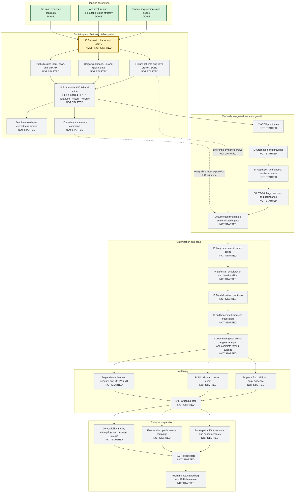

# rustmatch implementation roadmap

**Last reviewed:** 2026-07-17  
**Overall implementation status:** **NOT STARTED**  
**Implementation increments started:** **0/12**  
**Implementation increments complete:** **0/12**  
**Next gate:** **I0 - time-boxed semantic charter**

This page is the at-a-glance map from the completed product planning to a
tested rustmatch release. The detailed requirements, architecture, use cases,
evidence contracts, and exit criteria remain in the [main README](../README.md).
This graph shows dependency and status; it does not replace those definitions.

## Dependency graph

### Legend

| Appearance | Meaning |
|---|---|
| Green, `DONE` | Durable planning artifact or implementation evidence exists |
| Yellow, `NEXT - NOT STARTED` | The next dependency gate, with no implementation claim yet |
| Blue, `IN PROGRESS` | Work and at least one reproducible evidence command exist, but the exit criteria do not yet pass |
| Gray, `NOT STARTED` | No implementation evidence has been accepted |
| Solid arrow | Required dependency or critical-path progression |
| Dotted arrow | Evidence that accumulates across several increments |

## Milestone ledger

The graph is intentionally conservative. A milestone changes to `IN PROGRESS`
only after implementation or fixture work exists and at least one named
evidence command runs. It changes to `DONE` only when its README exit criteria
and use-case evidence bundle pass from a clean checkout.

| ID | Milestone | Status | Evidence needed for `DONE` |
|---|---|---|---|
| P0 | Product requirements and scope | Done | PRD, goals, non-goals, requirements, and release criteria in README |
| P1 | Architecture and executable-spine strategy | Done | Architecture, boundaries, ADR backlog, and vertical delivery strategy in README |
| P2 | Use-case evidence contracts | Done | Evidence classes plus UC-0 through UC-12 proof requirements in README |
| I0 | Time-boxed semantic charter | Next - not started | UTF-16 and event ADRs, fixture schema, pinned Java oracle protocol, first ASCII fixture set |
| I1 | Executable ASCII-literal spine | Not started | Public end-to-end literal matcher through real HIR, dense shared NFA, database, scan loop, sink, differential fixture, and benchmark smoke |
| I2 | ASCII predicates | Not started | Public differential fixtures and exhaustive ASCII predicate tests through the same spine |
| I3 | Alternation and grouping | Not started | Public composition fixtures, epsilon-closure invariants, and bounded HIR/NFA property comparison |
| I4 | Repetition and longest match | Not started | Exact overlap/ambiguity fixtures, quantifier binding, repetition limits, and Java event equality |
| I5 | UTF-16, flags, and assertions | Not started | Full documented syntax tier, exhaustive character/context evidence, and semantic parity manifests |
| I6 | Lazy deterministic-state cache | Not started | Optimized/baseline event equality, cache-budget fallback evidence, and measured improvement |
| I7 | Safe prefilter | Not started | Prefilter on/off event equality, adversarial safety fixtures, and measured activation policy |
| I8 | Parallel partitions | Not started | Event equality across worker counts, failure/deadlock tests, resource cleanup, and complete thread sweep |
| I9 | Benchmark integration | Not started | Packaged adapter accepted by the ordinary harness with validated, reproducible receipts |
| I10 | Hardening | Not started | Property/fuzz/Miri/soak evidence, public API/rustdoc audit, and dependency/license/security/MSRV audit |
| I11 | Release preparation | Not started | Exact package passes semantic, consumer, documentation, and performance gates; compatibility matrix and changelog complete |
| Publish | First stable release | Not started | Published crate, signed tag, GitHub release, and archived release receipts |

## Status update protocol

When work begins or a gate is completed:

1. Update the status text inside the corresponding Mermaid node.
2. Change its Mermaid class to `next`, `active`, or `done` as appropriate.
3. Update the milestone ledger with a link to the durable evidence.
4. Update the summary counts at the top of this page and in the README link.
5. Commit the roadmap update with the implementation or evidence that justifies
   it, not as an unsupported progress claim.

The roadmap status is evidence-driven. Code volume, elapsed time, and a green
unit test for one disconnected layer do not by themselves move a box forward.
