# rustmatch implementation roadmap

**Last reviewed:** 2026-07-26

**Implementation increments started:** **10/12**

**Implementation increments complete:** **10/12**

**Active:** `B2-H-0009` shared-candidate mechanism is `investigate`; its exact
artifact remains rejected and unmerged

**Next evidence goal:** review the
[instrumentation-neutral shared-candidate successor](experiments/shared-candidate-recovery-analysis.md)
suggested by `B2-H-0009`; begin no implementation until B2 authorizes and
freezes exactly one new hypothesis

This page is the at-a-glance map from the completed product planning to a
tested rustmatch release. The detailed requirements, architecture, use cases,
evidence contracts, and exit criteria remain in the [main README](../README.md).
This graph shows dependency and status; it does not replace those definitions.
Roadmap IDs identify evidence-bearing milestones, not required one-to-one pull
request boundaries. The README's bootstrap sequence favors small vertical PRs
that keep the system executable.

> **Hard optimization rule:** Results from Java rmatch, RegexSet, Hyperscan, or
> any other competitor can nominate a Rust experiment, but cannot advance an
> optimization milestone. The acceptance baseline is the frozen, existing
> Rustmatch production path, not the competitor. Every performance-motivated
> change must preserve results and show a positive Rustmatch improvement beyond
> a predeclared noise threshold. Only a fully passing candidate may merge.
> Investigated, neutral, inconclusive, rejected, or slower results leave the
> production baseline unchanged. The
> [versioned decision policy](optimization-decision-policy.md) requires causal
> follow-up when large opposing effects expose a separable signal. Semantic
> extensions require correctness and applicable non-regression evidence, not a
> speedup.

The system-level target is stronger than the admission rule for one change:
rustmatch should ultimately exceed Java rmatch on representative workloads
where both engines enumerate the same events. Strong absolute throughput is
progress, but does not by itself satisfy that reference gate.

## Dependency graph

Select any task or gate to jump to its detailed description in the README.
Color carries status or role, so task boxes do not repeat state labels.
Every task and gate begins with a unique symbolic short name. These IDs are
stable references for commits, pull requests, evidence manifests, and roadmap
discussion even when a task's wording or color changes.

```mermaid
flowchart TB
    subgraph LEGEND[Color legend]
        L0["Planned"]
        L1["Complete"]
        L2["Available for execution"]
        L3["Active"]
        L4["Evidence and testing"]
        L5["Gate or review"]
        L6["Blocked or failed"]
    end

    subgraph PLAN[Planning foundation]
        P0["P0 Product requirements and scope"]
        P1["P1 Architecture and executable-spine strategy"]
        P2["P2 Use-case evidence contracts"]
        Q0["Q0 Documentation and Rust hygiene policy"]
        Q1["Q1 Community health and repository governance"]
    end

    subgraph BOOT[Bootstrap and first executable system]
        I0["I0 Semantic charter and ADRs"]
        F0["F0 Fixture schema and Java 2.0.0-RC1 oracle JSONL"]
        W0["W0 Cargo workspace and quality tooling"]
        A0["A0 Public builder, input, span, and sink API"]
        I1["I1 Executable ASCII-literal spine<br/>HIR -> shared NFA -> database -> scan -> events"]
        C0["C0 Mandatory functional PR CI"]
        C1["C1 Coarse CI performance tripwire"]
        C2["C2 Wuthering Heights CI performance tripwire"]
        B0["B0 RegexSet-aware benchmark adapter<br/>and correctness smoke"]
        E0["E0 UC evidence summary command"]
    end

    subgraph SEM[Vertically integrated semantic growth]
        I2["I2 ASCII predicates"]
        I3["I3 Alternation and grouping"]
        I4["I4 Repetition and longest-match semantics"]
        I5["I5 UTF-16, flags, anchors, and boundaries"]
        S0["S0 Documented rmatch 2.x semantic parity gate"]
    end

    subgraph OPT[Optimization and scale]
        X0["X0 Authoritative external base/branch<br/>regression campaign"]
        I6["I6 Lazy deterministic-state cache"]
        G6["G6 Rust performance proof for I6<br/>correctness parity + positive win beyond noise<br/>competitor evidence does not count"]
        I7["I7 Safe start acceleration and literal prefilter"]
        G7["G7 Rust performance proof for I7<br/>correctness parity + positive win beyond noise<br/>competitor evidence does not count"]
        I8["I8 Parallel pattern partitions"]
        G8["G8 Rust performance proof for I8<br/>correctness parity + positive win beyond noise<br/>competitor evidence does not count"]
        I9["I9 Full benchmark-harness integration"]
        B1["B1 Correctness-gated cross-engine receipts<br/>and complete thread sweeps"]
        B2["B2 Full-dataset analysis<br/>and reviewed hypotheses"]
        G9["G9 Existing-Rustmatch candidate gate<br/>correctness + positive win beyond noise"]
    end

    subgraph HARD[Hardening]
        H1["H1 Property, fuzz, Miri, and soak evidence"]
        H2["H2 Public API and rustdoc audit"]
        H3["H3 Dependency, license, security, and MSRV audit"]
        I10["I10 Hardening gate"]
    end

    subgraph RELEASE[Release preparation]
        R1["R1 Packaged-artifact semantic and consumer tests"]
        R2["R2 Exact-artifact performance campaign"]
        R3["R3 Compatibility matrix, changelog, and package review"]
        I11["I11 Release gate"]
        REL["REL Publish crate, signed tag, and GitHub release"]
    end

    P0 --> I0
    P1 --> I0
    P2 --> I0
    Q0 --> W0
    Q1 --> W0

    I0 --> F0
    I0 --> A0
    F0 --> I1
    W0 --> I1
    A0 --> I1
    I1 --> B0
    I1 --> E0
    I1 --> C0
    I1 --> C1

    B0 --> I2
    E0 --> I2
    C0 --> I2
    C1 --> I2
    I2 --> I3 --> I4 --> I5 --> S0
    F0 -. differential evidence grows with every slice .-> S0
    E0 -. every slice must expose its UC evidence .-> S0

    B0 --> X0
    C1 -. severe-anomaly signal only .-> X0
    S0 --> I6 --> G6 --> C2 --> I7 --> G7 --> I8 --> G8 --> I9 --> B1
    X0 -. authoritative Rust performance evidence .-> G6
    X0 -. authoritative Rust performance evidence .-> G7
    X0 -. authoritative Rust performance evidence .-> G8

    B1 --> B2 --> G9
    G9 --> H1
    G9 --> H2
    G9 --> H3
    H1 --> I10
    H2 --> I10
    H3 --> I10

    I10 --> R1
    I10 --> R2
    I10 --> R3
    R1 --> I11
    R2 --> I11
    R3 --> I11
    I11 --> REL

    classDef planned fill:#e5e7eb,stroke:#6b7280,color:#111827,stroke-width:1px;
    classDef complete fill:#dcfce7,stroke:#15803d,color:#14532d,stroke-width:2px;
    classDef available fill:#fef9c3,stroke:#ca8a04,color:#422006,stroke-width:3px;
    classDef active fill:#ffedd5,stroke:#ea580c,color:#431407,stroke-width:3px;
    classDef evidence fill:#dbeafe,stroke:#2563eb,color:#172554,stroke-width:2px;
    classDef gate fill:#f3e8ff,stroke:#9333ea,color:#3b0764,stroke-width:3px;
    classDef blocked fill:#fee2e2,stroke:#dc2626,color:#450a0a,stroke-width:3px;

    class L0 planned;
    class L1 complete;
    class L2 available;
    class L3 active;
    class L4 evidence;
    class L5 gate;
    class L6 blocked;

    class P0,P1,P2,Q0,Q1,W0,I0,F0,A0,I1,I2,I3,I4,I5,I6,I7,I8,I9,S0,C0,C1,C2,B0,E0,G6,G7,G8 complete;
    class B1,B2 complete;
    class X0,H1,R1,R2 evidence;
    class G9 gate;
    class I10,I11 gate;
    class H2,H3,R3,REL planned;

    click P0 "https://github.com/la3lma/rustmatch/blob/main/README.md#product-requirements-document" "Open product requirements"
    click P1 "https://github.com/la3lma/rustmatch/blob/main/README.md#architecture" "Open architecture"
    click P2 "https://github.com/la3lma/rustmatch/blob/main/README.md#use-case-evidence-contract" "Open evidence contracts"
    click Q0 "https://github.com/la3lma/rustmatch/blob/main/CONTRIBUTING.md" "Open documentation and Rust hygiene policy"
    click Q1 "https://github.com/la3lma/rustmatch/blob/main/GOVERNANCE.md" "Open community health and governance policy"
    click I0 "https://github.com/la3lma/rustmatch/blob/main/README.md#increment-0-time-box-the-semantic-charter" "Open I0 description"
    click F0 "https://github.com/la3lma/rustmatch/blob/main/README.md#increment-0-time-box-the-semantic-charter" "Open fixture and oracle description"
    click W0 "https://github.com/la3lma/rustmatch/blob/main/README.md#increment-1-executable-ascii-literal-spine" "Open workspace description"
    click A0 "https://github.com/la3lma/rustmatch/blob/main/README.md#public-api-requirements" "Open public API requirements"
    click I1 "https://github.com/la3lma/rustmatch/blob/main/README.md#increment-1-executable-ascii-literal-spine" "Open I1 description"
    click C0 "https://github.com/la3lma/rustmatch/blob/main/README.md#fast-functional-pr-ci" "Open functional CI policy"
    click C1 "https://github.com/la3lma/rustmatch/blob/main/README.md#coarse-ci-performance-tripwire" "Open CI performance policy"
    click C2 "https://github.com/la3lma/rustmatch/blob/main/docs/benchmarking/wuthering-scale.md#coarse-ci-tripwire" "Open Wuthering CI tripwire"
    click B0 "https://github.com/la3lma/rustmatch/blob/main/docs/benchmarking/regexset-comparison.md" "Open RegexSet benchmark contract"
    click E0 "https://github.com/la3lma/rustmatch/blob/main/README.md#use-case-evidence-contract" "Open evidence command description"
    click I2 "https://github.com/la3lma/rustmatch/blob/main/README.md#increment-2-ascii-predicates-through-the-spine" "Open I2 description"
    click I3 "https://github.com/la3lma/rustmatch/blob/main/README.md#increment-3-alternation-and-grouping-through-the-spine" "Open I3 description"
    click I4 "https://github.com/la3lma/rustmatch/blob/main/README.md#increment-4-repetition-and-general-longest-match-execution" "Open I4 description"
    click I5 "https://github.com/la3lma/rustmatch/blob/main/README.md#increment-5-assertions-and-exact-character-behavior" "Open I5 description"
    click S0 "https://github.com/la3lma/rustmatch/blob/main/README.md#increment-5-assertions-and-exact-character-behavior" "Open semantic parity gate"
    click X0 "https://github.com/la3lma/rustmatch/blob/main/README.md#authoritative-external-regression-testing" "Open external regression policy"
    click I6 "https://github.com/la3lma/rustmatch/blob/main/README.md#increment-6-lazy-deterministic-state-cache" "Open I6 description"
    click G6 "https://github.com/la3lma/rustmatch/blob/main/README.md#increment-6-lazy-deterministic-state-cache" "Open I6 performance gate"
    click I7 "https://github.com/la3lma/rustmatch/blob/main/README.md#increment-7-safe-start-acceleration-and-literal-prefilter" "Open I7 description"
    click G7 "https://github.com/la3lma/rustmatch/blob/main/README.md#increment-7-safe-start-acceleration-and-literal-prefilter" "Open I7 performance gate"
    click I8 "https://github.com/la3lma/rustmatch/blob/main/README.md#increment-8-parallel-pattern-partitions" "Open I8 description"
    click G8 "https://github.com/la3lma/rustmatch/blob/main/README.md#increment-8-parallel-pattern-partitions" "Open I8 performance gate"
    click I9 "https://github.com/la3lma/rustmatch/blob/main/README.md#increment-9-benchmark-harness-integration" "Open I9 description"
    click B1 "https://github.com/la3lma/rustmatch/blob/main/docs/experiments/b1-cross-engine-campaign.md" "Open frozen B1 campaign protocol"
    click B2 "https://github.com/la3lma/rustmatch/blob/main/docs/experiments/b2-competitor-win-optimization.md" "Open full-dataset analysis protocol"
    click G9 "https://github.com/la3lma/rustmatch/blob/main/docs/experiments/b2-competitor-win-optimization.md#g9-experiment-loop-and-candidate-admission-gate" "Open current-Rustmatch admission gate"
    click H1 "https://github.com/la3lma/rustmatch/blob/main/README.md#increment-10-hardening" "Open hardening evidence"
    click H2 "https://github.com/la3lma/rustmatch/blob/main/README.md#increment-10-hardening" "Open API audit description"
    click H3 "https://github.com/la3lma/rustmatch/blob/main/README.md#increment-10-hardening" "Open dependency audit description"
    click I10 "https://github.com/la3lma/rustmatch/blob/main/README.md#increment-10-hardening" "Open I10 gate"
    click R1 "https://github.com/la3lma/rustmatch/blob/main/README.md#increment-11-release-preparation" "Open packaged test description"
    click R2 "https://github.com/la3lma/rustmatch/blob/main/README.md#increment-11-release-preparation" "Open release performance description"
    click R3 "https://github.com/la3lma/rustmatch/blob/main/README.md#increment-11-release-preparation" "Open release documentation description"
    click I11 "https://github.com/la3lma/rustmatch/blob/main/README.md#increment-11-release-preparation" "Open I11 gate"
    click REL "https://github.com/la3lma/rustmatch/blob/main/README.md#increment-11-release-preparation" "Open publication description"
```

Solid arrows show required dependencies. Dotted arrows show evidence that
accumulates across several increments; they are intentionally retained as a
separate visual language from the execution path.

I6 through I8 record bootstrap optimizations completed before the systematic B1
campaign and before the B2 gate was adopted. They are historical evidence, not
precedent for bypassing the current sequence. The stable-host B1 campaign and
reviewed B2 analysis are now complete. Their durable
[Optimization and scale synthesis](optimization-and-scale.md) is maintained at
`docs/optimization-and-scale.md`. The generated
[Optimization attempt ledger](optimization-attempt-ledger.md) retains every
merged, investigated, rejected, and inconclusive attempt, an improvement-only progress chart, and the
versioned Java rmatch, RegexSet, and Hyperscan scorecard. B2-H-0001 completed
with exact semantics but
regressed both targets by about 28%; its shared-candidate revision is rejected
and not admitted. B2-H-0002 measured only 2.4618% lifecycle plus join at the
median, so no persistent-pool candidate was authorized. B2-H-0003 then measured
only 1.7699% and 1.4288% median removable partition skew, unstable slowest
partitions, and no stable compile-time predictor. Its load-aware partitioning
proposal is also rejected without production code. The refreshed review
also rejects B2-H-0005: doubling the cache budget reduced fallback by about 5%
at both endpoints, but paired throughput changed only +0.43% at sixteen workers
and -0.83% at twenty-four workers while hardware cache-miss rate worsened by
roughly 20% to 26%. No adaptive cache policy or diagnostic revision is
admitted. B2-H-0004 then measured external callback omission at only -0.16%
median scan-time opportunity at sixteen workers and +0.08% at thirty-two
workers; event-vector growth consumed only 0.033-0.078 ms. Exact buffering and
delivery batching are rejected without production code. B2-H-0008 then
reproduced the sparse and dense high-worker collapses at -42.52% and -41.30%;
logical input work scaled exactly with partitions while cache misses rose
47.07% and 61.97%. Topology-aware placement recovered only 0.70% and 0.12%.
That diagnostic admits no code, but the v11 review authorized exactly
`B2-H-0009`: parallel shared candidate construction followed by
partition-local prefix admission, with the existing private plan retained as
fallback. H9 subsequently preserved exact semantics and improved every primary
target by 122.143% to 734.672%; the sparse 24-worker target ran 8.35 times as
fast. The unchanged zero-output private fallback nevertheless regressed
2.00249% with all six pairs negative. The strict no-regression gate therefore
rejected the exact candidate under `G9-v1` and admitted no code. The later
[`G9-v2` decision policy](optimization-decision-policy.md) preserves that
admission result while classifying the mechanism as `investigate`. Its measured
algorithmic upside supports fresh review of a structurally isolated successor,
not benchmark-specific tuning.

The subsequent
[recovery analysis](experiments/shared-candidate-recovery-analysis.md) found a
narrower first step. `main` and every direct private scanner moved by exactly
`0x1cf0` bytes, while the rejected one-worker guard never executed the shared
planner. Static controls recover `0x1540`, about 73% of that displacement, by
removing candidate-only diagnostics and leave a `0x7b0` shared-code residual.
The recommended successor therefore keeps the timed harness byte-identical to
baseline, moves phase diagnostics to a separate non-timed artifact, and
separates whole private and shared dispatch pipelines. A new internal crate is
the ranked fallback only if that bounded candidate still fails.

## Milestone ledger

The graph is intentionally conservative. A milestone changes to `Active`
only after implementation or fixture work exists and at least one named
evidence command runs. It changes to `Complete` only when its README exit criteria
and use-case evidence bundle pass from a clean checkout.

| ID | Milestone | Status | Evidence needed for `Complete` |
|---|---|---|---|
| P0 | Product requirements and scope | Complete | PRD, goals, non-goals, requirements, and release criteria in README |
| P1 | Architecture and executable-spine strategy | Complete | Architecture, boundaries, ADR backlog, and vertical delivery strategy in README |
| P2 | Use-case evidence contracts | Complete | Evidence classes plus UC-0 through UC-12 proof requirements in README |
| Q0 | Documentation and Rust hygiene policy | Complete | Contribution standard defines formatting, linting, visibility, errors, unsafe, dependencies, rustdoc, tests, evidence IDs, and required checks |
| Q1 | Community health and repository governance | Complete | Conduct, security, support, governance, ownership, issue, pull-request, dependency, changelog, and citation policies are present and linked |
| I0 | Time-boxed semantic charter | Complete | Accepted UTF-16 and event ADRs, versioned fixture schema, exact Maven Central `no.rmz:rmatch:2.0.0-RC1` oracle, seven first-slice cases, deterministic golden results, and `cargo xtask ci` evidence |
| F0 | Fixture schema and Java oracle | Complete | Raw UTF-16 JSONL schema, structured rejection output, exact artifact checksum, two-run determinism, golden results, manifest hashes, and mandatory CI comparison |
| W0 | Cargo workspace and quality tooling | Complete | Rust 2024 workspace, pinned `1.97.0` toolchain, `1.85.0` MSRV lane, formatting, Clippy, tests, rustdoc, root quality command, and green GitHub Actions run |
| A0 | Minimal public API | Complete | Accepted ADR-0003, seven documented root types, compiled public example, typed errors, and one literal exercised through the complete private walking spine |
| I1 | Executable ASCII-literal spine | Complete | Public end-to-end literal matcher through real HIR, dense shared NFA, database, scan loop, sink, differential fixture, mandatory functional PR CI, coarse performance tripwire, benchmark smoke, and E0 evidence summary |
| C0 | Mandatory functional PR CI | Complete | Required GitHub quality gate runs formatting, Clippy, tests, Rustdoc, MSRV, the pinned Java oracle, all implemented differential tiers, and benchmark smoke |
| B0 | RegexSet-aware benchmark smoke | Complete | Correctness-gated RS-NATIVE set-membership and overlap-preserving RS-EVENTS lanes pass against pinned `regex` 1.13.1; systematic stable-machine scaling is deferred to X0/B1 |
| C1 | Coarse CI performance tripwire | Complete | Deterministic 64-pattern/1 MiB correctness gate, seven-scan median receipt, same-runner base/head comparator, catastrophic-slowdown tests, one automatic reverse-order retry, retained artifacts, and three green hosted-runner calibration attempts |
| E0 | UC evidence summary command | Complete | `cargo xtask evidence` runs the oracle, differential adapter, and benchmark smoke, then reports all UC-0 through UC-12 as partial or not started with named evidence |
| I2 | ASCII predicates | Complete | Dot, classes, ranges, negation, escapes, and six ASCII shorthands run through interned 128-bit predicates; exhaustive truth tables, bounded parser totality, a fuzz target, and 12 Java differential fixtures pass as `I2-E1` |
| I3 | Alternation and grouping | Complete | Normalized recursive HIR, Thompson branching, nullable/minimum-length analysis, public composition fixtures, epsilon-closure invariants, bounded HIR/NFA property comparison, and 17 pinned Java cases pass as `I3-E1` |
| I4 | Repetition and longest match | Complete | Unary and counted repetition run through normalized HIR and Thompson NFA loops; public overlap, ambiguity, nullable-loop, 1,000-bound, property, and recovery tests pass; 29 pinned Java cases pass as `I4-E1`; full repository and performance gates are green |
| I5 | UTF-16, flags, and assertions | Complete | Raw UTF-16, non-ASCII predicates, prefix/typed flags, a reproducible 65,536-entry Java case table, and 23 differential cases pass as `I5-E1`; NFA-native line anchors and ASCII word boundaries, exhaustive boundary classification, assertion adversaries, and 28 differential cases pass as `I5-E2`; assertion-free scans retain a separate hot path |
| S0 | Documented rmatch 2.x semantic parity gate | Complete | The complete documented consuming-language suite passes through the public Rust API against the pinned Java `2.0.0-RC1` oracle; pure zero-width rejection remains the explicit documented product difference |
| I6 | Lazy deterministic-state cache | Complete | Native ARM optimized/baseline equality, exact pressure fallback, 4.64 MiB measured RSS cost, focused positive gates, Wuthering/no-match scaling, cache sweep, and profile analysis retained as `I6-P1`/`I6-B1` |
| C2 | Wuthering Heights CI performance tripwire | Complete | PR #16 reproduced exact 74,604-event equality on GitHub Linux x64 and measured 39.953 s versus 25.726 ms; broad threshold, reverse-order retry, and retained receipt upload are active on future PRs |
| I7 | Safe prefilter | Complete | Exact on/off equality, structural proof adversaries, explicit assertion/density/size/unfilterable paths, bounded storage, accepted compact-filter ADR, native focused gates, 1,000/5,000/10,000-pattern Wuthering gains, build accounting, rejected prototypes, and profile analysis retained as `I7-P1`/`I7-B1` |
| I8 | Parallel partitions | Complete | Exact parity and lifecycle gates, unchanged total cache budget, protected one-worker path, complete native 1/2/3/4/6/8/12/18/24 sweep, 60.09% positive 10,000-pattern gain with 0.04% repeat drift, short-input and default-path guards, memory accounting, and profiles in the [I8 evidence package](evidence/i8/ef61173/README.md) |
| I9 | Benchmark integration | Complete | Exact-SHA archive and pinned container, ASCII/UTF-16 equivalence, NFA/single/eight-partition parity, strict validation, six retained receipts, and ordinary plot support are documented in the [I9 evidence package](evidence/i9/fdd5efa/README.md) |
| B1 | Cross-engine receipts and thread sweeps | Complete | The [frozen B1 protocol](experiments/b1-cross-engine-campaign.md) produced 3,636 accepted runs, 21,020 retained samples, 248 confirmed winners, 34 explicit unresolved groups, 20 Rustmatch profile points, zero accepted failures, and a hash-audited final report; all rejected windows remain preserved and excluded |
| B2 | Full-dataset analysis and reviewed hypotheses | Complete | The complete dataset has quantitative and qualitative dispositions, a reviewed nine-entry registry, seven completed experiments through B2-H-0009, and the hash-bound [Optimization and scale synthesis](optimization-and-scale.md); H9's artifact is rejected with no production merge while its mechanism is `investigate` under G9-v2 |
| G9 | Existing-Rustmatch candidate gate | Available: fresh review required | B2-H-0009 proved 2.22x-8.35x primary-target speedups but failed its unchanged private fallback guard at -2.00249%; the [recovery analysis](experiments/shared-candidate-recovery-analysis.md) recommends an instrumentation-neutral timed artifact and separate private/shared pipelines as the first successor under the [G9-v2 policy](optimization-decision-policy.md), while retaining the two-percent investigation boundary and three-percent veto |
| I10 | Hardening | Planned | Property/fuzz/Miri/soak evidence, public API/rustdoc audit, and dependency/license/security/MSRV audit |
| I11 | Release preparation | Planned | Exact package passes semantic, consumer, documentation, and performance gates; compatibility matrix and changelog complete |
| REL | First stable release | Planned | Published crate, signed tag, GitHub release, and archived release receipts |

## Status update protocol

Yellow means that a task's declared prerequisites are satisfied and the task
can be started. It does not mean that the roadmap has selected that task as the
next or most important work. When several tasks are yellow, the next task is a
separate decision based on current value, risk reduction, evidence needs,
available capacity, and explicit maintainer direction. Starting the selected
task changes it to orange; the remaining executable candidates stay yellow.

When work begins or a gate is completed:

1. Keep the node's symbolic short name stable. New tasks and gates must receive
   a unique short name before they are added.
2. Change the node's Mermaid class to `available`, `active`, `complete`, or
   `blocked` as appropriate; node labels remain free of repeated status prose.
3. Update the milestone ledger with a link to the durable evidence.
4. Update the summary counts at the top of this page and in the README link.
5. Verify that the node still links to its detailed README description.
6. Commit the roadmap update with the implementation or evidence that justifies
   it, not as an unsupported progress claim.

The roadmap status is evidence-driven. Code volume, elapsed time, and a green
unit test for one disconnected layer do not by themselves move a box forward.
